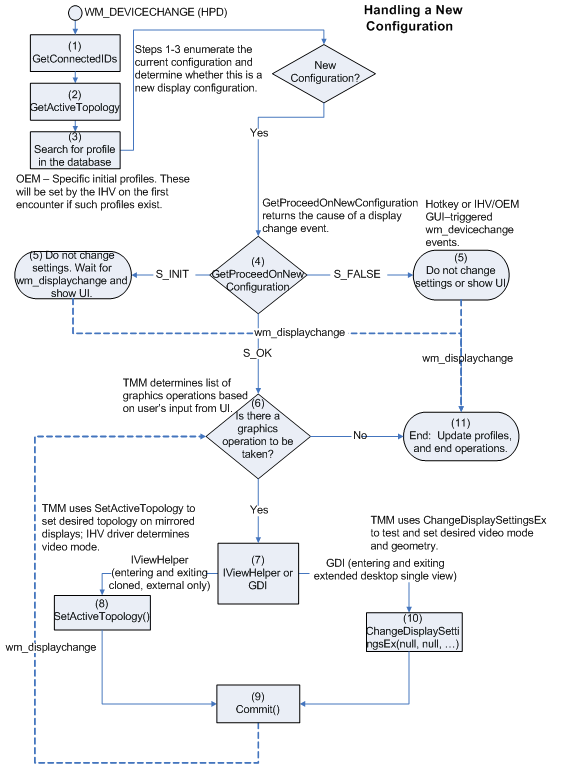

# Handling Two Monitor Configurations

A two-monitor configuration generates the TMM dialog. If two targets are part of the same graphics adapter, TMM will map the one source that is currently mapped to one of the targets to both targets. After TMM performs the mapping, the TMM dialog will pop up. If the targets are on different graphics adapters, the TMM dialog will pop up without activating the second monitor. In this situation, the TMM dialog will not have the option for clone or extended.

The following sequence shows the order in which TMM calls the methods of [IViewHelper](https://msdn.microsoft.com/library/windows/hardware/ff568164) and performs other operations in this situation:

1.  TMM calls the **EnumDisplayDevices** function to retrieve the current display configuration, which includes adapters, displays, and monitors. For more information about **EnumDisplayDevices**, see the Microsoft Windows SDK documentation.

2.  TMM compares display configuration against the previously recorded display configurations.

3.  If the display configuration has one or two monitors with Extended Display Information Data ([*EDID*](https://msdn.microsoft.com/library/windows/hardware/ff556279#wdkgloss-edid)) that TMM has not encountered before, TMM proceeds to bring up the TMM dialog.

4.  For each adapter in the display configuration, TMM makes calls to the [**IViewHelper::GetConnectedIDs**](https://msdn.microsoft.com/library/windows/hardware/ff568171) method to retrieve all of the sources on the adapter whether the sources are mapped or not.

5.  TMM makes calls to the [**IViewHelper::GetConnectedIDs**](https://msdn.microsoft.com/library/windows/hardware/ff568171) method to retrieve all of the targets on the adapter, whether the targets are mapped or not. Each target must be connected but is not required to be active.

6.  For each source in the graphics adapter, TMM makes calls to the [**IViewHelper::GetActiveTopology**](https://msdn.microsoft.com/library/windows/hardware/ff568169) method to retrieve the active targets for the source.

7.  TMM finds the graphics adapter that has a source that is mapped to a target. This source identifier is called "CloneSource." If the adapter has two targets, TMM creates an array of two entries (ULONG targetArray\[2\]). TMM places the existing target identifier as the first element and the second target identifier as the second element.

8.  TMM calls the [**IViewHelper::SetActiveTopology**](https://msdn.microsoft.com/library/windows/hardware/ff568174)(adapterName, CloneSource, 2, targetArray) method with the indicated parameters.

9.  TMM calls the [**IViewHelper::Commit**](https://msdn.microsoft.com/library/windows/hardware/ff568167) method.

If an error result is returned from any of the [IViewHelper](https://msdn.microsoft.com/library/windows/hardware/ff568164) methods, the computer does not enter clone view, and the TMM dialog pops up with clone-view and external-only options disabled.

If the computer enters clone view and the user chooses extended view from the TMM dialog (and clicks **OK** or **Apply**), TMM must turn off clone view as follows:

1.  TMM calls the [**IViewHelper::SetActiveTopology**](https://msdn.microsoft.com/library/windows/hardware/ff568174)(adapterName, CloneSource, 1, targetArray) method with the indicated parameters.

2.  TMM calls the [**IViewHelper::Commit**](https://msdn.microsoft.com/library/windows/hardware/ff568167) method.

In the preceding **SetActiveTopology** call, parameter three is set to 1 and not 2. In this situation, **SetActiveTopology** interprets *targetArray* as an array with one element. **SetActiveTopology** turns off the second target and enters single view. Next, TMM uses the **ChangeDisplaySettingsEx** function to extend the display. For more information about **ChangeDisplaySettingsEx**, see the Microsoft Windows SDK documentation.

The following figure shows the flow of operations that occur when TMM handles the situation when a monitor is added to make a two-monitor configuration.

 

 

