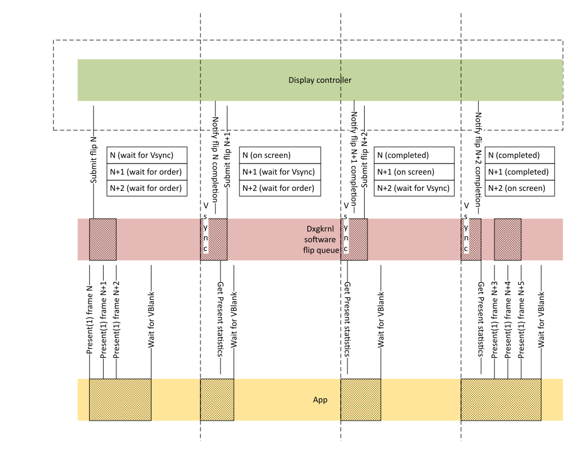
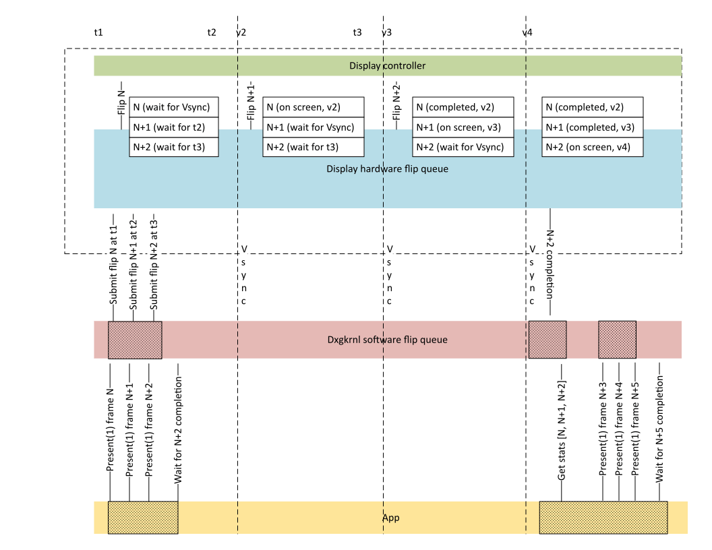
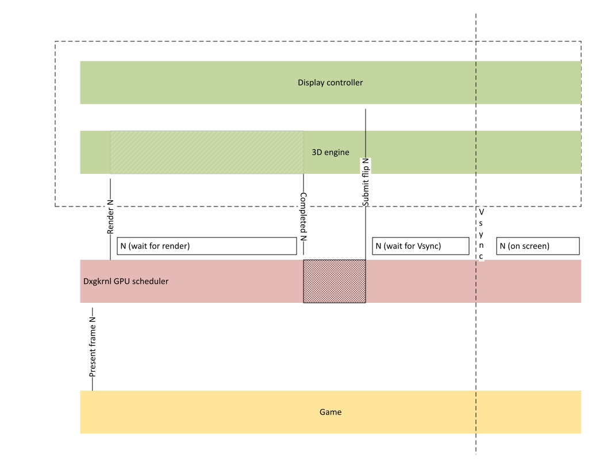
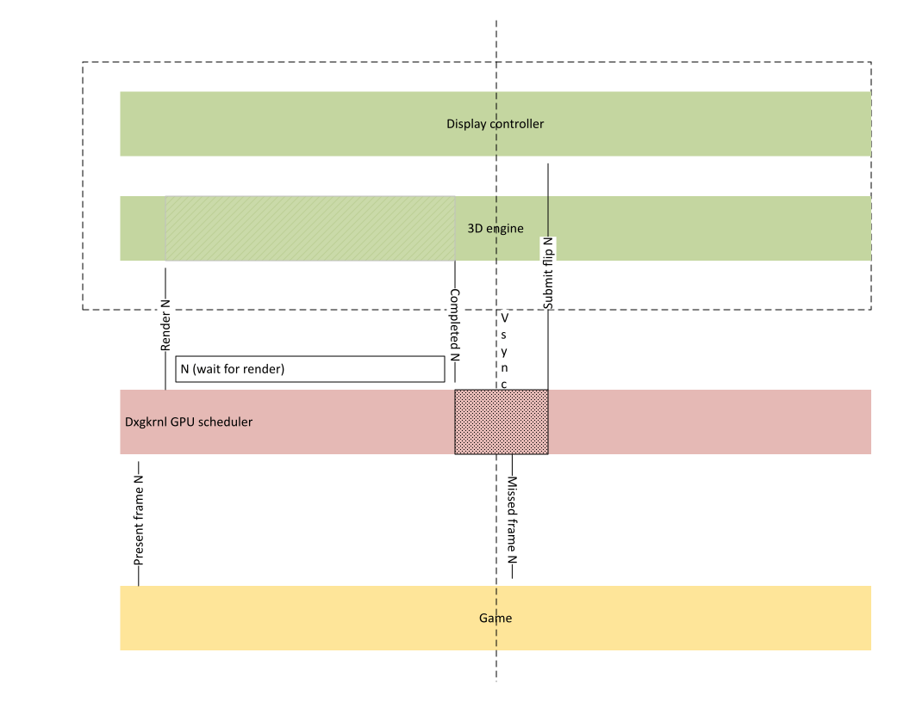
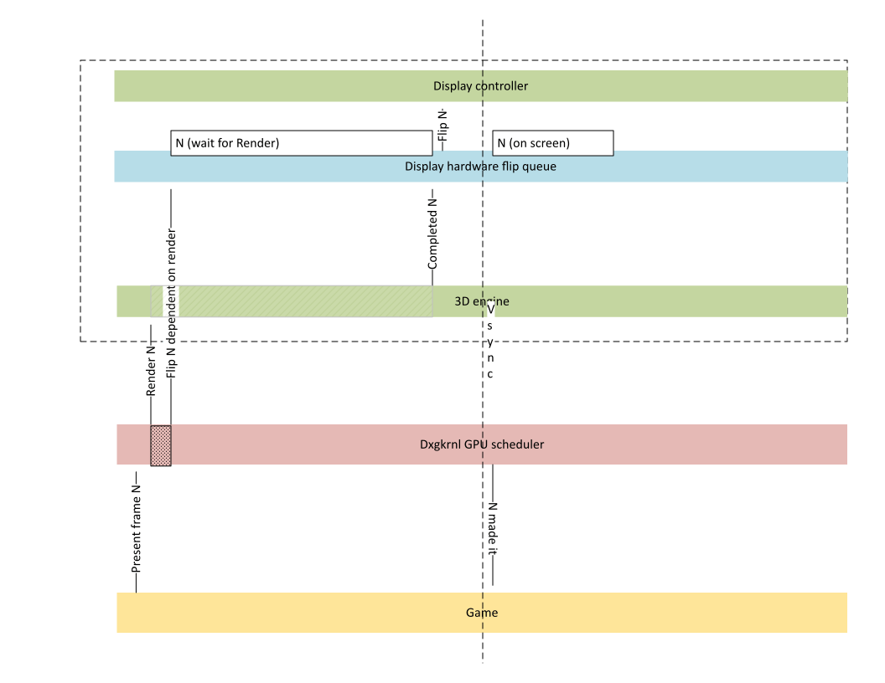

# Hardware flip queue

This article describes the hardware flip queue feature that is supported starting in Windows 11 (WDDM 3.0). The hardware flip queue feature allows multiple future frames to be submitted to the display controller queue. The CPU and parts of the GPU can transition to lower power states while the display controller is processing multiple queued frames, improving power efficiency of video playback scenarios on capable hardware.

## Pre-WDDM 3.0 flip queue model

Many modern display controllers support the ability to queue multiple frames that are to be displayed in a sequence. Starting in WDDM 2.1, the OS supports multiple outstanding flip overwrite requests that are to be presented on the next VSync. The display miniport driver (KMD) indicates this support through the **MaxQueuedMultiPlaneOverlayFlipVSync** value in [**DXGK_DRIVERCAPS**](/windows-hardware/drivers/ddi/d3dkmddi/ns-d3dkmddi-_dxgk_drivercaps). This capability is useful for reducing latency in high frame rate gaming scenarios where multiple frames are sequentially rendered with interval 0, with the intent to only display the most recent frame.

In video playback scenarios, the contents of multiple future frames to be sequentially displayed is known in advance and can be queued to the GPU. This advance queuing allows the CPU to enter a low power state while the queued frames are processed, resulting in substantial power savings. However, prior to WDDM 3.0 there was no mechanism for the OS to submit more than one frame that needs to stay on the screen for at least one VSync interval without further CPU intervention. The [Basic hardware flip queue](#basic-hardware-flip-queue) section introduces a solution that enables the CPU to enter a low power state and offload queued frame processing to the GPU.

In gaming scenarios prior to WDDM 3.0, after the GPU finishes rendering the scene to the swap chain back buffer, there's a roundtrip to the CPU in order to submit the request to present the frame contents to the screen. For heavy GPU workloads that finish close to the VSync, this roundtrip may cause frames to be delayed and miss the intended target time, resulting in observable frame glitches. The [Advanced hardware flip queue](#advanced-hardware-flip-queue) section introduces a mechanism to avoid this CPU roundtrip and present completed frames to the screen with very low latency. Advanced hardware flip queue requires both basic hardware flip queue and GPU hardware scheduling stage 2 functionality to be present.

## Basic hardware flip queue

The following diagram illustrates the case of presenting three frames, each staying on the screen for one VSync interval.



The fill pattern in the diagram shows the times when *Dxgkrnl* software flip queue processing and application threads have to wake up and do CPU work. On each VSync, the display controller has to issue a CPU notification to the OS for the completed flip, and the OS has to submit the next flip request. The application also has to wake up on each VSync and query present statistics to eventually learn when the last frame in the batch of three is displayed.

Hardware flip queue DDIs that can submit multiple future frames to the display controller queue are available starting in WDDM 3.0. As previously stated, this mechanism allows the CPU and parts of the GPU to transition to lower power states while the display controller is processing multiple queued frames, improving power efficiency of video playback scenarios on capable hardware.

The following diagram illustrates the proposed architecture.



With the hardware flip queue approach, both the application and *Dxgkrnl* CPU components are fully idle for two VSync intervals between times *v2* and *v4*, enabling the CPU to enter a low power state. The CPU is only notified when the frame *N+2* that the application requested a wait for is completed.

## Advanced hardware flip queue

In gaming scenarios before WDDM 3.0, after the GPU finishes rendering the scene to the swap chain back buffer, there's a roundtrip to the CPU in order to submit the request to present the frame contents to the screen. The following diagram shows this scenario.



The cost of this roundtrip can cause frames to miss their target if the render is finished too close to the VSync, as shown in the following diagram.



Some display controllers natively support wait conditions that allow the display to submit the flip request once the GPU is done rendering the frame without the CPU roundtrip. Because the hardware flip queue can submit the just completed frame *N* to the display without a CPU roundtrip, it may avoid missed frames as shown in the following diagram.



The remainder of this article discusses the basic hardware flip queue feature.

## DDI support

The following DDIs were added to support the hardware flip queue feature.

### Checking for feature availability

Hardware flip queue requires OS enable/disable negotiation. A KMD that supports hardware flip queue must first call [**DXGKCB_QUERYFEATURESUPPORT**](/windows-hardware/drivers/ddi/d3dkmddi/nc-d3dkmddi-dxgkcb_queryfeaturesupport) during device start time with a [**FeatureId**](/windows-hardware/drivers/ddi/d3dkmddi/ne-d3dkmddi-_dxgk_feature_id) of **DXGK_FEATURE_HWFLIPQUEUE** to determine whether the OS allows hardware flip queue to be enabled.

Hardware flip queue can only be used if the callback succeeds and **Enable** is set to TRUE.

A KMD can use the following sample code during hardware flip queue bring-up and experimental stages.

``` C++

DXGKARGCB_QUERYFEATURESUPPORT HwFlipQueueEnabledArgs = {};
HwFlipQueueEnabledArgs.DeviceHandle = DeviceHandle;
HwFlipQueueEnabledArgs.FeatureId = DXGK_FEATURE_HWFLIPQUEUE;
HwFlipQueueEnabledArgs.DriverSupportState = DXGK_FEATURE_SUPPORT_EXPERIMENTAL;

if (!NT_SUCCESS(pDxgkInterface->DxgkCbQueryFeatureSupport(&HwFlipQueueEnabledArgs)) ||
    !HwFlipQueueEnabledArgs.Enabled)
{
    // Disable hardware flip queue because the OS didn't allow it.           
}
else
{
    // Enable hardware flip queue because the OS allowed it.
}
```

During driver bring-up, even though it's possible to enable hardware flip queue without enabling GPU hardware scheduling, this combination isn't officially supported. Windows currently requires GPU hardware scheduling to be enabled in order for basic hardware flip queue to be enabled on officially released drivers.

### Indicating hardware queuing capabilities

**MaxHwQueuedFlips** was added to [**DXGK_DRIVERCAPS**](/windows-hardware/drivers/ddi/d3dkmddi/ns-d3dkmddi-_dxgk_drivercaps) to indicate hardware flip queue support. If the OS allowed hardware flip queue support as previously described, a KMD that supports hardware flip queue should set **MaxHwQueuedFlips** to a value greater than 1. When **MaxHwQueuedFlips** is greater than 1, KMD indicates that the display hardware supports up to **MaxHwQueuedFlips** future frames that can be queued to be displayed for a given VidPnSource on the GPU. The OS will honor driver provided restrictions on the type of flips that can be queued in advance.

**HwQueuedFlipCaps** was also added to [**DXGK_DRIVERCAPS**](/windows-hardware/drivers/ddi/d3dkmddi/ns-d3dkmddi-_dxgk_drivercaps). This member is currently reserved for system use and shouldn't be used by drivers.

### Flip target time and target timestamp format

When the OS submits a flip request to the hardware flip queue, it also sends the target flip time. The flip can be made visible to the user after the target flip time has been reached.

The OS uses the CPU clock counter units, obtained from [**KeQueryPerformanceCounter**](/windows-hardware/drivers/ddi/ntifs/nf-ntifs-kequeryperformancecounter), to pass the target frame time and interpret the actual frame time.

### Submitting queued flips

The [**DXGKARG_SETVIDPNSOURCEADDRESSWITHMULTIPLANEOVERLAY3**](/windows-hardware/drivers/ddi/d3dkmddi/ns-d3dkmddi-_dxgkarg_setvidpnsourceaddresswithmultiplaneoverlay3) structure, which is passed to KMD's [**DxgkDdiSetVidPnSourceAddressWithMultiPlaneOverlay3**](/windows-hardware/drivers/ddi/d3dkmddi/nc-d3dkmddi-dxgkddi_setvidpnsourceaddresswithmultiplaneoverlay3) callback function, was modified as follows to enable the submission of queued flips:

* The following three members were added to **OutputFlags**'s [**DXGK_SETVIDPNSOURCEADDRESS_OUTPUT_FLAGS**](/windows-hardware/drivers/ddi/d3dkmddi/ns-d3dkmddi-_dxgk_setvidpnsourceaddress_output_flags) structure. See [DxgkDdiSetVidPnSourceAddressWithMultiPlaneOverlay3 retry and failure cases](#dxgkddisetvidpnsourceaddresswithmultiplaneoverlay3-retry-and-failure-cases) for details about these members.

  * **HwFlipQueueDrainNeeded**
  * **HwFlipQueueDrainAllPlanes**
  * **HwFlipQueueDrainAllSources**

* A **TargetFlipTime** member was added. **TargetFlipTime** describes the target flip time in QPC units. When the clock reaches this value, the frame can be sent to the display while honoring VSync and tearing flags. In the presence of previously queued pending flips, the OS guarantees that for each MPO plane referenced by the flip request, **TargetFlipTime** is greater than or equal to any of the pending flip target times for this plane. In other words, there can be a sequence of flips with the same or increasing timestamps, but there can't be a sequence that goes back in time.

### DxgkDdiSetVidPnSourceAddressWithMultiPlaneOverlay3 retry and failure cases

#### Failure to queue the request to hardware due to pending flips

There are several special cases that may prevent KMD from queueing a flip request while other flip requests are pending. In such cases, KMD should return STATUS_RETRY from [**DxgkDdiSetVidPnSourceAddressWithMultiPlaneOverlay3**](/windows-hardware/drivers/ddi/d3dkmddi/nc-d3dkmddi-dxgkddi_setvidpnsourceaddresswithmultiplaneoverlay3) and set **HwFlipQueueDrainNeeded** equal to 1. The OS will attempt to submit the flip request again after all pending flips on planes affected by this flip are finished and once the target time is reached.

In some cases, display hardware may require completion of pending flips on all planes, not just the ones referenced by the incoming flip request. In this case, both the **HwFlipQueueDrainNeeded** and **HwFlipQueueDrainAllPlanes** flags should be set to 1, and KMD should return STATUS_RETRY.

Similarly, display hardware may require completion of pending flips on all VidPn sources in order to reallocate internal resources, in which case the **HwFlipQueueDrainAllSources** and **HwFlipQueueDrainNeeded** flags must be set, and KMD should return STATUS_RETRY.

In addition, KMD can indicate to the OS whether the resubmission should be done at the device IRQL (**PrePresentNeeded** set to 0), or if the OS should perform this call at PASSIVE_LEVEL (**PrePresentNeeded** set to 1). If KMD still returns STATUS_RETRY even though there are no more pending flips on that VidPnSourceId, this condition will be treated as an [invalid parameter failure](#invalid-parameter-failure).

It's important that the value of [**MaxHwQueuedFlips**](/windows-hardware/drivers/ddi/d3dkmddi/ns-d3dkmddi-_dxgk_drivercaps) still reflects the maximum number of simple address-only change flips that can be queued to an MPO plane. The STATUS_RETRY mechanism should be used for more complex flip requests that can't be deeply queued, such as plane configuration changes.

#### Invalid parameter failure

In the hardware flip queue model, the OS's handling of failed flip requests was reworked to allow for better debuggability. When KMD is unable to process a flip request, it should return STATUS_INVALID_PARAMETER from [**DxgkDdiSetVidPnSourceAddressWithMultiPlaneOverlay3**](/windows-hardware/drivers/ddi/d3dkmddi/nc-d3dkmddi-dxgkddi_setvidpnsourceaddresswithmultiplaneoverlay3). Depending on OS settings, the OS will do one of the following actions:

* Kernel Debugger break and bug check: This behavior will often be enabled on development / prerelease builds for better debuggability right as the failure condition occurs.
* Live Kernel Dump followed by a TDR: The retail end-user behavior.

### Specifying VSync interrupt behavior

In order to achieve power savings in queued flip scenarios, the OS will often suspend regular VSync interrupts to keep the CPU in a low power state. However, some flips will be marked as requiring an interrupt to be raised in order for the application to observe the batch of completed presents and to queue further work. There are also cases when applications request waking up on every VSync interrupt regardless of whether there are pending flip requests. And conversely, on a completely idle system, VSync interrupts are suspended until new presentation activity or VSync listeners appear.

To handle all of these cases, the following driver callback and callback structure were introduced:

* [**DXGKDDI_SETINTERRUPTTARGETPRESENTID**](/windows-hardware/drivers/ddi/d3dkmddi/nc-d3dkmddi-dxgkddi_setinterrupttargetpresentid)
* [**DXGKARG_SETINTERRUPTTARGETPRESENTID**](/windows-hardware/drivers/ddi/d3dkmddi/ns-d3dkmddi-dxgkarg_setinterrupttargetpresentid)

KMD provides a pointer to its **DxgkDdiSetInterruptTargetPresentId** function in [**DRIVER_INITIALIZATION_DATA**](/windows-hardware/drivers/ddi/dispmprt/ns-dispmprt-_driver_initialization_data)

The OS calls **DxgkDdiSetInterruptTargetPresentId** to specify the target PresentId that should result in a VSync interrupt raised when the corresponding flip is completed. It's called at device interrupt level (DIRQL) to synchronize with [**DxgkDdiSetVidPnSourceAddress**](/windows-hardware/drivers/ddi/d3dkmddi/nc-d3dkmddi-dxgkddi_setvidpnsourceaddress) and the VSync interrupt.

#### Interaction with DxgkDdiControlInterrupt

When VSync interrupts are disabled entirely via [**DxgkDdiControlInterrupt**](/windows-hardware/drivers/ddi/d3dkmddi/nc-d3dkmddi-dxgkddi_controlinterrupt)/[**DxgkDdiControlInterrupt2**](/windows-hardware/drivers/ddi/d3dkmddi/nc-d3dkmddi-dxgkddi_controlinterrupt2)/[**DxgkDdiControlInterrupt3**](/windows-hardware/drivers/ddi/d3dkmddi/nc-d3dkmddi-dxgkddi_controlinterrupt3), they stay disabled regardless of the interrupt target PresentId value. KMD is required to store the latest interrupt target present ID so that it can be honored once VSync is enabled again.

When VSync interrupts are enabled via **DxgkDdiControlInterrupt*Xxx***, the interrupt target present ID ([**pSetInterruptTargetPresentId**](/windows-hardware/drivers/ddi/d3dkmddi/ns-d3dkmddi-dxgkarg_setinterrupttargetpresentid)) provides finer grained control as follows:

* When the target present ID is set to UINT64_MAX, no VSync interrupt is required going forward until the target present ID is changed again. VSync interrupts are disabled, but KMD is required to implement [**DXGK_VSYNC_DISABLE_KEEP_PHASE**](/windows-hardware/drivers/ddi/d3dkmddi/ne-d3dkmddi-_dxgk_crtc_vsync_state) behavior for re-enabling interrupts.

* When the target present ID is set to 0, interrupts are required for every VSync.

* For any other present ID value, interrupts are raised if the currently scanned PresentId >= [**InterruptTargetPresentId**](/windows-hardware/drivers/ddi/d3dkmddi/ns-d3dkmddi-dxgkarg_setinterrupttargetpresentid).

When multiple MPO planes are available, the VSync interrupt should be raised if any of the planes require it.

##### 2-Stage VSync disable with DxgkDdiSetInterruptTargetPresentId

If the OS call to [**DxgkDdiSetInterruptTargetPresentId**](/windows-hardware/drivers/ddi/d3dkmddi/nc-d3dkmddi-dxgkddi_setinterrupttargetpresentid) sets an **InterruptTargetPresentId** on a plane that would lead to disabling VSync entirely on this VidPnSource (that is, this plane was the last plane that had kept VSync enabled, and now it's disabling VSync as well), KMD should disable VSync interrupts but keep the VSync phase in hardware enabled (DXGK_VSYNC_DISABLE_KEEP_PHASE). After a certain time period (typically equivalent to two VSync periods), the OS will follow up with a call to **DxgkDdiControlInterrupt*Xxx*** with DXGK_VSYNC_DISABLE_NO_PHASE. This call ensures that KMD gets a chance to disable the VSync phase and VSync clocks to save maximum power and to maintain performance parity with non-hardware flip queue systems.

### Queued flip cancellation

In cases such as full screen state transitions or application exits, future queued flips might need to be canceled. To handle these cases, the following driver callback and related structures were introduced:

* [**DXGKDDI_CANCELFLIPS**](/windows-hardware/drivers/ddi/d3dkmddi/nc-d3dkmddi-dxgkddi_cancelflips)
* [**DXGKARG_CANCELFLIPS**](/windows-hardware/drivers/ddi/d3dkmddi/)
* [**DXGK_CANCELFLIPS_PLANE**](/windows-hardware/drivers/ddi/d3dkmddi/)

KMD provides a pointer to its **DxgkDdiCancelFlips** function in [**DRIVER_INITIALIZATION_DATA**](/windows-hardware/drivers/ddi/dispmprt/ns-dispmprt-_driver_initialization_data).

 The OS specifies the range of queued flips to cancel when it calls **DxgkDdiCancelFlips**, and KMD reports back to the OS the range of flips it was able to cancel synchronously.

The following example illustrates the mechanics and synchronous case of flip cancellation on a single plane. (The OS doesn't support asynchronous cancel in Windows 11, version 22H2.) Imagine the following flips are being queued to the hardware flip queue:

* PresentId *N*
* time t0 PresentId *N+1*
* time t1 PresentId *N+2*
* time t2 PresentId *N+3*
* time t3 PresentId *N+4*
* time t4

The OS then decides to cancel flips *N+2*, *N+3*, and *N+4*, so it calls [**DxgkDdiCancelFlips**](/windows-hardware/drivers/ddi/d3dkmddi/nc-d3dkmddi-dxgkddi_cancelflips) with **PresentIdCancelRequested** set to *N+2*.

When KMD inspects the hardware flip queue state, it determined that flip *N+2* has already been sent to the display hardware and can't be canceled at the time of the call, but *N+3* and *N+4* can be synchronously removed from the hardware flip queue without side effects. KMD sets **PresentIdCancelled** to *N+3* and completes *N+2* as usual.

The OS will mark *N+3* and *N+4* as canceled, and it will treat *N*, *N+1*, *N+2* as being in flight. When the next VSync interrupts are raised, the flip queue log will indicate the timestamps for *N*, *N+1*, *N+2* as usual.

The range of synchronously canceled flips has to be continuous and, when not zero, is assumed to include the last present ID submitted to KMD. In other words, there can be no gaps inside both synchronous canceled flip ranges.

### Cancelling interlocked flips on multiple planes

An interlocked flip is submitted by calling [**DxgkDdiSetVidPnSourceAddress**](/windows-hardware/drivers/ddi/d3dkmddi/nc-d3dkmddi-dxgkddi_setvidpnsourceaddress) with multiple planes and PresentIds. The contract between the OS and KMD follows:

* The set of planes must be made visible on the same VSync.
* The display hardware isn't allowed to only display a subset of these planes on one VSync, and the rest on the next VSync.

In the hardware flip queue model, such interlocked flips are canceled by passing multiple planes and PresentIds in the call to [**DxgkDdiCancelFlips**](/windows-hardware/drivers/ddi/d3dkmddi/nc-d3dkmddi-dxgkddi_cancelflips). The set of planes passed in such cases must correspond to a pending interlocked flip request, and KMD's decision regarding all of the interlocked PresentIds must be the same:

* Don't cancel, or
* Cancel synchronously

[**DxgkDdiCancelFlips**](/windows-hardware/drivers/ddi/d3dkmddi/nc-d3dkmddi-dxgkddi_cancelflips) is called at the device interrupt level (DIRQL) to synchronize with [**DxgkDdiSetVidPnSourceAddress**](/windows-hardware/drivers/ddi/d3dkmddi/nc-d3dkmddi-dxgkddi_setvidpnsourceaddress) and VSync interrupt.

### Obtaining present statistics for queued flips

Since the hardware flip queue approach is to avoid waking up the CPU on each VSync, there needs to be a mechanism to retain frame display times for the last several queued flips.

Graphics drivers that support hardware flip queue are required to write information for each completed or canceled flip per a given MPO plane for each active VidPnSource to the flip queue log buffer provided by the OS.

The OS guarantees to provide the flip queue log pointer (in a call to [**DxgkDdiSetFlipQueueLogBuffer**](/windows-hardware/drivers/ddi/d3dkmddi/nc-d3dkmddi-dxgkddi_setflipqueuelogbuffer)) prior to the first [**DxgkDdiSetVidPnSourceAddress**](/windows-hardware/drivers/ddi/d3dkmddi/nc-d3dkmddi-dxgkddi_setvidpnsourceaddress) call for a given MPO plane for each active VidPnSource. The OS is allowed to destroy the flip queue log buffer when the flip queue doesn't have any outstanding requests. In this case, it will provide a new log pointer prior to the next **DxgkDdiSetVidPnSourceAddress** call. The flip queue log is circular. Once the [**NumberOfEntries**-1] entry is written, the next log entry will be [0].

After a batch of queued flips is completed, KMD has to guarantee that the flip queue log for the completed flips is updated at the earliest of these two points in time:

* A VSync interrupt handler for a flip that required an interrupt to be raised.
* In response to an explicit [**DxgkDdiUpdateFlipQueueLog**](/windows-hardware/drivers/ddi/d3dkmddi/nc-d3dkmddi-dxgkddi_updateflipqueuelog) request from the OS.

### Flip queue log DDIs

The following flip queue log-related callback and associated structures were added:

* [**DXGKDDI_SETFLIPQUEUELOGBUFFER**](/windows-hardware/drivers/ddi/d3dkmddi/nc-d3dkmddi-dxgkddi_setflipqueuelogbuffer)
* [**DXGKARG_SETFLIPQUEUELOGBUFFER**](/windows-hardware/drivers/ddi/d3dkmddi/ns-d3dkmddi-dxgk_flipqueue_log_entry)
* [**DXGK_FLIPQUEUE_LOG_ENTRY**](/windows-hardware/drivers/ddi/d3dkmddi/ns-d3dkmddi-dxgkarg_setflipqueuelogbuffer)

* [**DXGKDDI_UPDATEFLIPQUEUELOG**](/windows-hardware/drivers/ddi/d3dkmddi/nc-d3dkmddi-dxgkddi_updateflipqueuelog)
* [**DXGKARG_UPDATEFLIPQUEUELOG**](/windows-hardware/drivers/ddi/d3dkmddi/ns-d3dkmddi-dxgkarg_updateflipqueuelog)

KMD provides a pointer to its functions in [**DRIVER_INITIALIZATION_DATA**](/windows-hardware/drivers/ddi/dispmprt/ns-dispmprt-_driver_initialization_data).

### VSync interrupt structure updates

The following changes were made to the [**DXGKARGCB_NOTIFY_INTERRUPT_DATA**](/windows-hardware/drivers/ddi/d3dkmddi/ns-d3dkmddi-_dxgkargcb_notify_interrupt_data) structure to implement VSync interrupts for the hardware flip queue model:

* The [**DXGK_INTERRUPT_CRTC_VSYNC_WITH_MULTIPLANE_OVERLAY3**](/windows-hardware/drivers/ddi/d3dkmddi/ne-d3dkmddi-_dxgk_interrupt_type) enum value was added as the **InterruptType**.
* The **CrtcVSyncWithMultiPlaneOverlay3** structure was added to the union. **CrtcVSyncWithMultiPlaneOverlay3**'s semantics are similar to the existing **CrtcVSyncWithMultiPlaneOverlay2** structure, except that instead of a single last completed PresentId for each plane, **CrtcVSyncWithMultiPlaneOverlay3.pMultiPlaneOverlayVSyncInfo** points to the range of previously unreported PresentIds from the flip queue log.
* The [**DXGK_MULTIPLANE_OVERLAY_VSYNC_INFO3**](/windows-hardware/drivers/ddi/d3dkmddi/ns-d3dkmddi-dxgk_multiplane_overlay_vsync_info3) structure was added for **CrtcVSyncWithMultiPlaneOverlay3**'s **pMultiPlaneOverlayVSyncInfo** member.

Using the [Basic hardware flip queue](#basic-hardware-flip-queue) example diagram again:


Assume [**FirstFreeFlipQueueLogEntryIndex**](/windows-hardware/drivers/ddi/d3dkmddi/ns-d3dkmddi-dxgk_multiplane_overlay_vsync_info3) was set to 40 at the time flip *N* was submitted and then *N*, *N+1*, *N+2* presents were completed.

After a single plane configuration completes three PresentIds *N*, *N+1*, and *N+2* at respective times v2, v3, v4, KMD will have written three new entries in its flip queue log buffer with indices 40, 41, and 42. KMD reports a **FirstFreeFlipQueueLogEntryIndex** value of 43 in the [**CrtcVSyncWithMultiPlaneOverlay3**](/windows-hardware/drivers/ddi/d3dkmddi/ns-d3dkmddi-_dxgkargcb_notify_interrupt_data) structure. The OS will observe that **FirstFreeFlipQueueLogEntryIndex** changed from 40 to 43, and will read from log entries 40, 41, and 42. KMD needs to set the following flip queue log buffer values as follows:

* **VidPnTargetId**: same meaning as in **CrtcVSyncWithMultiPlaneOverlay2**
* **PhysicalAdapterMask**: same meaning as in **CrtcVSyncWithMultiPlaneOverlay2**

* **MultiPlaneOverlayVSyncInfoCount** = 1
* **pMultiPlaneOverlayVSyncInfo**[0].**LayerIndex** = 0
* **pMultiPlaneOverlayVSyncInfo**[0].**FirstFreeFlipQueueLogEntryIndex** = 43

* **LogBufferAddressForPlane0**[40].**PresentId** = *N*
* **LogBufferAddressForPlane0**[40].**PresentTimestamp** = v2
* **LogBufferAddressForPlane0**[41].**PresentId** = *N+1*
* **LogBufferAddressForPlane0**[41].**PresentTimestamp** = v3
* **LogBufferAddressForPlane0**[42].**PresentId** = *N+2*
* **LogBufferAddressForPlane0**[42].**PresentTimestamp** = v4

### Explicit flip queue log update request

There are cases when the OS needs to obtain information about the last completed batch of flips without having to wait for the VSync interrupt. In such cases, the OS makes an explicit call to [**DxgkDdiUpdateFlipQueueLog**](/windows-hardware/drivers/ddi/d3dkmddi/nc-d3dkmddi-dxgkddi_updateflipqueuelog) to request that KMD read from its proprietary display hardware data structure and write past flip information to the flip queue log. Semantics of the log are the same as previously described; the only change is that **FirstFreeFlipQueueLogEntryIndex** is returned to the OS outside the VSync interrupt.

**DxgkDdiUpdateFlipQueueLog** is called at the device interrupt level (DIRQL), and it's in the same synchronization class as [**DxgkDdiSetVidPnSourceAddressWithMultiPlaneOverlay3**](/windows-hardware/drivers/ddi/d3dkmddi/nc-d3dkmddi-dxgkddi_setinterrupttargetpresentid) DDI.

### Display mode changes and power transitions in the presence of a queued flip in the hardware flip queue

*Dxgkrnl* will ensure that already queued flips in the hardware flip queue are completed or canceled prior to initiating a mode change or powering down the monitor.

### Mapping Present requests to hardware flip queue timestamps

When hardware flip queue is enabled on a particular adapter, all flip calls will be accompanied by a timestamp. In other words, KMD won't need to handle a mix of old and new [**DxgkDdiSetVidPnSourceAddress**](/windows-hardware/drivers/ddi/d3dkmddi/nc-d3dkmddi-dxgkddi_setvidpnsourceaddress) semantics.

The OS will automatically convert existing interval-based Present API requests to timestamp-based flip calls to KMD. The following sections discuss various cases and how they're mapped to a combination of flags, **Duration**, and timestamps received by KMD.

#### Tearing and non-tearing flips semantics

The semantics of tearing flips are conceptually the same when hardware flip queue is enabled. Once the [**TargetFlipTime**](/windows-hardware/drivers/ddi/d3dkmddi/ns-d3dkmddi-_dxgk_setvidpnsourceaddress_output_flags) is reached, KMD should submit the flip to display while still honoring flags such as **FlipImmediate**, **FlipImmediateNoTearing**, and **FlipOnNextVSync**. In other words, KMD should behave as if the OS submitted the flip to it exactly at **TargetFlipTime** with the same flip flags and parameters.

For example, if **FlipOnNextVSync** is set to 1 and the **TargetFlipTime** is in the middle of the frame, this flip should only be displayed on the next VSync.

#### FlipOverwrite support and hardware flip queue

Hardware flip queue is a strict superset of the flip overwrite feature controlled by **MaxQueuedMultiPlaneOverlayFlipVSync** value in [**DXGK_DRIVERCAPS**](/windows-hardware/drivers/ddi/d3dkmddi/ns-d3dkmddi-_dxgk_drivercaps).

Therefore, the OS ignores **MaxQueuedMultiPlaneOverlayFlipVSync** value if the driver opts into the hardware flip queue by setting MaxHwQueuedFlips to a value greater than 1.

#### Multiple flips with an expired TargetFlipTime

When there are multiple queued flips with an expired **TargetFlipTime** for a given MPO plane, the hardware display queue must pick the most recently queued expired flip and submit it to display. The rest of the expired flips should be treated as canceled, and corresponding flip queue log entries for them should contain **DXGK_HWFLIPQUEUE_TIMESTAMP_CANCELLED** as the [**PresentTimestamp**](/windows-hardware/drivers/ddi/d3dkmddi/ns-d3dkmddi-dxgkarg_setflipqueuelogbuffer) values.

#### Interaction between Duration and TargetFlipTime

The **Duration** parameter in the [**DXGKARG_SETVIDPNSOURCEADDRESSWITHMULTIPLANEOVERLAY3**](/windows-hardware/drivers/ddi/d3dkmddi/ns-d3dkmddi-_dxgkarg_setvidpnsourceaddresswithmultiplaneoverlay3) structure should take effect when the flip specified in this structure is displayed on the screen. It specifies the new desired display refresh rate behavior for the output specified by **VidPnSourceId** across all planes. In the WDDM 3.1 and Windows 2022 releases, in order to simplify driver implementation for hardware that doesn't support queued custom **Duration** changes, the OS only submits flip requests with a new **Duration** parameter after previous flip requests have been completed.

### Mapping Present intervals to TargetFlipTime

#### Mapping intervals when refresh rate is fixed

To preserve existing present interval semantics, the OS has to calculate the target flip time using the present interval and refresh rate. However, setting the target flip time exactly to the intended VSync time at which the flip should hit the screen will result in frequent glitches due to the missed VSync in case the actual VSync timing drifts a bit. To guard against glitches, the OS subtracts half of the VSync interval from the calculated target flip time.

Here's a simplified formula for mapping the present interval to the target flip time:

```TargetFlipTime = PreviousFlipStartVSyncTime + (PreviousFlipPresentInterval * FixedRefreshRate) - (FixedRefreshRate / 2)```

#### Mapping intervals when the virtual refresh rate WDDM 2.9 feature is present

The virtual refresh rate feature may temporarily boost the display refresh rate to an integer multiple of the current refresh rate (that is, 24 Hz can be boosted to 144 Hz or 192 Hz). For devices that are capable of supporting this boost, the formula in the previous section is modified to use the fastest multiple of the current refresh rate:

```TargetFlipTime = PreviousFlipStartVSyncTime + (PreviousFlipPresentInterval * FixedRefreshRate) - (FastestRefreshRate / 2)```

#### Mapping intervals when refresh rate is changed to a non-multiple

When the refresh rate is changed to a non-multiple of a current refresh rate (for example, from 24 Hz to 60 Hz), the OS will have to inspect the queue flips to see if their calculated target time is still valid given the new refresh rate. If the target flip time needs to be changed, the OS will cancel queued flips and requeue them with the newly calculated target flip times.
