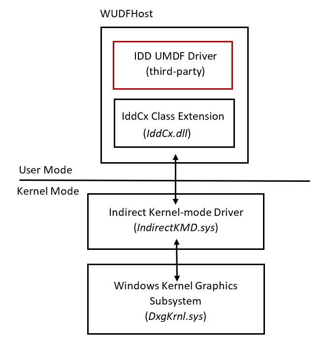

# Indirect display driver overview

The indirect display driver (IDD) model provides a simple user-mode driver model to support monitors that are not connected to traditional GPU display outputs. An example is a dongle connected to the PC via USB that has a regular (VGA, DVI, HDMI, DP etc) monitor connected to it.

## IDD implementation

An IDD is the third party-provided [UMDF](../wdf/umdf-driver-host-process.md) driver for the device. It is developed using the functionality exposed by the [IddCx](/windows-hardware/drivers/ddi/iddcx/) (Indirect Display Driver Class eXtension) to interface with the windows graphics subsystems in the following ways:

* Create the graphics adapter representing the indirect display device
* Report monitors being connected and disconnected from the system
* Provide descriptions of the monitors connected
* Provide available display modes
* Support other display functionality, like hardware mouse cursor, gamma, I2C communications, and protected content
* Process the desktop images to display on the monitor

Because an IDD is a UMDF driver, it is also responsible for implementing all [UMDF](../wdf/overview-of-the-umdf.md) functionality such as device communications, power management, plug and play etc.

The IDD runs in [Session 0](../wdf/session-zero-guidelines-for-umdf-drivers.md) without any components running in the user session, so any driver instability will not affect the stability of the system as a whole.

The following diagram provides an architectural overview.

## User-mode model

The IDD is a user-mode only model with no support for kernel-mode components. As such, the driver is able to use any DirectX APIs in order to process the desktop image. In fact, the IddCx provides the desktop image to encode in a DirectX surface.

> [!NOTE]
>
> The driver should not call user-mode APIs that are not appropriate for driver use, such as GDI, windowing APIs, OpenGL, or Vulkan.
>
> The IDD should be built as a [universal windows driver](../gettingstarted/writing-a-umdf-driver-based-on-a-template.md) so it can be used on multiple Windows platforms.

At build time, the UMDF IDD declares the version of IddCx it was built against and the OS ensures that the correct version of IddCx is loaded when the driver is loaded.

## IddCx callback and function naming conventions

| Prefix | Type | Notes |
| ------ | ---- | ----- |
| **EVT_IDD_CX**\_*XXX* | IDD callback function | IDDs implement both IddCx-specific callbacks such as [**EVT_IDD_CX_ADAPTER_COMMIT_MODES**](/windows-hardware/drivers/ddi/iddcx/nc-iddcx-evt_idd_cx_adapter_commit_modes), as well as relevant WDF callbacks such as [**EVT_WDF_DEVICE_D0_EXIT**](/windows-hardware/drivers/ddi/wdfdevice/nc-wdfdevice-evt_wdf_device_d0_exit). |
| **IddCx***Xxx* | Function | System-supplied IddCx class extension functions that IDDs can call; for example, [**IddCxAdapterInitAsync**](/windows-hardware/drivers/ddi/iddcx/nf-iddcx-iddcxadapterinitasync). |
| **PFN_IDDCX**\_*XXX* | Pointers to IddCx functions | IDDs do not use these pointers. Instead, drivers should use the **IddCx***Xxx* functions. |

## Sample code

Microsoft provides a sample IDD implementation at the [Windows Driver Samples GitHub](https://github.com/microsoft/Windows-driver-samples/tree/master/video/IndirectDisplay). This sample demonstrates how to connect a monitor, how to respond to a mode set, and how to receive frames.
