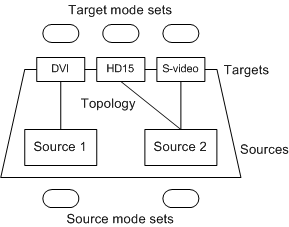
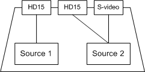
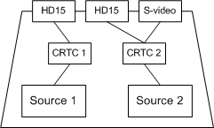
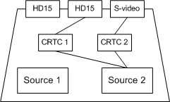

# Introduction to Video Present Networks

The video present network (VidPN) manager, which is a component of the DirectX graphics kernel subsystem (Dxgkrnl.sys), is responsible for managing the collection of monitors and other display devices that are connected to a display adapter. The responsibilities of the VidPN manager include the following:

-   Respond to hot plugging and unplugging of monitors.

-   Maintain and update a set of available display modes as the set of connected monitors changes.

-   Manage the association between rendering surfaces and video outputs on the display adapter; for example, clone views and extension of the desktop to multiple monitors.

-   Adjust the set of available display devices and display modes when the lid on a laptop computer is opened or closed.

-   Adjust the set of available display devices and display modes when a laptop computer is docked or undocked.

The hardware on a display adapter that is responsible for scanning rendered content from video memory and presenting it on video outputs is called the *display adapter's presentational subsystem*. A *video present network (VidPN)* is a software model of a display adapter's presentational subsystem.

The key elements of a display adapter's presentational subsystem are the views (primary surface chains) and the video outputs. In the VidPN model, a view is called *video present source*, and a video output is called a *video present target*.

A *video present path* is an association between a video present source and a video present target. A VidPN models the relationship between sources and targets by maintaining a set of video present paths. The set of paths is called a *VidPN topology*.

Note that video present targets are not the monitors (or other external display devices) connected to the display adapter. The video present targets are the video output connectors themselves.

The following diagram illustrates a VidPN.

The VidPN illustrated in the preceding diagram has three video present targets: a DVI connector, an HD15 connector, and an S-video connector. The VidPN topology is represented by the lines that connect the two sources to the three targets. The topology specifies that Source 1 is connected to the DVI target and Source 2 is connected to both the HD15 and S-video targets. The content rendered on Source 2 is presented as a clone view on the display devices connected to the HD15 and S-video connectors.

Each video present source supports a certain set of surface formats called *source modes*. To keep track of the source modes supported by the various video present sources, a VidPN maintains a *source mode set* for each video present source. The source mode set for a particular video present source is not static; it changes as the topology changes, and it changes according to the modes chosen for other video present sources.

The model works similarly for video present targets. Each video present target supports a certain set of video signal formats called *target modes*, and a VidPN maintains a *target mode set* for each video present target. The target mode set for a particular video present target changes as the topology changes and as modes are chosen for other video present targets.

### The Role of the Display Miniport Driver

A display adapter has one or more *video output codecs* (for example, a CRTC) that read from video present sources and place the corresponding video signals on video present targets. At any given time, a video output codec can read from at most one video present source; however, that codec can supply a video signal to more than one video present target (clone view).The VidPN manager concerns itself with the associations between video present sources and video present targets, but does not concern itself with the role of the video output codecs. The decisions about which video output codec reads from a particular video present source is entirely under the control of the display miniport driver. For example, suppose a display adapter has two video output codecs, and the VidPN manager asks the display miniport driver to implement the topology shown in the following diagram.

The following diagram shows one way that the display miniport driver could assign video output codecs to video present sources.

Notice that the clone view (HD15, S-video) in the preceding diagram is handled by a single CRTC. Now suppose that the HD15 output connected to CRTC 1 is no longer needed. Then the display miniport driver could implement the clone view by configuring the video output codecs as shown in the following diagram:

Implementing the clone view with two CRTCs has some advantages over implementing it with one CRTC. For example, with two CRTCs the HD15 and S-video outputs can have different resolutions and refresh rates.

The important point is that the VidPN manager never knows anything about how the video output codecs on a display adapter are assigned to the video present sources and targets. The VidPN manager knows only the associations between sources and targets. The underlying composite associations that involve the video output codecs are known only to the display miniport driver.

 

 

