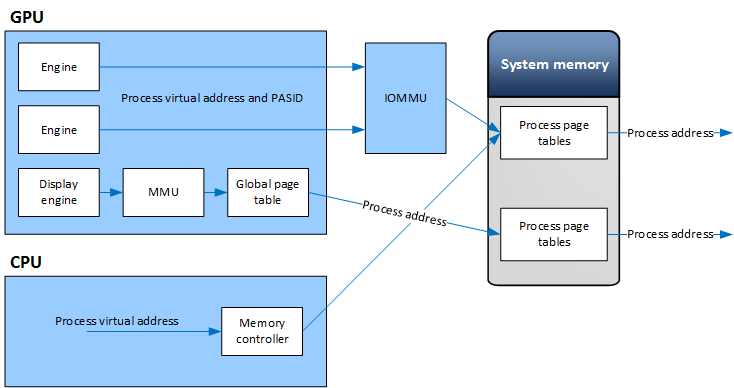

# IoMmu model

In the *IoMmu* model each process has a single virtual address space that is shared between the CPU and graphics processing unit (GPU) and is managed by the OS memory manager.

To access memory, the GPU sends a data request to a compliant *IoMmu*. The request includes a shared virtual address and a *process address space identifier* (PASID). The *IoMmu* unit performs the address translation using the shared page table. This is illustrated below:

The kernel mode driver expresses support for the *IoMmu* model by setting the [**DXGK\_VIDMMCAPS**](https://msdn.microsoft.com/library/windows/hardware/ff562072)::**IoMmuSupported** caps. When this flags is set, the video memory manager will automatically register any process using the GPU with the *IoMmu* and obtain a *PASID* for that process address space. The *PASID* is passed to the driver during device creation.

Primary allocations are mapped by the video memory manager into the aperture segment before being displayed, ensuring that the display controller has physical access to these allocations.

In the *IoMmu* model, the driver continues to allocate video memory for the GPU using the video memory manager's [*Allocate*](https://msdn.microsoft.com/library/windows/hardware/ff568893) service. This allow the user mode driver to follow the residency model, support the Microsoft DirectX resource sharing model, ensure that primary surfaces are visible to the kernel, and are mapped into aperture before being displayed.

The first level of translation (*tile resource address* to *shared CPU/GPU address*) is entirely managed in user mode by the user mode driver.

 

 

