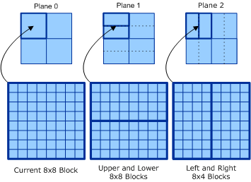

# ITU-T H.263

## 

ITU-T Recommendation H.263 is titled Video Coding for Low Bit Rate Communication. This recommendation offers improved compression performance relative to H.261, MPEG-1, and MPEG-2. The H.263 standard contains a baseline mode of operation that supports only the most basic features of H.263. It also contains a large number of optional, enhanced modes of operation that can be used for various purposes. Baseline H.263 prediction operates in this interface using a subset of the MPEG-1 features. The baseline mode contains no bidirectional prediction − only forward prediction.

**Rounding control:** Several H.263 optional modes require rounding control. This feature is supported by the **bRcontrol** member of [**DXVA\_PictureParameters**](https://msdn.microsoft.com/library/windows/hardware/ff564012).

**Motion Vectors over Picture Boundaries:** Several H.263 optional modes allow motion vectors that address locations outside the boundaries of a picture, as defined in H.263 Annex D. The **bPicExtrapolation** member of [**DXVA\_PictureParameters**](https://msdn.microsoft.com/library/windows/hardware/ff564012), indicates whether the accelerator needs to support such motion. There are two ways that an accelerator can support motion vectors over picture boundaries. In either case, the result is the same:

-   Clip the value of the address on each sample fetch to ensure that it stays within picture boundaries.

-   Pad the picture by using duplicated samples to widen the actual memory area used by one macroblock width and height across each border of the picture.

**Bidirectional motion prediction:** the bidirectional motion prediction used in some optional H.263 prediction operations uses a different rounding operator than MPEG-1. (It uses downward-rounding of half integer values as opposed to upward-rounding.) The **bBidirectionalAveragingMode** member of [**DXVA\_PictureParameters**](https://msdn.microsoft.com/library/windows/hardware/ff564012) indicates the rounding method used for combining prediction planes in bidirectional motion compensation.

**Four-MV Motion Compensation (INTER4V)**: Although each macroblock in H.263 is 16x16 in size, some optional modes (for example, Annex F and Annex J of H.263) allow four motion vectors to be sent for a single macroblock, with one motion vector sent for each of the four 8x8 luminance blocks within the macroblock. The corresponding 8x8 chrominance area uses a single, derived motion vector.

**Overlapped Block Motion Compensation (OBMC)**: H.263 Annex F contains Overlapped Block Motion Compensation (OBMC) for luminance samples, in addition to INTER4V support. OBMC prediction is supported by allowing 12 motion vectors to be sent for forward prediction of a macroblock.

OBMC prediction blocks can be realized in the hardware accelerator as a combination of predictions organized into three planes:

-   A current plane (with a plane index of zero)

-   An upper/lower plane (with a plane index of 1)

-   A left/right plane (with a plane index of 2)

The three planes can serve as temporary storage for the blocks *q(x,y)*, *r(x,y)*, and *s(x,y)* defined in H.263 Section F.3. After each of the three planes have been filled out for all four blocks, they can be combined according to the formula in H.263 Section F.3, and weighted by their respective *H* matrices given in H.263 Annex F.

As an example, an OBMC luminance macroblock prediction may be comprised of eight top/bottom prediction blocks of 8x4 shape, eight left/right blocks of 4x8 shape, and four current blocks of 8x8 shape. If all four of the motion vectors for the plane with index 0 have the same motion vector (that is, when not in an INTER4V macroblock), a single 16x16 macroblock prediction can be used to fill the entire 16x16 plane.

To implement the OBMC process in DirectX VA, 10 motion vectors are sent for the macroblock as shown in the following figure. The first four motion vectors are for the Y₀, Y₁, Y₂, and Y₃ blocks in the current macroblock. Remote motion vectors are then sent in the following order:

1.  Left and right halves of the top of the macroblock.

2.  Top and bottom halves of the left side of the macroblock.

3.  Top and bottom halves of the right side of the macroblock.

The following figure shows the motion vectors sent for a macroblock when using OBMC processing. (The letter C indicates a motion vector of the current macroblock. The letter R indicates a motion vector that is remote with respect to the current macroblock.)

Note that H.263 does not use distinct remote vectors for the left and right halves of the bottom of the macroblock—it reuses the vectors for the current macroblock.

The following figure shows how one 8x8 block is placed in the three types of prediction planes used by OBMC processing in H.263.

**PB frames (Annex G and M)**: In this mode, macroblocks for a P-frame and a pseudo−B-frame are multiplexed together into the unique PB-frame picture coding type. The B portion of each macroblock borrows from information encoded for the P portion of the macroblock: the B-frame forward and backward motion vectors are scaled from the P-frame vector, and the reconstructed P-frame macroblock serves as backward reference for the B portion. The PB-frame includes only a pseudo−B-frame, because the backward prediction for each macroblock can only refer to the reconstructed P macroblock that is contained within the same PB macroblock. However, as with traditional B-frame semantics, a B macroblock within a PB-frame can refer to any location within the forward-reference frame. The limitation of the backward reference creates smaller backward prediction block shapes (as described in H.263 Figure G.2). PB-frames are supported in DirectX VA by representing the P portions of the PB-frame as a P-frame, and the B portions of the PB-frame as a separate B-in-P bidirectionally predicted picture containing a unique B-in-PB type of macroblock that has two motion vectors.

**Deblocking Filter (Annex J)**: Special commands are defined to accelerate deblocking filters, whether used within the [motion-compensated prediction](motion-compensated-prediction.md) loop as with Annex J, or outside the loop as is the case when deblocking H.261 pictures or H.263 baseline pictures. The [*host CPU*](https://msdn.microsoft.com/library/windows/hardware/ff556288#wdkgloss-host-cpu) must create deblocking commands that observe group of blocks (GOB) or slice segment boundaries, if necessary.

**Reference Picture Selection (Annexes N and U)**: Multiple reference frames are supported by the accelerator using the picture index selection field of each prediction block.

**Scalability (Annex O)**: Temporal, SNR, and spatial scalability features are specified in H.263 Annex O. H.263 temporal scalability B-frames are very similar in DirectX VA to MPEG-1 B-frames. Spatial scalability requires upsampling the lower-layer reference picture and then using the upsampled picture as a reference picture for coding an enhancement-layer picture (in all other aspects, spatial scalability is essentially the same as signal-to-noise ratio and temporal scalability). The appropriate bidirectional averaging rounding control should be set to downward-biased averaging for H.263. (MPEG-1 and MPEG-2 use upward-biased averaging, and H.263 uses downward-biased averaging.)

**Reference Picture Resampling (Annex P)**: The simple form of this annex is supported by reference buffer resampling. For advanced forms of Annex P resampling, the reconstructed frames that serve as reference frames must be resampled by external means and stored as reference frame buffers that are addressable by the accelerator.

**Reduced-Resolution Update (Annex Q)**: The H.263 reduced-resolution update mode is not currently supported, as it has unusual residual upsampling requirements, a different form of deblocking filter, and a different form of advanced prediction OBMC. However, reduced-resolution update-mode operation can be supported in this interface using host-based IDCT processing when the deblocking filter mode and the advanced prediction mode are inactive.

**Independent Segment Decoding (Annex R)**: There is no accelerator awareness of independent segment borders. Some forms of Annex R can be supported without any special handling (for example, baseline plus Annex R). Forms of Annex R that require picture segment extrapolation can be supported by decoding each segment as a picture and then constructing the complete output picture from these smaller pictures.

**IDCT (Annex W):** This interface supports the inverse discrete cosine transform (IDCT) specified in Annex W of H.263.

**Other H.263 Optional Features:** Other optional features of H.263 can be supported without any impact on the DirectX VA design. For example, Annexes I, K, S, and T can be easily handled by altering the software decoder without any impact on the accelerator.

 

 

