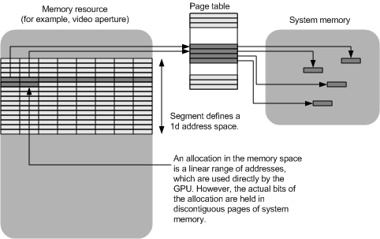

# Linear Aperture-Space Segments

## 

A linear aperture-space segment is similar to a linear memory-space segment; however, the aperture-space segment is only an address space and cannot hold bits. To hold the bits, system memory pages must be allocated, and the address-space range must be redirected to refer to those pages. The display miniport driver must implement the [**DxgkDdiBuildPagingBuffer**](https://msdn.microsoft.com/library/windows/hardware/ff559587) function for DXGK\_OPERATION\_MAP\_APERTURE\_SEGMENT and DXGK\_OPERATION\_UNMAP\_APERTURE\_SEGMENT operation types to handle the redirection and must expose this function as described in [**DriverEntry of Display Miniport Driver**](https://msdn.microsoft.com/library/windows/hardware/ff556157). The *DxgkDdiBuildPagingBuffer* function receives the range to be redirected and the MDL that references the physical system memory pages that were allocated.

The display miniport driver typically accomplishes the redirection of the address-space range by programming a page table, which is unknown to the video memory manager.

The driver must set the **Aperture** bit-field flag in the **Flags** member of the [**DXGK\_SEGMENTDESCRIPTOR**](https://msdn.microsoft.com/library/windows/hardware/ff562035) structure to specify a linear aperture-space segment. The driver can also set the following bit-field flags to indicate additional segment support:

-   **CpuVisible** to indicate that the segment is CPU-accessible.

-   **CacheCoherent** to indicate that the segment maintains cache coherency with the CPU for the pages to which the segment redirects.

The following figure shows a visual representation of a linear aperture-space segment.

 

 

