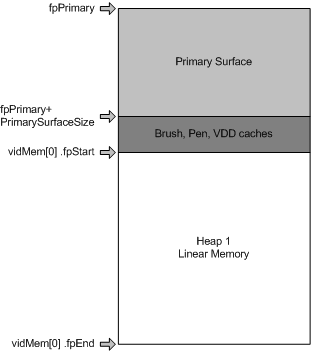

# Linear Memory Allocation


## <span id="ddk_linear_memory_allocation_gg"></span><span id="DDK_LINEAR_MEMORY_ALLOCATION_GG"></span>


Display memory is considered *linear* whenever the pitch can be changed to match the surface width, taking into account alignment requirements (as shown in the following figure). For example, if the blitter can only hit 8-byte strides, and a 31-pixel sprite is used, each line of display needs to be adjusted by one to align the next line on an 8-byte boundary.

The pitch is determined by multiplying the pixel depth, in bytes, by surface width, taking into account alignment requirements. If the display is 640 8-bit pixels across, then the pitch is 640. If the pixels are 16-bit (2 bytes) and there is a 640 X 480 screen, then the pitch is 1280 (640 \* 2). Likewise, 640 wide, 32-bit (4 bytes) pixel screens have a pitch of 2560 (640 \* 4) in linear display memory.

The following diagram illustrates linear memory heap allocation with one primary surface and one scratch area.



The pointer to the start of the primary surface is **fpPrimary**, a member of the [**VIDEOMEMORYINFO**](https://msdn.microsoft.com/library/windows/hardware/ff570172) structure. The size of the primary surface and the various Windows caches are added to this to give a pointer to the beginning of the scratch area, indicated by the **fpStart** member of the [**VIDEOMEMORY**](https://msdn.microsoft.com/library/windows/hardware/ff570171) structure. The end point, indicated by the **fpEnd** member of the **VIDEOMEMORY** structure, is calculated by adding the size of the remaining memory minus one.

The [**VIDEOMEMORY**](https://msdn.microsoft.com/library/windows/hardware/ff570171) structure holds the information that manages the display memory heaps. This sample has only one element in the array of **VIDEOMEMORY** structures because there is only one heap. VIDMEM\_ISLINEAR, a flag in the **dwFlags** member of the **VIDEOMEMORY** structure, denotes this as linear memory.

The following pseudocode shows how a [**VIDEOMEMORY**](https://msdn.microsoft.com/library/windows/hardware/ff570171) structure is set up for linear memory:

```cpp
/*
 * video memory pool usage
 */
static VIDEOMEMORY vidMem [] = {
    { VIDMEM_ISLINEAR, 0x00000000, 0x00000000,
           { 0 }, { 0 } },
};/*
```

The following pseudocode shows how linear memory heaps are set up:

```cpp
/*
 * video memory pool information
 */

/* Calculate the number of video memory heaps */
    ddHALInfo.vmiData.dwNumHeaps = sizeof ( vidMem ) / sizeof ( vidMem [ 0 ] );

/* set up the pointer to the first available video memory after the primary surface */
    ddHALInfo.vmiData.pvmList     = vidMem;

/*
 * remainder of screen memory
 */

    VideoHeapBase = ddHALInfo.vmiData.fpPrimary + dwPrimarySurfaceSize + dwCacheSize;
    VideoHeapEnd = VideoHeapBase + dwDDOffScreenSize - 1;

    vidMem[ 0 ].fpStart = VideoHeapBase;
    vidMem[ 0 ].fpEnd = VideoHeapEnd;
```

The beginning of the first available scratch area is calculated by adding the beginning of the GDI primary surface to the size of the primary surface and the size of the Windows brush, pen, and VDD caches. The result is used to set the starting point in the first element of the [**VIDEOMEMORY**](https://msdn.microsoft.com/library/windows/hardware/ff570171) structure to the beginning of the scratch area.

The end of the scratch area is found by adding the beginning of the scratch area to the size of the scratch area and subtracting one to make it inclusive. The result is used to set the end point of the first (and, in this case, only) element of the [**VIDEOMEMORY**](https://msdn.microsoft.com/library/windows/hardware/ff570171) structure to the end of the scratch area. If there is more than one heap, the end point is set to the end of this heap and the next heap starts where this one leaves off.

 

 


