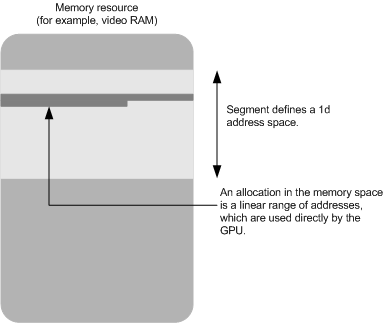

# Linear Memory-Space Segments

## 

A linear memory-space segment is the classical type of segment that display hardware uses. The linear memory-space segment conforms to the following model:

-   Virtualizes video memory located on the graphics adapter.

-   Is accessed directly by the GPU (that is, without redirection through page mapping).

-   Is managed linearly in a one-dimensional address space.

The driver sets the **Flags** member of the [**DXGK\_SEGMENTDESCRIPTOR**](/windows-hardware/drivers/ddi/d3dkmddi/ns-d3dkmddi-_dxgk_segmentdescriptor) structure to 0 to specify a linear memory-space segment. However, the driver can set the following bit-field flags to indicate additional segment support:

-   **CpuVisible** to indicate that the segment is CPU-accessible.

-   **UseBanking** to indicate that the segment is divided into banks.

The following figure shows a visual representation of a linear memory-space segment.

 

