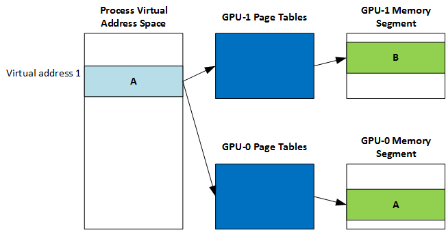

# Linked display adapter

Each physical adapter in a linked display adapter (LDA) link can support *GpuMmu* or *IoMmu* or both addressing modes independently.

## IoMmu support

Each physical adapter in a link can support the *IoMmu* model and/or the *GpuMmu* model.

[*DxgkDdiCreateDevice*](/windows-hardware/drivers/ddi/d3dkmddi/nc-d3dkmddi-dxgkddi_createdevice) will be called for logical adapters, which support the *IoMmu* model.

## GpuMmu support

All physical adapters in a link share the same process virtual address space, but each graphics processing unit (GPU) has its own page tables. Generally, content of page tables is different on each GPU.

Each physical adapter is allowed to have its own *GpuMmu* capabilities (page table segment, page table update node, virtual address layout, the underlying page table format, size, etc.). The only restriction is that all physical adapters must have the same virtual address size. **GpuMmuCaps.VirtualAddressBitCount** must be the same for all adapters. The driver should clamp the address space size to the smallest of the physical GPUs.

The Microsoft DirectX graphics kernel will now query *GpuMmu* caps for every physical adapter in a link. [*DxgkDdiQueryAdapterInfo*](/windows-hardware/drivers/ddi/d3dkmddi/nc-d3dkmddi-dxgkddi_queryadapterinfo) (**DXGKQAITYPE\_PAGETABLELEVELDESC**) will also be called for each physical adapter.

**InputDataSize** and **pInputData** for [*DxgkDdiQueryAdapterInfo*](/windows-hardware/drivers/ddi/d3dkmddi/nc-d3dkmddi-dxgkddi_queryadapterinfo)(**DXGKQAITYPE\_GPUMMUCAPS**) will point to **DXGK\_GPUMMUCAPSIN**.

**InputDataSize** and **pInputData** for [*DxgkDdiQueryAdapterInfo*](/windows-hardware/drivers/ddi/d3dkmddi/nc-d3dkmddi-dxgkddi_queryadapterinfo)(**DXGKQAITYPE\_PAGETABLELEVELDESC**) will point to **DXGK\_PAGETABLELEVELDESCIN**.

## Related topics

[*DxgkDdiCreateDevice*](/windows-hardware/drivers/ddi/d3dkmddi/nc-d3dkmddi-dxgkddi_createdevice)

 

