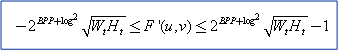

# Low-Level IDCT Processing Elements

## 

The DirectX VA interface supports various ways of handling low-level inverse discrete-cosine transform ([*IDCT*](https://msdn.microsoft.com/library/windows/hardware/ff556290#wdkgloss-idct)). There are two fundamental types of operation:

1.  Off-host IDCT: Passing macroblocks of transform coefficients to the accelerator for external IDCT, picture reconstruction, and reconstruction clipping.

2.  Host-based IDCT: Performing an IDCT on the host and passing blocks of spatial-domain results to the accelerator for external picture reconstruction and reconstruction clipping.

In both cases, the basic inverse-quantization process, pre-IDCT range saturation, MPEG-2 mismatch control (if necessary), and intra-DC offset (if necessary) are performed on the host. In both cases, the final picture reconstruction and reconstruction clipping are done on the accelerator.

The inverse quantization, pre-IDCT saturation, mismatch control, intra-DC offset, IDCT, picture reconstruction, and reconstruction clipping processes are defined in the following steps. The [**DXVA\_QmatrixData**](https://msdn.microsoft.com/library/windows/hardware/ff564034) structure loads inverse-quantization matrix data for compressed video picture decoding. (The values of *BPP*, *W*T, and *H*T should be assumed to be equal to 8, unless otherwise specified by the [**DXVA\_PictureParameters**](https://msdn.microsoft.com/library/windows/hardware/ff564012) structure.)

1. Perform inverse quantization as necessary (including application of any inverse-quantization weighting matrices) to create a set of IDCT coefficient values *F"(u,v)* from entropy-coded quantization indices. This is performed by the host.

2. Saturate each reconstructed coefficient value *F"(u,v)* of the transform coefficient block to obtain a value *F'(u,v)* within the restricted allowable range as defined in the following formula. This is performed by the host.

3. Perform mismatch control for MPEG-2. (This stage of processing is needed for MPEG-2 only.) Mismatch control is performed by summing the saturated values of all coefficients in the macroblock (this is equivalent to XORing their least significant bits). If the sum is even, 1 is subtracted from the saturated value of the last coefficient *F'*(*W*T*-1,H*T*-1*). If the sum is odd, the saturated value of *F'(W*T*-1,H*T<em>-1)</em>*<strong><em>is used as is, without alteration. The coefficient values that are created after saturation and mismatch control are referred to as *F(u,v)</em> in this documentation. This is performed by the host.
   **Note</strong>   MPEG-1 has a different form of mismatch control that consists of altering the value by plus or minus 1 for each coefficient that would otherwise have an even value after inverse quantization. H.263 does not require the mismatch control described in this section. In any case, mismatch control is the host's responsibility if needed.

     

4. Add an intra-DC offset (if necessary) to all intra blocks so all intra blocks represent a difference relative to a spatial reference prediction value of 2(BPP-1). Such an offset is necessary for all the referenced video-coding standards (H.261, H.263, MPEG-1, MPEG-2, and MPEG-4), except when *HostResidDiff* is 1 and the **bConfigIntraResidUnsigned** member of the [**DXVA\_ConfigPictureDecode**](https://msdn.microsoft.com/library/windows/hardware/ff563133) structure is 1. The intra DC offset has the value (2(BPP-1)) \* sqrt(*W*T*H*T) in the transform domain. This value is 1024 in all cases except MPEG-4, which allows *BPP* to be greater than 8. This is performed by the host.

5. Perform the inverse discrete cosine transform (IDCT) on either the host or the accelerator. The IDCT is specified by the following formula, where:
   *C*(*u*) = 1 for *u* = 0, otherwise *C(u)* = sqrt(2)
   *C*(*v*) = 1 for *v* = 0, otherwise *C(v)* = sqrt(2)
   *x* and *y* are the horizontal and vertical spatial coordinates in the pixel domain
   *u* and *v* are the transform-domain horizontal and vertical frequency coordinates
   *W*T and *H*T are the width and height of the transform block (generally both are 8).
6. Add the spatial-domain residual information to the [motion-compensated prediction](motion-compensated-prediction.md) value for nonintra blocks or to the constant reference value for intra blocks to perform picture reconstruction on the accelerator. The constant reference value for intra blocks is 2(BPP-1) except when HostResidDiff (bit 10 of the **wMBtype** member of the [**DXVA\_MBctrl\_P\_HostResidDiff\_1**](https://msdn.microsoft.com/library/windows/hardware/ff563993)) structure is 1 and the **bConfigIntraResidUnsigned** member of the [**DXVA\_ConfigPictureDecode**](https://msdn.microsoft.com/library/windows/hardware/ff563133) structure is 1. In the latter case, the constant is zero.

7. Clip the picture reconstruction to a range from zero through (2BPP)-1 and store the final resulting picture sample values on the accelerator.

 

 

