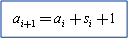

# Macroblock Control Command Buffers

## 

A decoded picture contains one or more macroblock control command buffers (if it does not contain bitstream buffers). The decoding process for every macroblock is specified (only once) in a macroblock control command buffer.

For every macroblock control command buffer, there is a corresponding residual difference block data buffer containing data for the same set of macroblocks. If one or more [deblocking filter control buffers](deblocking-filter-commands.md) are sent, the set of macroblocks in each deblocking filter control buffer is the same as the set of macroblocks in the corresponding macroblock control and residual difference block data buffers.

The processing of a picture requires that the motion prediction for each macroblock precede the addition of the residual difference data. Picture decoding can be accomplished in one of the following two ways:

-   Process the motion prediction commands in the macroblock control command buffer first and then read the motion-compensated prediction data back in from the uncompressed destination surface, while processing the residual difference data buffer.

-   Process the macroblock control command buffer and the residual difference data buffer in a coordinated fashion. Add the residual data specified in the residual difference data buffer to the prediction before writing the result to the uncompressed destination surface.

The macroblock control command and the residual difference data for each macroblock affect only the rectangular region within that macroblock.

The total number of macroblock control commands in the macroblock control command buffer is specified by the **dwNumMBsInBuffer** member of the corresponding [**DXVA\_BufferDescription**](https://msdn.microsoft.com/library/windows/hardware/ff563122) structure.

The quantity and type of data in the residual difference data buffer is determined by the **wPatternCode**, **wPC\_Overflow**, and **bNumCoef** members of the corresponding macroblock control command.

The following figure shows the relationship between the macroblock control command buffer and the residual difference data buffer.

If the **bConfigMBcontrolRasterOrder** member of the [**DXVA\_ConfigPictureDecode**](https://msdn.microsoft.com/library/windows/hardware/ff563133) structure is equal to 1, then the following expression applies to the preceding illustration where *i* is the index of the macroblock within the macroblock control command buffer.

 

 

