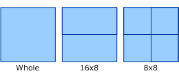
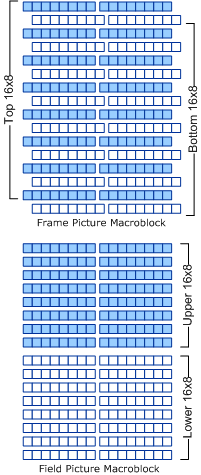

# Macroblock Partitioning

## 

Macroblocks can be broken into the following segments. (This is done to compartmentalize areas with different characteristics.) The following diagram shows how macroblocks can be broken into the following segments.

In the MPEG-2 case, the top and bottom portion of a field-structured macroblock in a frame picture represent lines from two different fields captured at different instances in time, as much as one-fiftieth of a second apart. Thus, the top and bottom portion could have totally noncorrelated content if significant movement has taken place between the two fields for the frame area covered by the macroblock. As illustrated in the following figure, an additional 16x8 scheme is added in field-structured pictures to provide a finer vertical granularity of prediction, which better accommodates edges and smaller objects with different motion characteristics.

The prediction block itself is an approximation of shape and represents a compromise selection of motion vector for all samples that belong to the portion of the macroblock that the prediction block represents. Ideally, each sample would have its own motion vector, but this would consume a considerable number of bits and require extra overhead in processing.

Prediction blocks contribute to only one partition of a macroblock. A whole prediction block covers the 16x16 area of a macroblock. (This is the case with all H.261 and MPEG-1 predictions.) MPEG-2 introduced the 16x8 prediction shape to address the dual field/frame nature of macroblocks. The 16x8 shape was also borrowed for use in MPEG-2 field-structured pictures to create a finer granularity of prediction. The 8x8 shape is deployed in H.263 (Advanced Prediction) and MPEG-4. Each chrominance prediction block generally uses a motion vector derived from the motion vector of the corresponding luminance prediction block, because the standards model motion as being the same for all color components.

Chrominance prediction blocks usually have half the size in both horizontal and vertical directions of their corresponding luminance prediction blocks. Chrominance vectors are therefore generally derived by scaling down the luminance vectors to account for the difference in the respective luminance and chrominance sample dimensions. MPEG-2's 16x8 luminance prediction blocks have corresponding 8x4 chrominance shapes.

Exceptions to the method of scaling chrominance block dimensions are often made when the luminance prediction block becomes too small. For example, in the H.263 Advanced Prediction mode, the chrominance prediction block remains 8x8 in shape, and the chrominance motion vector is derived from a scaled average of the four 8x8 luminance motion vectors.

 

 

