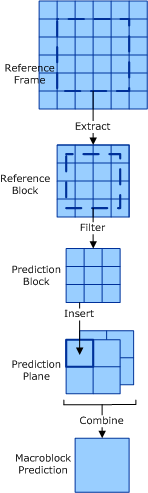
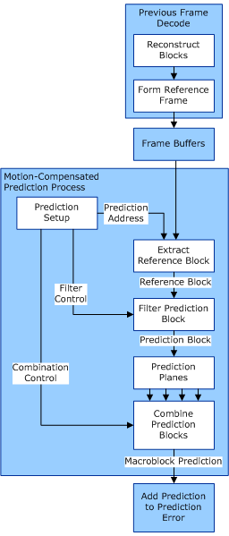

# Macroblock Prediction

## 

The formation of a macroblock prediction through motion-compensated prediction (MCP) must be done as a series of discrete stages as shown in the following figure and steps:

The following four steps are involved in creating a macroblock prediction:

1.  Form the reference frame

    A reference frame is an uncompressed surface that was previously created by the decoding of a previous picture, or by writing directly into a video accelerator uncompressed surface.

2.  Extract the reference block

    A reference block is not necessarily the same as a prediction block. It most likely consists of extra samples that are needed in the prediction filtering stages. Unless half-sample filtering is executed in the memory unit, the reference block for a 16x16 half-sample filtered macroblock has a 17x17 matrix of blocks with each block consisting of an 8 row by 8 column of pixel element data. The size of the reference block is both a function of the prediction block dimensions and filter attributes of the prediction block. A reference block must refer to a block of data extracted from a reference frame buffer for use in [motion-compensated prediction](motion-compensated-prediction.md) (MCP).

    **Note**   The reference block is not defined for DirectX VA because it may have properties that reflect implementation-specific means of maintaining picture buffers.

     

3.  Filter the reference block to form a prediction block

    The reference block may be filtered in a third stage to produce a prediction block.

4.  Combine prediction blocks to form macroblock prediction

    One or more prediction blocks are combined to form the final prediction of the macroblock samples. Blocks are combined by averaging the pixel values between corresponding blocks in one or more prediction planes and rounding each up to the nearest integer (when fractional data is 0.5 or higher). P picture blocks are combined with the temporally closest previous I or P picture blocks. B picture blocks are combined with the closest previous and future I or P picture blocks.

The following figure shows the additional steps in the video decoding process that occur when creating a macroblock prediction. (The blocks with solid lines depict the motion compensation process, while the blocks with dotted lines depict other aspects of video decoding.)

 

 

