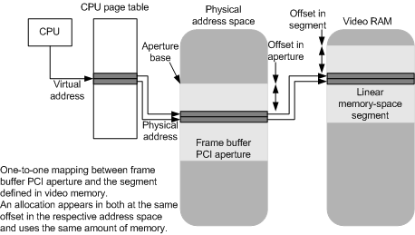
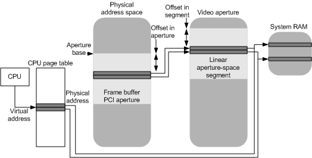

# Mapping Virtual Addresses to a Memory Segment

## 

The display miniport driver can specify, for each memory-space or aperture-space segment that it defines, whether CPU virtual addresses can map directly to an allocation located in the segment by setting the **CpuVisible** bit-field flag in the **Flags** member of the [**DXGK\_SEGMENTDESCRIPTOR**](https://msdn.microsoft.com/library/windows/hardware/ff562035) structure for the segment.

To map a CPU virtual address to a segment, the segment should have linear access through the PCI aperture. In other words, the offset of any allocation within the segment should be the same as the offset in the PCI aperture. Therefore, the video memory manager can calculate the bus-relative physical address of any allocation based on the allocation's offset within the given segment.

The following diagram illustrates how virtual addresses are mapped to a linear memory-space segment.

The following diagram illustrates how virtual addresses are mapped to the underlying pages of a linear aperture-space segment.

Before mapping a virtual address to a portion of the segment, the video memory manager calls the display miniport driver's [**DxgkDdiAcquireSwizzlingRange**](https://msdn.microsoft.com/library/windows/hardware/ff559582) function so that the driver can set up the aperture that is used for accessing bits of the allocation that might be swizzled. The driver can change neither the offset into the PCI aperture where the allocation is accessed nor the amount of space that the allocation takes up in the aperture. If the driver cannot make the allocation CPU-accessible given these constraints (for example, the hardware possibly ran out of unswizzling aperture), the video memory manager evicts the allocation to system memory and lets the application access the bits there.

If the content of a previously created allocation is in system memory when the user-mode display driver calls the [**pfnLockCb**](https://msdn.microsoft.com/library/windows/hardware/ff568914) function to request direct access to the memory, the video memory manager returns the system memory buffer to the user-mode display driver, and the display miniport driver is not involved in accessing the allocation. Therefore, the content of the allocation is not modified by the display miniport driver and remains in unswizzled format. This implies that when a CPU-accessible allocation is evicted from video memory, the display miniport driver must unswizzle the allocation so that the resultant system memory bits can be directly accessed by the application.

If the GPU resources that are associated with an allocation currently mapped for direct application access are evicted, the content of the allocation is transferred to system memory so that the application can continue to access the content at the same virtual address but different physical medium. To set up the transfer, the video memory manager calls the display miniport driver's [**DxgkDdiBuildPagingBuffer**](https://msdn.microsoft.com/library/windows/hardware/ff559587) function to create a paging buffer, and the GPU scheduler calls the driver's [**DxgkDdiSubmitCommand**](https://msdn.microsoft.com/library/windows/hardware/ff560790) function to queue the paging buffer to the GPU execution unit. The hardware-specific transfer command is in the paging buffer. For more information, see [Submitting a Command Buffer](submitting-a-command-buffer.md). The video memory manager ensures that the transition of video to system memory is invisible to the application. However, the driver must ensure that the byte ordering of an allocation through the PCI aperture exactly matches the byte ordering of the allocation when the allocation is evicted.

For aperture-space segments, the underlying bits of the allocation are already in system memory, so no transfer (unswizzling) of data during the eviction process is required. Therefore, a CPU-accessible allocation located in an aperture-space segment cannot be swizzled if it is accessed directly by an application.

If a surface will be directly accessible through the CPU by an application but will be swizzled in an aperture-space segment, the display drivers should implement the surface as two different allocations. When the user-mode display driver creates such a surface, it can call the [**pfnAllocateCb**](https://msdn.microsoft.com/library/windows/hardware/ff568893) function and can set the **NumAllocations** member of the [**D3DDDICB\_ALLOCATE**](https://msdn.microsoft.com/library/windows/hardware/ff544137) structure to 2 and the **pPrivateDriverData** members of the [**D3DDDI\_ALLOCATIONINFO**](https://msdn.microsoft.com/library/windows/hardware/ff544364) structures in the **pAllocationInfo** array of D3DDDICB\_ALLOCATE to point to private data about the allocations (such as their swizzled and unswizzled formats). The allocation that will be used by the GPU contains bits in swizzled format, and the allocation that will be accessed by the application contains the bits in unswizzled format. The video memory manager calls the display miniport driver's [**DxgkDdiCreateAllocation**](https://msdn.microsoft.com/library/windows/hardware/ff559606) function to create the allocations. The display miniport driver interprets the private data (in the **pPrivateDriverData** member of the [**DXGK\_ALLOCATIONINFO**](https://msdn.microsoft.com/library/windows/hardware/ff560960) structure for each allocation) that is passed from the user-mode display driver. The video memory manager is unaware of the format of the allocations; it just allocates blocks of memory of certain sizes and alignments for the allocations. A call to the user-mode display driver's *Lock* function to lock the surface for processing causes the following actions:

1.  The user-mode display driver calls the [**pfnRenderCb**](https://msdn.microsoft.com/library/windows/hardware/ff568923) function to submit the unswizzle operation in the command buffer to the Direct3D runtime and on to the display miniport driver.

2.  The user-mode display driver calls the [**pfnLockCb**](https://msdn.microsoft.com/library/windows/hardware/ff568914) function to lock the unswizzled allocation. Note that the user-mode display driver must not set the D3DDDILOCKCB\_DONOTWAIT flag in the **Flags** member of the D3DDDICB\_LOCK structure.

3.  The **pfnLockCb** function waits until the transfer (unswizzling) between allocations is performed.

4.  The **pfnLockCb** function requests that the display miniport driver obtains a virtual address for the unswizzled allocation and returns the virtual address to the user-mode display driver in the **pData** member of [**D3DDDICB\_LOCK**](https://msdn.microsoft.com/library/windows/hardware/ff544205).

5.  The user-mode display driver returns the unswizzled allocation's virtual address to the application in the **pSurfData** member of D3DDDIARG\_LOCK.

 

 

