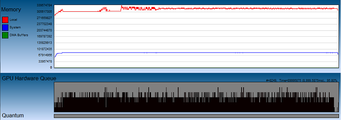
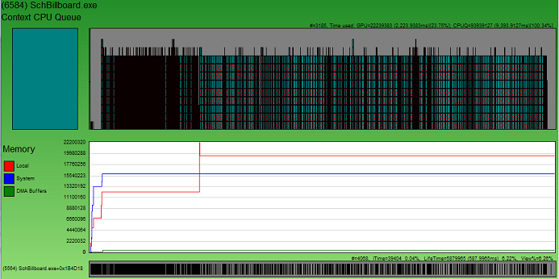

# Memory Charts

The Memory Charts show local and system memory usage over time. The graphs are both global and process based in scope. There is one Memory Chart per adapter and one per process that actually uses video memory. 

The following diagram is a screen shot of the memory associated with an adapter. 

Note that when GPUView displays memory associated with an adapter, it creates a blue gradient area above the GPU Hardware Queue. 

When viewing a Memory Chart associated with a process, the view is slightly different. 

Notice in this case that the Memory Chart is located below the Context CPU Queue and above the threads. It is also contained within the same green gradient area reserved for the individual process. 

In either case, the key shows that local video memory is shown in red and system memory is shown in blue. The size of DMA Packets is shown in green. The scale is relative to the largest amount of allocated memory at one given time. 

Note that with the two Memory Charts above, the scales are radically different. For the adapter Memory Chart it tops out at 339,574,784, whereas the process Memory Chart tops out at 22,200,320, which makes the adapter memory an order of magnitude larger than this particular process.