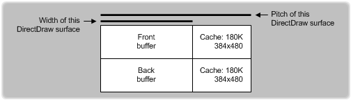

# Memory Heap Allocation


## <span id="ddk_memory_heap_allocation_gg"></span><span id="DDK_MEMORY_HEAP_ALLOCATION_GG"></span>


To allocate a surface, DirectDraw scans through the display memory heaps, in the order they were specified by the drivers. Heaps are specified in an array of [**VIDEOMEMORY**](https://msdn.microsoft.com/library/windows/hardware/ff570171) structures. DirectDraw visits the heaps in the order of the VIDEOMEMORY structures in the array. The VIDEOMEMORY structure sets up certain metrics of the heap, such as the starting and ending memory addresses, flags describing the heap access, and what types of usage are restricted for the surface placed in this heap. DirectDraw manages the heap by suballocating and deallocating memory, that is, by creating and destroying surfaces under each heap's jurisdiction. Physical limits determine how to set up these attributes.

DirectDraw's heap manager makes two passes through the [**VIDEOMEMORY**](https://msdn.microsoft.com/library/windows/hardware/ff570171) structure when attempting to allocate memory in response to a surface creation or restoration. The **ddsCaps** member of the VIDEOMEMORY structure informs DirectDraw what the memory in the heap cannot be used for on the first pass. For example, if the heap is just big enough for a back buffer, sprites can be excluded from being allocated on the first pass by setting the DDSCAPS\_OFFSCREENPLAIN flag. That way, other heaps fill up with off-screen plain surfaces, while preserving the back buffer for page flipping.

The **ddsCapsAlt** member of the VIDEOMEMORY structure can be set to allow sprites on the second pass. That way, the heap in question can allow sprites, but only if the sprite could not be created in any other heap. Do not specify the DDSCAPS\_OFFSCREENPLAIN flag in **ddsCapsAlt**. This allows heaps to be used optimally, without ruling out alternative uses.

Display memory heaps can be either linear or rectangular, depending on the blitter or the needs of an existing display driver. The **dwFlags** member of the [**VIDEOMEMORY**](https://msdn.microsoft.com/library/windows/hardware/ff570171) structure is used to specify the memory allocation type. Linear heaps describe regions of memory where the pitch of each surface can be different. Rectangular heaps describe regions of memory where the pitch of each surface is fixed. These heaps can be mixed and matched within the same display card, if necessary. For more information, see [Memory Configurations](memory-configurations.md).

A surface's memory *pitch*, also called stride or offset, is the number of bytes added to a column of display memory in order to reach the same column of display memory on the following scan line. Because pitch is measured in bytes rather than pixels, a 640x480x8 surface has a different pitch value than a surface with the same width and height dimensions but a different pixel format (depth in bits). Additionally, the pitch value sometimes reflects extra bytes that the runtime has reserved as a cache along with extra bytes due to alignment requirements. Therefore, you cannot assume that pitch is simply the surface's width multiplied by the number of bytes per pixel. Rather, visualize the difference between width and pitch as shown in the following figure.



As noted previously, you must also take into account alignment requirements when determining the pitch value. For example, suppose a one byte per pixel (bpp) surface is 97 pixels wide. Also, suppose that the hardware or display driver requires DWORD (4 bytes) alignment. If the runtime has not reserved cache bytes, the pitch is 100, which is the next higher number above 97 that is evenly divisible by 4. The following calculation determines this pitch value:

```cpp
pitch = bpp * width + ( 4 - ( bpp * width) % 4 )
// that is, pitch = 97 + (4 - 1) = 100
```

 

 


