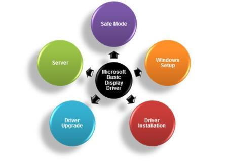

# Microsoft Basic Display Driver

In Windows 8, The Microsoft Basic Display Driver (MSBDD) is the in-box display driver that replaces the XDDM VGA Save and VGA PnP drivers.

The key benefits of using MSBDD are as follows:

-   MSBDD helps to enable a consistent end user and developer experience because it is compatible with DirectX APIs and technologies such as the Desktop Composition.
-   Server scenarios can benefit from the higher functionality (specifically, features like reboot-less updates, dynamic start and stop, and so on) that are provided by the WDDM driver model.
-   MSBDD supports Unified Extensible Firmware Interface (UEFI) Graphics Output Protocol (GOP).
-   MSBDD works on both XDDM and WDDM hardware.

MSBDD is the default in-box display driver that is loaded during setup, in safe mode, in the absence of an IHV graphics driver, or when the inbox installed graphics IHV driver is not working or is disabled. The primary purpose of this driver is to enable Windows to write to the display controller's linear frame buffer.

MSBDD can use the video BIOS to manage modes and resolutions on a single monitor. On UEFI platforms, MSBDD inherits the linear frame buffer that is set during boot; in this case, no mode or resolution changes are possible. As shown in *Figure 1 Scenarios supported by Microsoft Basic Display Driver*, MSBDD is used in the following scenarios:

-   Server: Server configurations that lack WDDM-capable graphics hardware can use MSBDD.
-   Windows setup: In the early phases of Windows setup, just before the final boot, only the MSBDD is loaded.

    For example, a user has an older platform that is currently in working condition although it has no in-box graphics driver support for Windows 8. The user upgrades to Windows 8 and uses MSBDD for the setup, installation, and to retrieve an IHV driver if one is available.

-   Driver installation, in the following cases:
    -   When a user is installing a new WDDM IHV driver, MSBDD is used during the transition (from the point when the old WDDM IHV driver is uninstalled to the point before the new IHV driver is installed).
    -   When a user encounters problems installing the latest WDDM IHV driver, the user or system can disable the current graphics driver and fallback to using MSBDD.
-   Driver upgrade: By using MSBDD, there is no need to go through a system reboot when upgrading to the IHV-recommended driver.
-   Safe mode: In this mode, only trusted drivers get loaded; this includes MSBDD.

**Figure 1 Scenarios Supported by Microsoft Basic Display Driver**

 

 

