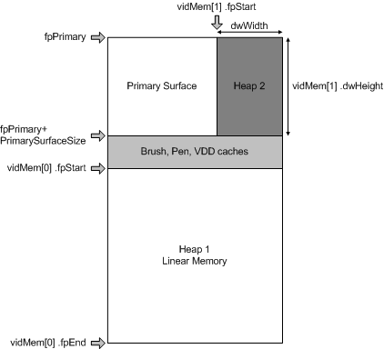

# Mixed Memory Allocation


## <span id="ddk_mixed_memory_allocation_gg"></span><span id="DDK_MIXED_MEMORY_ALLOCATION_GG"></span>


Linear and rectangular memory heaps can be mixed and matched in any fashion, if the hardware supports it. For example, if a front buffer has a fixed pitch, the DirectDraw-capable driver can allocate a rectangular heap to the right of it.

As shown in the following figure, if sufficient memory remains below the primary surface, this area can be made into a linear heap that can be used for a back buffer.



The preceding figure shows a linear piece of memory below the primary surface (Heap 1) and a rectangular piece of memory that is reclaimed by DirectDraw to the right of the primary surface (Heap 2).

The following pseudocode shows how a [**VIDEOMEMORY**](https://msdn.microsoft.com/library/windows/hardware/ff570171) structure is set up for a mix of linear and rectangular memory:

```cpp
/*
 * video memory pool usage
 */
static VIDEOMEMORY vidMem [] =
{
  { VIDMEM_ISRECTANGULAR, 0x00000000, 0x00000000,
            { 0 }, { 0 } },
  { VIDMEM_ISLINEAR, 0x00000000, 0x00000000,
            { 0 }, { 0 } },
};
```

Two areas of display memory can be allocated in this instance. The area to the conceptual right of the primary surface is necessarily rectangular, and is indicated by the VIDMEM\_ISRECTANGULAR flag. The area conceptually below the primary surface can be linear, and is indicated by the VIDMEM\_ISLINEAR flag.

The following pseudocode shows how a mix of linear and rectangular memory heaps are set up:

```cpp
/*
 * video memory pool information
 */

/* set up the pointer to the first available video memory after the primary surface */
    ddHALInfo.vmiData.pvmList       = vidMem;

/* how many heaps are there   
     ddHALInfo.vmiData.dwNumHeaps       = 2;

/* The linear piece:  */


/*
 * remainder of screen memory
 */

    VideoHeapBase = ddHALInfo.vmiData.fpPrimary + dwPrimarySurfaceSize
                    + dwCacheSize;
    VideoHeapEnd = VideoHeapBase + dwDDOffScreenSize - 1;
    vidMem[0].fpStart = VideoHeapBase;
    vidMem[0].fpEnd = VideoHeapEnd;

/* The rectangular piece:  */

/* set up the pointer to the next available video memory */
    ddHALInfo.vmiData.pvmList     = vidMem[1];

/*
 *  Compute the Pitch here ...
 */

    vidMem[1].fpStart  = ddHALInfo.vmiData.fpPrimary + 
                        dwPrimarySurfaceWidth;
    vidMem[1].dwWidth  = dwPitch - dwPrimarySurfaceWidth;
    vidMem[1].dwHeight = dwPrimarySurfaceHeight;
    vidMem[1].ddsCaps.dwCaps = 0;  // surface has no use restrictions
```

A linear memory heap is set up by determining the start and end points of the scratch area below the primary surface, indicated by the **fpStart** and **fpEnd** members of the linear [**VIDEOMEMORY**](https://msdn.microsoft.com/library/windows/hardware/ff570171) structure (<strong>vidMem\[</strong>0<strong>\]</strong>). The rectangular piece is set up using the starting point, indicated by the **fpStart** member of the rectangular VIDEOMEMORY structure (<strong>vidMem\[</strong>1<strong>\]</strong>), width, indicated by the **dwWidth** member, and height, indicated by the **dwHeight** member, of the primary surface. The pitch (the **dwPitch** member) must be calculated before the rectangular piece can be set up. This is the same as in the previous rectangular example, except in this case the pitch is the second element of the VIDEOMEMORY structure instead of the first. Each new heap requires a new VIDEOMEMORY structure.

In some cases, the flip register can handle only 256 KB boundaries. In these instances, a small heap can use up the space between the bottom of the caches and the start of the back buffer, allowing the back buffer to begin on a 256 KB boundary. This example is not shown, but it could be implemented by adding another element to the VIDEOMEMORY structure and setting the starting point just beyond the caches and the ending point just before the 256 KB boundary. Such a heap should be flagged with DDSCAPS\_BACKBUFFER so that it can be skipped over when the heap manager looks for a back buffer. This back buffer heap (the one aligned) would also be marked with DDSCAPS\_OFFSCREENPLAIN to keep sprites and textures from using this heap until no other memory is available in other heaps for off-screen plain surfaces.

 

 


