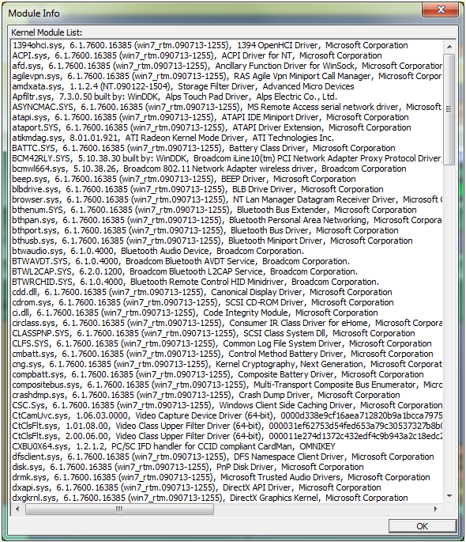

# Module Info Dialog Box  

The **Module Info** dialog box displays all the kernel mode modules loaded on the system from which the event log trace was gathered. Its context is alphabetical to help the user quickly locate module versions. This is useful when investigating known issues on known module versions. 

The information displayed in the dialog's list takes the form module name, followed by the version, followed by the friendly name and corporation. Video drivers are fairly easy to find in this list. 

