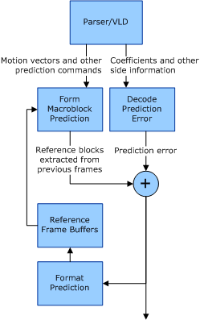

# Motion-Compensated Prediction

## 

Block motion-compensated prediction (MCP) is the type of prediction implemented by DirectX VA. This prediction type is what gives the MPEG and H.26x family of codecs the advantage over pure still-frame coding methods, such as JPEG. Types of motion-compensated prediction other than block-based prediction are not implemented by DirectX VA.

In motion-compensated prediction, previously transmitted and decoded data serves as the prediction for current data. The difference between the prediction and the actual current data values is the prediction error. The coded prediction error is added to the prediction to obtain the final representation of the input data. After the coded prediction error is added to the MCP, the final decoded picture is used in the MCP to generate subsequent coded pictures.

This recursive loop occasionally is broken by various types of resets that are specific to the element being predicted. The resets are described by the semantics of the decoding process. (For example, motion vectors and coefficient predictions are reset at slice boundaries, while the whole temporal frame prediction chain is reset by an intra-refresh frame.)

The following figure shows the signal flow for motion-compensated prediction.

The steps required for motion-compensated prediction coding of pictures are as follows:

1.  Reference blocks are extracted from previously decoded frames and modified as specified by encoded mode selection and the motion vectors and other prediction commands to form the prediction of each image block.

2.  The transformed difference between the current input data block and the prediction is approximated as closely as possible within the available bit rate by the encoder, and the result is sent as the coded prediction error.

3.  The prediction and inverse-transformed prediction error are summed to form a reconstructed picture block.

4.  The reconstructed picture block is stored in a reference frame buffer to be used for the prediction of subsequent pictures.

5.  This process continues again at step 1.

Motion vectors, DCT coefficients, and other data that is not directly part of the MCP process also employ prediction to make the transmitted form of the data more compact. These instances of prediction are executed on the [*host CPU*](https://msdn.microsoft.com/library/windows/hardware/ff556288#wdkgloss-host-cpu) processor or bitstream parser/variable-length-decoding unit.

 

 

