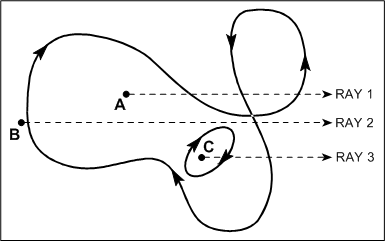

# Path Fill Modes

## 

The two fill modes defined for paths are *alternate* and *winding*. Both fill modes use an even-odd rule to determine how to fill a closed path.

FP\_ALTERNATEMODE applies the even-odd rule as follows: draw a line from any arbitrary start point in the closed path to some point obviously outside of the closed path. If the line crosses an odd number of path segments, the start point is inside the closed region and is therefore part of the fill area. An even number of crossings means that the point is not in an area to be filled.

FP\_WINDINGMODE considers not only the number of times that the vector crosses segments of the path, but also considers the direction of each segment. The path is considered to be drawn from start to finish, with each segment's direction implied by the order of its specified points: the first vertex of a segment is the "from" point, and the second vertex is the "to" point. Now draw the same arbitrary line described in alternate mode. Starting from zero, add one for every "forward" direction segment that the line crosses, and subtract one for every "reverse" direction segment crossed. (Forward and reverse are based on the dot product of the segment and the arbitrary line.) If the count result is nonzero, then the start point is inside the fill area; a zero count means the point is outside the fill area.

The following figure shows how to apply both rules to the more complex situation of a self-intersecting path.

In alternate fill mode, point A is inside because ray 1 passes through an odd number of line segments, while points B and C are outside, because rays 2 and 3 pass through an even number of segments. In winding-fill mode, points A and C are inside, because the sum of the forward (positive) and reverse (negative) line segments crossed by their rays, 1 and 3 respectively, is not zero, while point B is outside, because the sum of the forward and reverse line segments that ray 2 crosses is zero.

 

 

