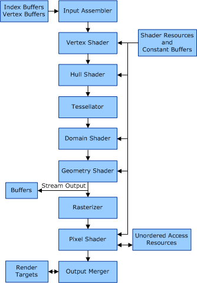
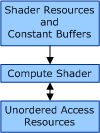

# Pipelines for Direct3D Version 11

This section applies only to Windows 7 and later, and Windows Server 2008 R2 and later versions of Windows operating system.

The graphics rendering pipeline for Direct3D version 11 is expanded from the [graphics rendering pipeline for Direct3D version 10](rendering-pipeline.md). In addition to the shared programmable shader cores that Direct3D version 10 supported, Direct3D version 11 also supports hull, domain, and compute shader cores.

Direct3D version 11 actually supports two separate pipelines: the draw pipeline (graphics rendering pipeline) and the dispatch pipeline (compute shader pipeline). The draw and dispatch pipelines are technically loosely connected in the sense that you cannot have the same subresource bound for writing in both pipelines simultaneously, or bound for writing in one pipeline and for reading in the other pipeline.

The following figure shows the functional block of the draw pipeline for Direct3D version 11.

The following figure shows the functional block of the dispatch pipeline for Direct3D version 11.

The following sections describe the new-for-Direct3D 11 blocks that are shown in the preceding figures.

### Hull Shader

The hull shader operates once per patch. You can use the hull shader with patches from the input assembler. The hull shader can transform input control points that make up a patch into output control points. The hull shader can perform other setup for the fixed-function tessellator stage. For example, the hull shader can output tess factors, which are numbers that indicate how much to tessellate.

The Direct3D runtime calls the following driver functions to create, set up, and destroy the hull shader:

[**CalcPrivateShaderSize**](https://docs.microsoft.com/windows-hardware/drivers/ddi/d3d10umddi/nc-d3d10umddi-pfnd3d10ddi_calcprivateshadersize)

[**CalcPrivateTessellationShaderSize**](https://docs.microsoft.com/windows-hardware/drivers/ddi/d3d10umddi/nc-d3d10umddi-pfnd3d11ddi_calcprivatetessellationshadersize)

[*CreateHullShader*](https://docs.microsoft.com/windows-hardware/drivers/ddi/d3d10umddi/nc-d3d10umddi-pfnd3d11ddi_createhullshader)

[**DestroyShader**](https://docs.microsoft.com/windows-hardware/drivers/ddi/d3d10umddi/nc-d3d10umddi-pfnd3d10ddi_destroyshader)

[**HsSetShaderResources**](https://docs.microsoft.com/windows-hardware/drivers/ddi/d3d10umddi/nc-d3d10umddi-pfnd3d10ddi_setshaderresources)

[**HsSetShader**](https://docs.microsoft.com/windows-hardware/drivers/ddi/d3d10umddi/nc-d3d10umddi-pfnd3d10ddi_setshader)

[**HsSetSamplers**](https://docs.microsoft.com/windows-hardware/drivers/ddi/d3d10umddi/nc-d3d10umddi-pfnd3d10ddi_setsamplers)

[**HsSetConstantBuffers**](https://docs.microsoft.com/windows-hardware/drivers/ddi/d3d10umddi/nc-d3d10umddi-pfnd3d10ddi_setconstantbuffers)

[**HsSetShaderWithIfaces**](https://docs.microsoft.com/windows-hardware/drivers/ddi/d3d10umddi/nc-d3d10umddi-pfnd3d11ddi_setshader_with_ifaces)

### Tessellator

The tessellator is a fixed-function unit whose operation is defined by declarations in the hull shader. The tessellator operates once per patch that is output by the hull shader. The hull shader generates tess factors, which are numbers that notify the tessellator how much to tessellate (generate geometry and connectivity) over the domain of the patch.

The Direct3D runtime calls the driver's [**CalcPrivateTessellationShaderSize**](https://docs.microsoft.com/windows-hardware/drivers/ddi/d3d10umddi/nc-d3d10umddi-pfnd3d11ddi_calcprivatetessellationshadersize) function to calculate the size of the memory region for a hull or domain shader.

### Domain Shader

The domain shader is invoked once per vertex, which is generated by the tessellator. Each invocation is identified by its coordinate on a generic domain. The role of the domain shader is to turn that coordinate into something tangible (such as, a point in 3-D space) for use down stream of the domain shader. Each domain shader invocation for a patch also accesses shared input of all the hull shader output (such as, output control points).

The Direct3D runtime calls the following driver functions to create, set up, and destroy the domain shader:

[**CalcPrivateTessellationShaderSize**](https://docs.microsoft.com/windows-hardware/drivers/ddi/d3d10umddi/nc-d3d10umddi-pfnd3d11ddi_calcprivatetessellationshadersize)

[*CreateDomainShader*](https://docs.microsoft.com/windows-hardware/drivers/ddi/d3d10umddi/nc-d3d10umddi-pfnd3d11ddi_createdomainshader)

[**DestroyShader**](https://docs.microsoft.com/windows-hardware/drivers/ddi/d3d10umddi/nc-d3d10umddi-pfnd3d10ddi_destroyshader)

[**DsSetShaderResources**](https://docs.microsoft.com/windows-hardware/drivers/ddi/d3d10umddi/nc-d3d10umddi-pfnd3d10ddi_setshaderresources)

[**DsSetShader**](https://docs.microsoft.com/windows-hardware/drivers/ddi/d3d10umddi/nc-d3d10umddi-pfnd3d10ddi_setshader)

[**DsSetSamplers**](https://docs.microsoft.com/windows-hardware/drivers/ddi/d3d10umddi/nc-d3d10umddi-pfnd3d10ddi_setsamplers)

[**DsSetConstantBuffers**](https://docs.microsoft.com/windows-hardware/drivers/ddi/d3d10umddi/nc-d3d10umddi-pfnd3d10ddi_setconstantbuffers)

[**DsSetShaderWithIfaces**](https://docs.microsoft.com/windows-hardware/drivers/ddi/d3d10umddi/nc-d3d10umddi-pfnd3d11ddi_setshader_with_ifaces)

### Compute Shader

The compute shader allows the GPU to be viewed as a generic grid of data-parallel processors, without any graphics impediments from the draw pipeline. The compute shader has explicit access to fast shared memory to facilitate communication between groups of shader invocations. The compute shader also has the ability to perform scattered reads and writes to memory. The availablility of atomic operations enables unique access to shared memory addresses. The compute shader is not part of the draw pipeline. The compute shader exists on its own. However, the compute shader exists on the same device as all the other shader stages. The Direct3D runtime calls the driver's *DispatchXxx* functions rather than the driver's *DrawXxx* functions to invoke the compute shader.

The Direct3D runtime calls the following driver functions to create, set up, and destroy the compute shader:

[*CreateComputeShader*](https://docs.microsoft.com/windows-hardware/drivers/ddi/d3d10umddi/nc-d3d10umddi-pfnd3d11ddi_createcomputeshader)

[**DestroyShader**](https://docs.microsoft.com/windows-hardware/drivers/ddi/d3d10umddi/nc-d3d10umddi-pfnd3d10ddi_destroyshader)

[**CsSetShaderResources**](https://docs.microsoft.com/windows-hardware/drivers/ddi/d3d10umddi/nc-d3d10umddi-pfnd3d10ddi_setshaderresources)

[**CsSetShader**](https://docs.microsoft.com/windows-hardware/drivers/ddi/d3d10umddi/nc-d3d10umddi-pfnd3d10ddi_setshader)

[**CsSetSamplers**](https://docs.microsoft.com/windows-hardware/drivers/ddi/d3d10umddi/nc-d3d10umddi-pfnd3d10ddi_setsamplers)

[**CsSetConstantBuffers**](https://docs.microsoft.com/windows-hardware/drivers/ddi/d3d10umddi/nc-d3d10umddi-pfnd3d10ddi_setconstantbuffers)

[**CsSetShaderWithIfaces**](https://docs.microsoft.com/windows-hardware/drivers/ddi/d3d10umddi/nc-d3d10umddi-pfnd3d11ddi_setshader_with_ifaces)

[**CsSetUnorderedAccessViews**](https://docs.microsoft.com/windows-hardware/drivers/ddi/d3d10umddi/nc-d3d10umddi-pfnd3d11ddi_setunorderedaccessviews)

[**Dispatch**](https://docs.microsoft.com/windows-hardware/drivers/ddi/d3d10umddi/nc-d3d10umddi-pfnd3d11ddi_dispatch)

[**DispatchIndirect**](https://docs.microsoft.com/windows-hardware/drivers/ddi/d3d10umddi/nc-d3d10umddi-pfnd3d11ddi_dispatchindirect)

### Unordered Access Resource Views

Unordered access resource views are read/write resources that you can bind to the compute shader or pixel shader. The binding of unordered access resource views is similar to how you can bind shader resource views, which are read-only resources, to any shader stage.

The Direct3D runtime calls the following driver functions to create, set up, and destroy unordered access resource views:

[**CalcPrivateUnorderedAccessViewSize**](https://docs.microsoft.com/windows-hardware/drivers/ddi/d3d10umddi/nc-d3d10umddi-pfnd3d11ddi_calcprivateunorderedaccessviewsize)

[**CreateUnorderedAccessView**](https://docs.microsoft.com/windows-hardware/drivers/ddi/d3d10umddi/nc-d3d10umddi-pfnd3d11ddi_createunorderedaccessview)

[**DestroyUnorderedAccessView**](https://docs.microsoft.com/windows-hardware/drivers/ddi/d3d10umddi/nc-d3d10umddi-pfnd3d11ddi_destroyunorderedaccessview)

[**ClearUnorderedAccessViewFLOAT**](https://docs.microsoft.com/windows-hardware/drivers/ddi/d3d10umddi/nc-d3d10umddi-pfnd3d11ddi_clearunorderedaccessviewfloat)

[**ClearUnorderedAccessViewUINT**](https://docs.microsoft.com/windows-hardware/drivers/ddi/d3d10umddi/nc-d3d10umddi-pfnd3d11ddi_clearunorderedaccessviewuint)

[**CopyStructureCount**](https://docs.microsoft.com/windows-hardware/drivers/ddi/d3d10umddi/nc-d3d10umddi-pfnd3d11ddi_copystructurecount)

[**SetRenderTargets(D3D11)**](https://docs.microsoft.com/windows-hardware/drivers/ddi/d3d10umddi/nc-d3d10umddi-pfnd3d11ddi_setrendertargets)

 

 

