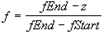
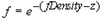
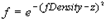

# Pixel Fog

## 

Pixel fog is similar to vertex fog, but the fog blending factor, **f**, is calculated at rasterization time rather than at lighting time. Pixel fog is more accurate than vertex fog. The fog blending factor specified in the LVERTEX or D3DTLVERTEX structures (described in the Direct3D SDK documentation) is ignored. Pixel fog is limited to the three fog profile types (linear fog, exponential fog, and exponential squared fog).

For pixel fog, the hardware does a table look-up on the depth value interpolated at each pixel. There is no need for 256 table entries if they are being interpolated linearly in-between. Future releases of DirectX may provide compensation for nonlinear z-distribution. ZFront and ZBack have values in the interval \[0.0, 1.0\].

Pixel fog is used by setting the **PRIMCAPS.dwPRasterCaps** to D3DPRASTERCAPS\_FOGTABLE. The **D3DDevice7::SetRenderState** method sets the D3DRENDERSTATE\_FOGENABLE render state to **TRUE**; the D3DRENDERSTATE\_FOGCOLOR render state to 24-bit RGB; and the D3DRENDERSTATE\_FOGTABLEMODE render state to one of D3DFOG\_LINEAR, D3DFOG\_EXP, or D3DFOG\_EXP2. Here, the fog blending factor is calculated according to the three render states as follows:

**fStart** is determined by the render state D3DRENDERSTATE\_FOGSTART and is in the interval \[0.0, 1.0\].

**fEnd** is determined by the render state D3DRENDERSTATE\_FOGEND and is in the interval \[0.0, 1.0\].

**fDensity** is determined by the render state D3DRENDERSTATE\_FOGDENSITY and is in the interval \[0.0, 1.0\].

The calculation of the fog blending factor **f** is based on z and the three fog render states just described. The actual calculation depends on the render state D3DRENDERSTATE\_FOGTABLEMODE. Only D3DFOGMODE\_LINEAR uses the fog start and end values.

-   D3DFOGMODE\_NONE

    No pixel fog is applied.

-   D3DFOGMODE\_LINEAR

    Linear fog growth.

-   D3DFOGMODE\_EXP

    Exponential fog growth.

-   D3DFOGMODE\_EXP2

    Exponential squared fog growth.

Typically, exponential and exponential squared fog are too expensive to do directly. Instead, look-up tables are precalculated for a number of z values in the interval \[0.0, 1.0\] using the current fog density. The nearest table entry can then be used for the current z value, or an interpolating value between the two surrounding z values can be used to get the appropriate fog factor.

The final fogged color **C** is then calculated in the same manner as vertex fog as follows:

**C = (1-f) \* fog\_color + f \* src\_color**

In this formula,

-   **f** is the fog blending factor

-   **fog\_color** is the current fog color (set by the render state D3DRENDERSTATE\_FOGCOLOR)

-   **src\_color** is the source, interpolated, textured color

If **f**, the fog blending factor, is 0.0, then the final fogged color is identical to the fog color. If **f** is 1.0, there is no fog effect.

 

 

