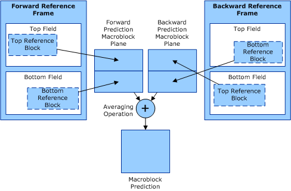

# Prediction Planes

## 

The following figure illustrates the conceptual macroblock prediction planes that exist prior to forming the final prediction.

MPEG-2 has two planes: forward and backward (bidirectional prediction), or same-parity and opposite-parity (dual-prime). The forward reference plane consists of blocks from the closest previous I or P picture. The backward reference plane consists of blocks from the closest future I or P picture.

In the cases of MPEG-1 and MPEG-2, prediction planes are combined by averaging between the corresponding block pixel values of the two prediction planes and rounding each up to the nearest integer. More sophisticated prediction schemes, such as H.263's overlapped block motion compensated (OBMC) prediction, have three planes.

 

 

