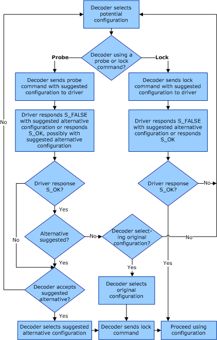

# Probing and Locking of Configurations

## 

The process for establishing the configuration for each DirectX VA function (a specific value of [bDXVA\_Func](bdxva-func-variable.md)) that needs a configuration (for example, compressed picture decoding, alpha-blending data loading, and alpha-blending combination) can be performed by:

1.  Probing (if needed) to determine whether a configuration is accepted by the accelerator.

2.  Locking in a specific configuration, if it is supported.

To determine if a specific configuration is supported, a probing command is sent to the accelerator for the particular *bDXVA\_Func* value to be probed, along with a configuration. In addition to the probing command, a configuration structure (for the value in *bDXVA\_Func*) is sent that describes the configuration being probed to determine whether the configuration is supported. The accelerator then returns a value of S\_OK or S\_FALSE, indicating whether the specified configuration is supported by the accelerator. The accelerator can also return a suggested alternative configuration.

To lock in a specific configuration, a locking command is sent to the accelerator for the particular *bDXVA\_Func* to be locked. Along with the locking command, a configuration structure (for the value in *bDXVA\_Func*) is sent that describes the configuration to be locked in, if the configuration is supported. The accelerator returns an S\_OK or S\_FALSE indicating whether the specified configuration is supported by the accelerator. If the return value is S\_OK, the specified configuration is locked in for use. If the return value is S\_FALSE, a suggested alternative configuration is returned.

The decoder may send a locking command without first sending a probing command for the specified configuration. If the accelerator returns an S\_OK in a probing command for a specific configuration, it returns an S\_OK to a locking command for that same configuration, unless otherwise noted. After a locking command has been sent and the accelerator returns S\_OK, the specified configuration is locked in and no additional probing or locking commands are sent by the decoder for the same value of *bDXVA\_Func*.

To ensure that all DirectX VA software decoders can operate with all DirectX VA accelerators, a [minimal interoperability configuration set](minimal-interoperability-configuration-sets.md) is defined as a set of configurations that must be supported by any decoder using a particular value for *bDXVA\_Func*. Every accelerator that indicates support for the *bDXVA\_Func* variable by exposing an associated video accelerator GUID must support at least one member of this interoperability configuration set. In some cases, an [additional encouraged configuration set](additional-encouraged-configuration-set.md) may also be defined.

The following figure shows the control flow of probing and locking commands sent by the decoder.

 

 

