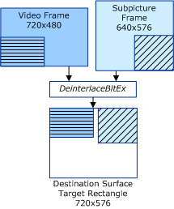
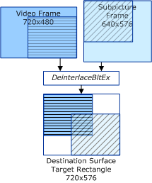

# Processing Subrectangles without Stretching

## 

**This section applies only to Windows Server 2003 with SP1 and later, and Windows XP with SP2 and later.**

In the following two examples, the destination surface is 720 x 576, the coordinates of the target rectangle are {0,0,720,576}, and the background color is solid black.

The first example shows a case in which the video stream and substream rectangles do not intersect.

In this example, the reference video stream and single substream are characterized by the following rectangular coordinates:

-   Video stream coordinates:
    -   Source surface: {0,0,720,480}
    -   Source subrectangle (**rcSrc**): {360,240,720,480}
    -   Destination subrectangle (**rcDest**): {0,0,360,240}
-   Substream coordinates:
    -   Source surface: {0,0,640,576}
    -   Source subrectangle (**rcSrc**): {0,288,320,576}
    -   Destination subrectangle (**rcDest**): {400,0,720,288}

In this example, the bottom-left corner of the video stream is displayed in the top-left corner of the destination surface, and the bottom-right corner of the substream is displayed in the top-right corner of the destination surface. The following diagram shows the output of the combination deinterlacing and substream compositing operation (the hashed regions indicate the subrectangles that are processed).

The second example shows a case in which the video stream and substream rectangles intersect.

In the second example, the source surface coordinates are the same as in the first example. In this example, the reference video stream and single substream are characterized by the following subrectangular coordinates:

-   Video stream subrectangular coordinates:
    -   Source subrectangle (**rcSrc**): {260,92,720,480}
    -   Destination subrectangle (**rcDest**): {0,0,460,388}
-   Substream subrectangular coordinates:
    -   Source subrectangle (**rcSrc**): {0,0,460,388}
    -   Destination subrectangle (**rcDest**): {260,188,720,576}

In this example, the lower-right corner of the video stream is displayed in the top-left corner of the destination surface, shifted on the X and Y axis by +100. The top-left corner of the substream is displayed in the lower-right corner of the destination surface, shifted on the X and Y axis by -100. The following diagram shows the output of the combination deinterlacing and substream compositing operation.

 

 

