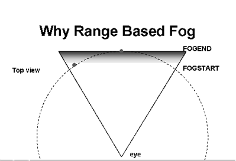

# Range Based Fog

## 

Fog can also be range-based. With normal z, or depth-based, fog an object can appear at the side of the view, but then as the viewer rotates toward it, the object disappears back into the fog because its z-value changes.

However, if fog is based on range instead of depth, it does not vary as the viewer rotates in place, as illustrated in the following figure.

Objects that are visible remain visible, regardless of the rotation. This is compelling for flight simulators, tank games, and other applications where it is undesirable to have objects disappearing and reappearing in the distance as the viewer rotates.

To set up fog to be range-based, D3DPRASTERCAPS\_FOGRANGE and the D3DRENDERSTATE\_RANGEFOGENABLE render state should be set. This render state works only with D3DVERTEX vertices. When the application specifies D3DLVERTEX or D3DTLVERTEX vertices, the F (fog) component of the RGBF fog value should already be corrected for range. The D3DVERTEX, D3DLVERTEX, and D3DTLVERTEX structures are defined in the Direct3D SDK documentation.

 

 

[Send comments about this topic to Microsoft](mailto:wsddocfb@microsoft.com?subject=Documentation%20feedback%20[display\display]:%20Range%20Based%20Fog%20%20RELEASE:%20%282/10/2017%29&body=%0A%0APRIVACY%20STATEMENT%0A%0AWe%20use%20your%20feedback%20to%20improve%20the%20documentation.%20We%20don't%20use%20your%20email%20address%20for%20any%20other%20purpose,%20and%20we'll%20remove%20your%20email%20address%20from%20our%20system%20after%20the%20issue%20that%20you're%20reporting%20is%20fixed.%20While%20we're%20working%20to%20fix%20this%20issue,%20we%20might%20send%20you%20an%20email%20message%20to%20ask%20for%20more%20info.%20Later,%20we%20might%20also%20send%20you%20an%20email%20message%20to%20let%20you%20know%20that%20we've%20addressed%20your%20feedback.%0A%0AFor%20more%20info%20about%20Microsoft's%20privacy%20policy,%20see%20http://privacy.microsoft.com/default.aspx. "Send comments about this topic to Microsoft")

