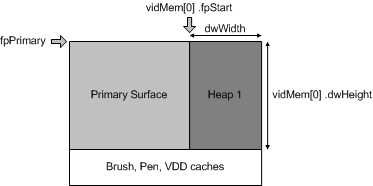

# Rectangular Memory Allocation


## <span id="ddk_rectangular_memory_allocation_gg"></span><span id="DDK_RECTANGULAR_MEMORY_ALLOCATION_GG"></span>


Display memory is considered *rectangular* whenever the pitch is fixed to a particular size for all the surfaces within a given heap.

With rectangular display memory, the layout is two-dimensional, with a finite width and height. This width is not always the same as the width of the screen. Because display memory must account for different display resolutions and design considerations, the actual horizontal width might span a much larger region than what is currently displayed on the monitor. As described in Memory Heap Allocation, the pitch value is based on the number of bytes to add to a column of display memory in order to reach the same column of display memory on the following scan line.

For example, even though a screen might be displaying 640 pixels across, if the rectangular display memory is 1280 bytes across with 8-bit pixels, then the pitch is 1280 (not 640). The pitch across a 1280-pixel horizontal stretch of memory with 16-bit pixels is 2560. The pitch for 32-bit pixels is quadruple what it is for 8-bit pixels, so if the display is 1280 32-bit pixels across, the pitch is 5120.

Rectangular memory is generally used less efficiently by applications than linear memory because small fragments might remain after an application stores a large surface. Applications might be unable to store other surfaces in the remaining space even though the number of available bytes in the remaining space is greater than any new surfaces require. Applications can access this space on a first-come, first-served basis and can only store small surfaces that fit in the remaining fragments.

A rectangular heap can be as large as a contiguous region of available memory, but it cannot be L-shaped because its size is measured in X by Y coordinates. If the rectangular heap is not tall enough and wide enough to hold a primary surface, then it cannot be a back buffer. If the pitch of the primary surface is not equal to the display width of the primary surface, a rectangular block of memory to the conceptual right of the display is left over (Heap 1 in the following figure). This block is as wide as the pitch minus the width of the display. Leftover memory to the right can also happen in linear cards if the existing display driver assumes a fixed pitch. Rectangular or linear memory may also be left over below the primary surface (but not in this example).

The following diagram illustrates rectangular memory allocation.



In the preceding figure, the starting point (indicated by the **fpStart** member of the [**VIDEOMEMORY**](https://msdn.microsoft.com/library/windows/hardware/ff570171) structure) of the rectangular heap is calculated by adding the width of the primary surface to the starting address of the primary surface. The width and height are also calculated to give the dimensions of the rectangular heap. If any memory remains below the Windows caches, a heap could be created there.

The following pseudocode shows how a [**VIDEOMEMORY**](https://msdn.microsoft.com/library/windows/hardware/ff570171) structure is set up for rectangular memory:

```cpp
/*
 * video memory pool usage
 */
static VIDEOMEMORY vidMem [] = {
    { VIDMEM_ISRECTANGULAR, 0x00000000, 0x00000000,
           { 0 }, { 0 } },
};
```

The only difference between the code for rectangular memory and its linear counterpart is the VIDMEM\_ISRECTANGULAR flag, which indicates that this is rectangular memory

The following pseudocode shows how rectangular memory heaps are set up:

```cpp
/*
 * video memory pool information
 */

/* set up the pointer to the first available video memory after the primary surface */
    ddHALInfo.vmiData.pvmList      = vidMem;

/* this is set to zero because there may only be one heap depending on the pitch 
    ddHALInfo.vmiData.dwNumHeaps      = 0; 


/*
 *  Compute the Pitch here ...
 */


    vidMem[0].fpStart  = ddHALInfo.vmiData.fpPrimary + dwPrimarySurfaceWidth;
    vidMem[0].dwWidth  = dwPitch - dwPrimarySurfaceWidth;
    vidMem[0].dwHeight = dwPrimarySurfaceHeight;
    vidMem[0].ddsCaps.dwCaps = 0;      // surface has no use restrictions
```

The memory heap starting point is set to the starting address of the primary surface plus the width of the primary surface. The width is determined by the pitch minus the width of the primary surface. The height is set to the height of the primary surface. The surface capabilities are set to zero to indicate that there are no imposed surface use restrictions (therefore, the surface can be used for sprites or any other type of surface).

 

 


