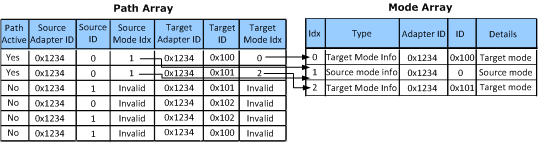

# Relationship of Mode Information to Path Information

This section applies only to Windows 7 and later, and Windows Server 2008 R2 and later versions of Windows operating system.

The [**QueryDisplayConfig**](https://msdn.microsoft.com/library/windows/hardware/ff569215) CCD function always returns path information and source and target mode information for a particular display configuration. The following figure shows an example of how the source and target mode information relates to the path information. In this example, the QDC\_ALL\_PATHS flag was passed to the *Flags* parameter in the call to **QueryDisplayConfig**.

 

 

[Send comments about this topic to Microsoft](mailto:wsddocfb@microsoft.com?subject=Documentation%20feedback%20[display\display]:%20Relationship%20of%20Mode%20Information%20to%20Path%20Information%20%20RELEASE:%20%282/10/2017%29&body=%0A%0APRIVACY%20STATEMENT%0A%0AWe%20use%20your%20feedback%20to%20improve%20the%20documentation.%20We%20don't%20use%20your%20email%20address%20for%20any%20other%20purpose,%20and%20we'll%20remove%20your%20email%20address%20from%20our%20system%20after%20the%20issue%20that%20you're%20reporting%20is%20fixed.%20While%20we're%20working%20to%20fix%20this%20issue,%20we%20might%20send%20you%20an%20email%20message%20to%20ask%20for%20more%20info.%20Later,%20we%20might%20also%20send%20you%20an%20email%20message%20to%20let%20you%20know%20that%20we've%20addressed%20your%20feedback.%0A%0AFor%20more%20info%20about%20Microsoft's%20privacy%20policy,%20see%20http://privacy.microsoft.com/default.aspx. "Send comments about this topic to Microsoft")

