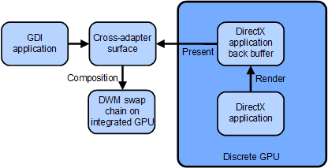
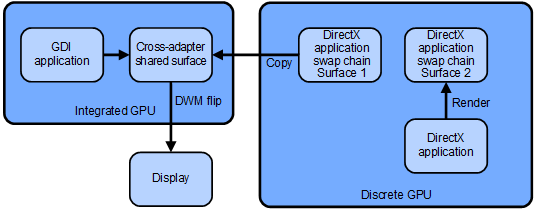

# Rendering on a discrete GPU using cross-adapter resources

Starting in Windows 8.1, a [discrete GPU](using-cross-adapter-resources-in-a-hybrid-system.md) uses a [cross-adapter resource](using-cross-adapter-resources-in-a-hybrid-system.md) as:

-   A destination for bit-block transfer (bitblt) or present operations, but without stretching or color conversion.
-   The resource that the operating system requests the user-mode display driver to perform the bitblt or present operation to and from.

An [integrated GPU](using-cross-adapter-resources-in-a-hybrid-system.md) uses a [cross-adapter resource](using-cross-adapter-resources-in-a-hybrid-system.md) as:

-   A texture during composition by the Desktop Window Manager (DWM).
-   A render target for [GDI hardware acceleration](gdi-hardware-acceleration.md).
-   A display primary.
-   Not as a render target for 3-D operations.

The following sections describe the architecture and processes involved in three possible scenarios where an application renders on a discrete GPU within a hybrid system.

## Redirected bitblt presentation model

1.  A cross-adapter resource for a top-level window is created in kernel mode as a standard allocation on the integrated GPU.
2.  When this resource is opened on the discrete GPU, the Microsoft DirectX graphics kernel subsystem (Dxgkrnl.sys) calls the [*DxgkDdiGetStandardAllocationDriverData*](https://msdn.microsoft.com/library/windows/hardware/ff559673) function and creates a new resource on the discrete GPU using the same backing store (mass-storage device) as for the integrated GPU.
3.  The Microsoft Direct3D runtime instructs the discrete GPU's user-mode display driver to open the cross-adapter resource using private driver data.
4.  A DirectX application renders on the discrete GPU to a back-buffer resource. See the "Render" operation in the figure.
5.  When a DirectX application calls a **Present** method, the Direct3D runtime calls the [*PresentDXGI*](https://msdn.microsoft.com/library/windows/hardware/ff569179) (or *pfnPresent*) function of the discrete GPU's user-mode driver to copy the back buffer to the cross-adapter resource. See the "Present" operation in the figure.
6.  When a Windows Graphics Device Interface (GDI) application renders to a top-level window, the DirectX graphics kernel subsystem calls the [*DxgkDdiRenderKm*](https://msdn.microsoft.com/library/windows/hardware/ff559800) function of the integrated GPU's display miniport driver and indicates that the cross-adapter resource is a render target. See the connection between the GDI application and the cross-adapter surface in the figure.
7.  The DWM process opens the cross-adapter resource in the integrated GPU and uses it during composition as a source texture. See the "Composition" operation in the figure.

## Direct flip presentation model

1.  The Direct3D runtime instructs the discrete GPU's user-mode display driver to create a cross-adapter resource for each swap chain surface.
2.  On the discrete GPU, the Direct3D runtime might set the **Primary** and **VidPnSourceId** members of the [**D3DDDI\_ALLOCATIONINFO**](https://msdn.microsoft.com/library/windows/hardware/ff544364) structure if the Direct Flip mode is available. These member values should be passed when the [*pfnAllocateCb*](https://msdn.microsoft.com/library/windows/hardware/ff568893) function is called.
3.  The Direct3D runtime instructs the integrated GPU's user-mode display driver to open a cross-adapter resource that is to be managed by the DWM.
4.  An application renders on the discrete GPU using the render target texture as a destination. See the "Render" operation in the figure.
5.  When an application calls a **Present** method, the Direct3D runtime calls the [*BltDXGI*](https://msdn.microsoft.com/library/windows/hardware/ff538252) (or *pfnBlt*) function of the discrete GPU's user-mode driver to perform a copy to the cross-adapter resource. The runtime then calls the [*PresentDXGI*](https://msdn.microsoft.com/library/windows/hardware/ff569179) (or *pfnPresent*) function of the discrete GPU's user-mode driver, with source set to the cross-adapter resource and the destination allocation set to **NULL**. See the "Copy" operation in the figure.
6.  The DWM performs its composition using the resource from the integrated GPU. If a Direct Flip operation is needed ([**DXGK\_SEGMENTFLAGS**](https://msdn.microsoft.com/library/windows/hardware/ff562039).**DirectFlip** is set), DWM instructs the integrated GPU's display miniport driver to perform a flip operation from one cross-adapter allocation to another. See the "DWM flip" operation in the figure.

## Full-screen model

1.  The Direct3D runtime instructs the integrated GPU's user-mode display driver to create a cross-adapter shared primary allocation for each swap chain surface.
2.  The Direct3D runtime instructs the discrete GPU's user-mode display driver to open the cross-adapter resources.
3.  An application renders on the discrete GPU using the render target texture as the destination.
4.  When the application calls a **Present** method, the Direct3D runtime instructs the discrete GPU's user-mode display driver to perform a copy to a cross-adapter resource.
5.  The integrated GPU's user-mode display driver and display miniport driver are instructed to flip to this cross-adapter resource.

 

 

