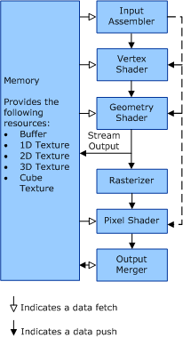

# Rendering Pipeline

Graphics hardware that supports Direct3D version 10 can be designed with shared programmable shader cores. The graphics processing unit (GPU) can program shader cores that can be scheduled across the functional blocks that make up the rendering pipeline. This load balancing means that hardware developers are not required to use every shader type, but only the ones that are required to perform rendering. This load balancing can then free resources for shader types that are active. The following figure shows the functional blocks of the rendering pipeline. The sections that follow the figure describe the blocks in more detail.

###  Input Assembler

The [input assembler](input-assembler-stage.md) stage uses fixed function operations to read vertices out of memory. The input assembler then forms geometry primitives and creates pipeline work items. Auto-generated vertex identifiers, instance identifiers (available to the vertex shader), and primitive identifiers (available to the geometry shader or pixel shader) enable identifier-specific processing. The dotted line in the figure shows the flow of identifier-specific processing.

###  Vertex Shader

The [vertex shader](vertex-shader-stage.md) stage takes one vertex as input and outputs one vertex.

###  Geometry Shader

The [geometry shader](geometry-shader-stage.md) stage takes one primitive as input and outputs zero, one, or multiple primitives. Output primitives can contain more data than possible without the geometry shader. The total amount of output data per operation is (vertex size x vertex count).

###  Stream Output

The [stream output](stream-output-stage.md) stage concatenates (streams out) primitives that reach the output of the geometry shader to output buffers. The stream output is associated with the geometry shader and both are programmed together.

###  Rasterizer

The [rasterizer](rasterizer-block.md) stage clips (including custom clip boundaries) primitives, performs perspective divide on primitives, implements viewport and scissor selection, performs render-target selection, and performs primitive setup.

###  Pixel Shader

The [pixel shader](pixel-shader-stage.md) stage takes one pixel as input and outputs one pixel at the same position or no pixel. The pixel shader cannot read current render targets.

###  Output Merger

The [output merger](output-merger-stage.md) stage performs fixed function render-target blend, depth, and stencil operations.

 

 

