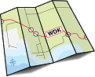

# Roadmap for Developing Drivers for the Windows 2000 Display Driver Model (XDDM)

The Windows 2000 display driver model (XDDM) requires that a graphics hardware vendor supply a paired display driver and video miniport driver. Both of these drivers for display run in kernel mode.

**Note**  XDDM and VGA drivers will not compile on Windows 8 and later versions. If display hardware is attached to a Windows 8 computer without a driver that is certified to support Windows Display Driver Model (WDDM) 1.2 or later, the system defaults to running the Microsoft Basic Display Driver.

 

To create XDDM display drivers on Windows 7 and earlier versions of Windows, download and install the Windows 7 Windows Driver Kit (WDK) (build 7600), open the WDK Help documentation from the **Start** menu, and follow the recommended steps in the topic, [Roadmap for Developing Drivers for the Windows Display Driver Model (WDDM)](roadmap-for-developing-drivers-for-the-windows-vista-display-driver-mo.md).

 

 

