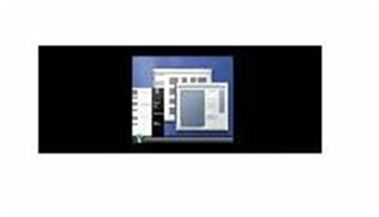
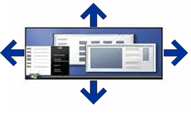
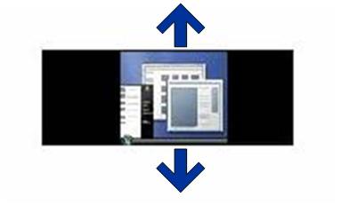

# Scaling the Desktop Image

This section applies only to Windows 7 and later, and Windows Server 2008 R2 and later versions of the Windows operating system.

A caller can use the [**SetDisplayConfig**](https://msdn.microsoft.com/library/windows/hardware/ff569533) CCD function to scale the desktop image to the monitor. If the desktop and monitor use the same resolution, **SetDisplayConfig** is not required to scale the desktop image to the monitor. This **SetDisplayConfig** operation is known as identify scaling. If the desktop and monitor resolution are different, **SetDisplayConfig** applies one of the following types of scaling. The monitor resolution is defined by the [**DISPLAYCONFIG\_TARGET\_MODE**](https://msdn.microsoft.com/library/windows/hardware/ff553993) structure.

**Centered**  
Centered scaling is a mode in which the desktop is displayed on the monitor without any scaling at all. When [**SetDisplayConfig**](https://msdn.microsoft.com/library/windows/hardware/ff569533) applies centered scaling, black bands might be visible above and below the desktop. The following figure shows centered scaling.

**Stretched**  
Stretched scaling is a mode in which the desktop is horizontally and vertically stretched on the monitor to ensure that the entire display is used. When [**SetDisplayConfig**](https://msdn.microsoft.com/library/windows/hardware/ff569533) applies stretched scaling, no black bands are visible above and below the desktop. However, the desktop might appear distorted. The following figure shows stretched scaling.

**Aspect-Ratio-Preserving Stretched**  
Aspect-ratio-preserving stretched scaling is a mode in which the desktop is stretched horizontally and vertically as much as possible while maintaining the aspect ratio. When [**SetDisplayConfig**](https://msdn.microsoft.com/library/windows/hardware/ff569533) applies aspect-ratio-preserving stretched scaling, black bands might be visible either *above and below* or *left and right of* the desktop. However, black bands cannot be visible both *above and below* and *left and right of* the desktop. Because users are expected to prefer this type of scaling, **SetDisplayConfig** applies this type of scaling as the default. The following figure shows aspect-ratio-preserving stretched scaling.

Scaling depends on the source and target modes that are used for a path. In addition, the caller can call [**SetDisplayConfig**](https://msdn.microsoft.com/library/windows/hardware/ff569533) without specifying the target mode information (that is, setting the *modeInfoArray* parameter is optional and can be set to **NULL**). Therefore, the caller cannot typically predict if **SetDisplayConfig** must perform any scaling. Furthermore, no API exists to get the full list of scaling types that the graphics adapter supports. The [**EnumDisplaySettings**](https://msdn.microsoft.com/library/windows/desktop/dd162611) Win32 function (described in the Windows SDK documentation) returns DMDFO\_DEFAULT in the **dmDisplayFixedOutput** member of the **DEVMODE** structure that the *lpDevMode* parameter points to when the caller requests the new Windows 7 scaling types.

The scaling that a caller passes to [**SetDisplayConfig**](https://msdn.microsoft.com/library/windows/hardware/ff569533) is a scaling intent rather than an explicit request to perform a scaling operation. If scaling is required (for example, source and target resolutions differ), **SetDisplayConfig** uses the scaling that the caller supplies. If the supplied scaling is not supported, **SetDisplayConfig** uses the graphics adapter's default scaling. When the source and target resolutions that the caller passes to **SetDisplayConfig** are the same, **SetDisplayConfig** always sets identify scaling.

The following table shows the different [**SetDisplayConfig**](https://msdn.microsoft.com/library/windows/hardware/ff569533) scaling requests.

<table>
<colgroup>
<col width="50%" />
<col width="50%" />
</colgroup>
<thead>
<tr class="header">
<th align="left">Symbol in table</th>
<th align="left">Meaning</th>
</tr>
</thead>
<tbody>
<tr class="odd">
<td align="left">
DC_IDENTITY
</td>
<td align="left">
DISPLAYCONFIG_SCALING_IDENTITY
</td>
</tr>
<tr class="even">
<td align="left">
DC_CENTERED
</td>
<td align="left">
DISPLAYCONFIG_SCALING_CENTERED
</td>
</tr>
<tr class="odd">
<td align="left">
DC_STRETCHED
</td>
<td align="left">
DISPLAYCONFIG_SCALING_STRETCHED
</td>
</tr>
<tr class="even">
<td align="left">
DC_ASPECTRATIOCENTEREDMAX
</td>
<td align="left">
DISPLAYCONFIG_SCALING_ASPECTRATIOCENTEREDMAX
</td>
</tr>
<tr class="odd">
<td align="left">
DC_CUSTOM
</td>
<td align="left">
DISPLAYCONFIG_SCALING_CUSTOM
</td>
</tr>
<tr class="even">
<td align="left">
DC_PREFERRED
</td>
<td align="left">
DISPLAYCONFIG_SCALING_PREFERRED
</td>
</tr>
<tr class="odd">
<td align="left">
AdapterDefault
</td>
<td align="left">
The adapter default scaling value

Currently, on tablet systems, the default is stretched. On non-tablet systems with graphics adapters that support the <a href="windows-vista-display-driver-model-design-guide.md" data-raw-source="[Windows Display Driver Model (WDDM)](windows-vista-display-driver-model-design-guide.md)">Windows Display Driver Model (WDDM)</a>, the default is defined by the driver. On non-tablet systems with graphics adapters that support the Windows Display Driver Model (WDDM) with <a href="https://msdn.microsoft.com/library/windows/hardware/ff557343" data-raw-source="[features new for Windows 7](https://msdn.microsoft.com/library/windows/hardware/ff557343)">features new for Windows 7</a>, the default is DC_ASPECTRATIOCENTEREDMAX.
</td>
</tr>
<tr class="even">
<td align="left">
DatabaseValue
</td>
<td align="left">
The scaling value from the database for the current connected monitors
</td>
</tr>
</tbody>
</table>

 

The following table shows the values that are saved in the database and the values that are actually set.

Scaling flag passed to SetDisplayConfig
The resultant source mode and target mode have same resolution
The resultant source mode and target mode have different resolution
**Set**

**Store**

**Set**

**Store**

DC\_IDENTITY current config not in Db

DC\_IDENTITY

AdapterDefault

AdapterDefault

AdapterDefault

DC\_IDENTITY current config in Db

DC\_IDENTITY

DatabaseValue

DatabaseValue

DatabaseValue

DC\_CENTERED

DC\_IDENTITY

DC\_CENTERED

DC\_CENTERED

DC\_CENTERED

DC\_STRETCHED

DC\_IDENTITY

DC\_STRETCHED

DC\_STRETCHED

DC\_STRETCHED

DC\_ASPECTRATIOCENTEREDMAX on WDDM with Windows 7 features driver

DC\_IDENTITY

DC\_ASPRATIOMAX

DC\_ASPRATIOMAX

DC\_ASPRATIOMAX

DC\_ASPECTRATIOCENTEREDMAX on WDDM driver

DC\_IDENTITY

AdapterDefault

AdapterDefault

AdapterDefault

DC\_CUSTOM on WDDM with Windows 7 features driver that does support custom scaling on the path

DC\_CUSTOM

DC\_CUSTOM

DC\_CUSTOM

DC\_CUSTOM

DC\_CUSTOM on WDDM with Windows 7 features driver that does not support custom scaling on the path

DC\_IDENTITY

AdapterDefault

AdapterDefault

AdapterDefault

DC\_CUSTOM on WDDM driver

DC\_IDENTITY

AdapterDefault

AdapterDefault

AdapterDefault

DC\_PREFERRED current config not in Db

DC\_IDENTITY

AdapterDefault

AdapterDefault

AdapterDefault

DC\_PREFERRED current config in Db

DC\_IDENTITY

DatabaseValue

DatabaseValue

DatabaseValue

 

The following table shows how the scaling that a caller can pass to the legacy [**ChangeDisplaySettingsEx**](https://msdn.microsoft.com/library/windows/desktop/dd183413)API (described in the Windows SDK documentation) maps to the scaling set.

Scaling flag passed to ChangeDisplaySettingsEx
The resultant source mode and target mode have same resolution
The resultant source mode and target mode have different resolution
**Set**

**Store**

**Set**

**Store**

DMDFO\_DEFAULT with current config not in CCD database

DC\_IDENTITY

AdapterDefault

AdapterDefault

AdapterDefault

DMDFO\_DEFAULT with current config in CCD database

DC\_IDENTITY

DatabaseValue

DatabaseValue

DatabaseValue

DMDFO\_STRETCH

DC\_IDENTITY

DC\_STRETCHED

DC\_STRETCHED

DC\_STRETCHED

DMDFO\_CENTER

DC\_IDENTITY

DC\_CENTERED

DC\_CENTERED

DC\_CENTERED

DM\_DISPLAYFIXEDOUTPUT not set, current config not in CCD database

DC\_IDENTITY

AdapterDefault

AdapterDefault

AdapterDefault

DM\_DISPLAYFIXEDOUTPUT not set, current config in CCD database

DC\_IDENTITY

DatabaseValue

DatabaseValue

DatabaseValue

 

The following table shows how display configuration scaling is translated and returned from [**EnumDisplaySettings**](https://msdn.microsoft.com/library/windows/desktop/dd162611).

<table>
<colgroup>
<col width="50%" />
<col width="50%" />
</colgroup>
<thead>
<tr class="header">
<th align="left">Current active scaling</th>
<th align="left">GDI scaling values returned from legacy EnumDIsplaySettings(ENUM_CURRENT_SETTINGS)</th>
</tr>
</thead>
<tbody>
<tr class="odd">
<td align="left">
DC_IDENTITY
</td>
<td align="left">
DMDFO_DEFAULT
</td>
</tr>
<tr class="even">
<td align="left">
DC_CENTERED
</td>
<td align="left">
DMDFO_CENTER
</td>
</tr>
<tr class="odd">
<td align="left">
DC_STRETCHED
</td>
<td align="left">
DMDFO_STRETCH
</td>
</tr>
<tr class="even">
<td align="left">
DC_ASPRATIOMAX
</td>
<td align="left">
DMDFO_DEFAULT
</td>
</tr>
<tr class="odd">
<td align="left">
DC_CUSTOM
</td>
<td align="left">
DMDFO_DEFAULT
</td>
</tr>
<tr class="even">
<td align="left">
DC_PREFERRED
</td>
<td align="left">
DMDFO_DEFAULT
</td>
</tr>
</tbody>
</table>

 

### DirectX Games and Scaling

Microsoft DirectX 9L and earlier runtimes require that applications always call the [**ChangeDisplaySettingsEx**](https://msdn.microsoft.com/library/windows/desktop/dd183413) function without DM\_DISPLAYFIXEDOUTPUT set in the **dmFields** member of the DEVMODE structure that the *lpDevMode* parameter points to. DirectX 10 and later runtimes allow applications to choose the scaling that those applications pass to **ChangeDisplaySettingsEx**. The following table shows the mapping of scaling values to scaling flags that are passed to **ChangeDisplaySettingsEx**.

<table>
<colgroup>
<col width="50%" />
<col width="50%" />
</colgroup>
<thead>
<tr class="header">
<th align="left">DXGI flip chain scaling value</th>
<th align="left">Scaling flags that are passed to ChangeDisplaySettingsEx</th>
</tr>
</thead>
<tbody>
<tr class="odd">
<td align="left">
DXGI_MODE_SCALING_UNSPECIFIED
</td>
<td align="left">
DMDFO_DEFAULT, DMDFO_CENTER, or DMDFO_STRETCH. The scaling that applications use depends on several factors, which include the current desktop scaling and the mode list that the driver exposes.
</td>
</tr>
<tr class="even">
<td align="left">
DXGI_MODE_SCALING_CENTERED
</td>
<td align="left">
DMDFO_CENTER
</td>
</tr>
<tr class="odd">
<td align="left">
DXGI_MODE_SCALING_STRETCHED
</td>
<td align="left">
DMDFO_STRETCH
</td>
</tr>
</tbody>
</table>

 

By using this information in combination with the preceding scaling tables, you can determine the expected scaling from a DirectX application.

 

 

