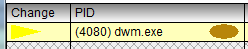

# Segment Viewer Window

The Segment Viewer displays information about the memory layout at a particular instant of time for a particular memory segment. The Segment Viewer window can be launched by either pressing the *Segment Viewer* button after bringing up the Object Details of a Standard Dma Packet in the GPU Hardware Queue or by double-clicking the segment in the *Object Viewer Dialog Object* tree control. 

A typical screen shot of the Segment Viewer window looks like the following. 

 

The area above the virtual scroll bar is a fixed area that is divided into four different sections. 

The top section consists of the adapter handle value, the Segment index and attributes, the segment size, and the commit limit values. 

The second section is the time location and memory event navigation buttons (arrows). The time value is the instant in the file that represents the information displayed. The buttons with the left- and right-pointing arrows reset the window to the previous or next memory event for that segment. 

The third section is a summary section that provides a quick overview of the Allocated, Marked, and Free memory space at the currently viewed moment in time. 

The last fixed area section is a continuation of the summary information. It shows the size of the largest free block and the largest free/marked block. 

The rest of the window displays information about individual memory allocations on each row. 

## Memory View Columns

The Default form of the Segment Viewer's memory rows is 14 columns wide. The main diagram (the preceding graphic) shows only nine of them. A horizontal scroll bar is provided for getting to the rightmost items.

:::row:::
:::column span="1":::
**Term**
:::column-end:::
:::column span="2":::
**Description**
:::column-end:::
:::row-end:::
:::row:::
:::column span="1":::
Change
:::column-end:::
:::column span="2":::
This column holds either text or a graphic that indicates where the most recent memory operation occurred. If the current view time is next to a memory operation where memory is marked, the column will read marked. If the memory has been discarded, the column will show a left-pointing red triangle. If the item is paged in, the graphic will be a right-pointing yellow triangle, as in the following diagram.

:::column-end:::
:::row-end:::
:::row:::
:::column span="1":::
PID
:::column-end:::
:::column span="2":::
This column displays the Process ID followed by the process name followed by the Context CPU Queue assigned color.
:::column-end:::
:::row-end:::
:::row:::
:::column span="1":::
Dxg Adapter Allocation
:::column-end:::
:::column span="2":::
This column displays the Dxgkernel Video Adapter Allocation memory address value. 
:::column-end:::
:::row-end:::
:::row:::
:::column span="1":::
Vid MM Global Allocation
:::column-end:::
:::column span="2":::
This column displays the Video Memory Manager Global Allocation memory address value.
:::column-end:::
:::row-end:::
:::row:::
:::column span="1":::
Placement
:::column-end:::
:::column span="2":::
This column holds the placement value.
:::column-end:::
:::row-end:::
:::row:::
:::column span="1":::
Preference
:::column-end:::
:::column span="2":::
This column holds the memory placement preferences.
:::column-end:::
:::row-end:::
:::row:::
:::column span="1":::
Priority
:::column-end:::
:::column span="2":::
This column holds the Priority flags.
:::column-end:::
:::row-end:::
:::row:::
:::column span="1":::
Segment Offset
:::column-end:::
:::column span="2":::
This column displays the memory locations offset into the segment.
:::column-end:::
:::row-end:::
:::row:::
:::column span="1":::
Size
:::column-end:::
:::column span="2":::
This column displays the size of the memory.
:::column-end:::
:::row-end:::
:::row:::
:::column span="1":::
Width
:::column-end:::
:::column span="2":::
This column displays the memory's width.
:::column-end:::
:::row-end:::
:::row:::
:::column span="1":::
Height
:::column-end:::
:::column span="2":::
This column displays the memory's height.
:::column-end:::
:::row-end:::
:::row:::
:::column span="1":::
Format
:::column-end:::
:::column span="2":::
This column displays the format of the memory.
:::column-end:::
:::row-end:::
:::row:::
:::column span="1":::
Locked
:::column-end:::
:::column span="2":::
This column indicates whether the memory block is locked or not.
:::column-end:::
:::row-end:::
:::row:::
:::column span="1":::
Flags
:::column-end:::
:::column span="2":::
This column displays the flags of the memory allocation as English words rather than hexadecimal bits.
:::column-end:::
:::row-end:::