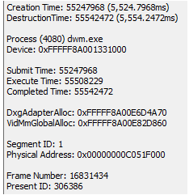

# Selections in the Flip Queue

## Flip Queue Entry

The Flip Queue Entry has data of the following form.

Creation Time: The start of the object lifetime.  
Destruction Time: The end of the object lifetime.  
Process: The owning process ID and name.  
Device: The handle of the owning device.  
Submit Time: The time when Present was submitted.  
Execute Time: The time when Present was completed.  
Completed Time: The time when the information was displayed on the monitor.  
DxgAdapterAlloc: The memory address on the adapter.  
Segment ID: The segment that memory is currently in.  
Physical Address: The address of memory for flip.  
Frame Number: The frame that this flip relates to.  
Present ID: A unique number that identifies the entry.  
