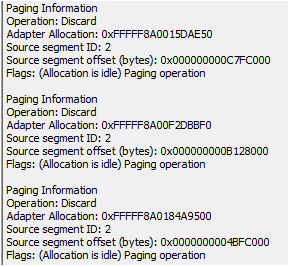

# Selections in the GPU Hardware Queue  

## Standard DMA Packet

The following diagram is a screen shot of the **Object Details** dialog when a Dma Packet is selected.  

## Header  

All the objects displayed by the **Object Details** dialog have a standard header that looks like the following.

Creation Time: The time at which the object was created.  
Process: The owning process ID and name.  
Context: The handle of the owning context. If selected, will be found when pressing the **Locate Object** button. 

## Parts  

All of the standard DMA Packets have a body that looks like the following.  

Type: The first line is the type of object displayed.  
Submission Fence: All DMA packets submitted to the hardware have a fence ID. Generally, these are ordered numbers that are always increasing in value.  
SubmittedToHardwareQueueTime: The time when the packet was placed down on the hardware.  
GpuStartProcessingTime: The time when the GPU started processing the packet.  
CompletedByISRTime: The time when the GPU says it is done processing the packet.  
CompletedByDPCTime: The time when the video kernel finishes with the DMA Packet (handled in a DPC).  
Time in HW Queue: The total time, from time submitted to ISR Completion.  
Execution time: The amount of GPU processing time (subset of Time In HW Queue).  
Packet Status: Either Preempted or Completed.  
Queue Packet Dma Size: The size of the Queue Packet.  
Queue Packet: The number of Allocations references, which is a count that varies.  
Queue Packet: The number of patch locations, which are locations in the Queue Packet that must be fixed before processing.

## Memory  

All of the memory references take the following form.

The first column is the address of the device-specific memory block. The second column is the global memory allocation as seen by the adapter. The third column is the memory read or write attribute. The fourth column is the memory placement attribute. The fifth column denotes either aperture or system memory. The sixth and seventh columns represent the size. 

Note that if the device-specific memory address or the global memory address is selected, the **Locate Object** button will look that address up in the Object viewer. 

## Present Dma Packet  

The only difference between the GPU Hardware Queue Standard Dma Packet and the GPU Hardware Queue Present Packet is the type field. Unlike the Standard Dma Packet, the Present packet reads "Present packet."

## Paging Dma Packet  

The Paging Dma Packet is scheduled by the video kernel during memory management operations. If some memory needs to be moved or prepared for some coming operation, you will find these packets in the GPU Hardware Queue. 

The only real difference between these objects and the standard Dma Packets is shown with the following diagram. 

Operation: This can be a number of types, but typically is Discard or Fill Memory.  
Adapter Allocation: The address of memory.  
Source segment ID: The number that represents the memory segment.  
Source segment offset: The offset into the segment.  
Flags: If there are any used. 

## Preemption Dma Packet  

The Preemption Dma Packet is created by the kernel video scheduler when it needs to preempt some work that the GPU is performing. This typically happens if some process is consuming a lot of the GPU and some other high-priority rendering must occur. 

The Preemption Dma Packet takes the form of the Standard Dma Packet and has no Allocation references.
