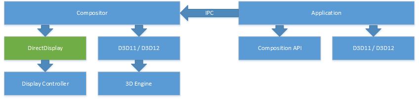
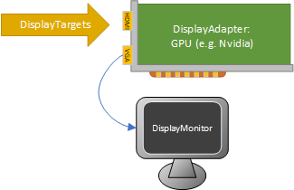

---
title: Building a custom compositor app for head-mounted and specialized monitors
description: Building a custom compositor app for head-mounted and specialized monitors
keywords:
- display devices WDK
- monitor drivers WDK
- display drivers WDK , monitor drivers
- monitors
- head-mounted display
- HMD
- virtual reality
ms.date: 7/8/2020
ms.topic: article
ms.prod: windows-hardware
ms.technology: windows-devices
ms.localizationpriority: medium
---

# Building a custom compositor app for head-mounted and specialized monitors

The [Windows.Devices.Display.Core API](/uwp/api/windows.devices.display.core) is a low-level Windows Runtime (WinRT) API for third-party compositors and internal Windows components that sits below all other public APIs for enumerating, configuring and driving display adapters and display targets in Windows. The idea is to treat the display controller as a separate “engine”, analogous to the 3D engine and the media engine on the GPU. This API is responsible for:

* Answering queries about the display hardware (such as capabilities and possible display modes)
* Answering queries about the current configuration
* Setting properties on the display hardware (such as display modes)
* Configuring the display hardware (the resolution of the connected monitors, their wire format, etc)
* Allocating and scanning out special GPU surfaces known as “primaries”
* Allowing interop between Direct3D and the Windows.Devices.Display.Core APIs (e.g. sharing surfaces, fences)

It’s worth calling out what Windows.Devices.Display.Core is *not*:

* It is not an API used by games or apps for displaying content in a window. Apps still use [DXGI](/windows/win32/direct3ddxgi/d3d10-graphics-programming-guide-dxgi), [XAML](/windows/uwp/xaml-platform/xaml-overview), [composition APIs](/windows/apps/desktop/modernize/visual-layer-in-desktop-apps), [GDI](/windows/win32/gdi/windows-gdi), etc.
* It is not an API used by games or apps for displaying content fullscreen. Apps still use DXGI, Win32 apps still use HWNDs, and UWP apps always display content in a CoreWindow.

This API is for compositor apps driving specialized hardware only.



## Scenarios for building custom compositors

The Windows.Devices.Display.Core APIs are appropriate to use in the following scenarios:

* Virtual and augmented reality displays that require a proprietary compositor to directly drive the display controller and receive fine-grained control over timing and mode configuration separate from the Windows desktop.
* Specialized display hardware scenarios that require dedicated control over a display in a commercial setting. For example, in cases where the Windows desktop cannot render correctly on such a display because of hardware warping, greyscale displays, etc.
* Specialized "appliance" scenarios where a monitor may be fully dedicated to an app without any interference from the Windows desktop experience over a long period of time (e.g. a dedicated video monitor).

The API accomplishes this by:

* Providing fine-grained control over the full display mode information, including wire format, HDR, etc.
* Using fences to synchronize presentation allows a compositor to chain presentation across processes or sub-components with almost zero performance overhead.
* Improving the ability to query and configure the underlying Video Present Network (VidPN) to allow both system components and low level composition components to do more complex operations in a less error-prone and more extensible way.

Note that this API is only for a *very specific set* of third-party use-cases with specialized hardware. Its use is highly restricted to hardware that declares itself needing the functionality of this API. Therefore, a certain degree of familiarity with hardware concepts is expected from developers, and partners should contact Microsoft directly to help with issues.

## Hardware and software requirements

Third-party custom compositors may only acquire displays that have been pre-designated as head-mounted displays (HMDs) or "specialized" displays. This designation must be provided in one of two ways:

* **EDID Extension** - Custom display devices designed for permanent use as HMDs, X-ray monitors, video walls, or other specialized scenarios should implement the [Microsoft EDID extension for head-mounted and specialized displays](specialized-monitors-edid-extension.md).
* **User Override** - For custom hardware installations using off-the-shelf monitors, Windows provides a UI toggle for designating monitors as "specialized".

Displays may *not* be designated as HMDs or specialized displays by overriding the EDID in software.

> [!NOTE]
> Specialized displays are only available starting in Windows 10, version 2004, and require Windows 10 Enterprise, Windows 10 Pro for Workstations, or Windows 10 IoT Enterprise.

## Roadmap for implementing a custom compositor

Implementing a custom compositor can be broken into several stages:

> [!div class="checklist"]
>
> * Enumerate and discover associated HMDs or specialized displays
> * Acquire ownership of selected displays
> * Configure modes for all selected displays
> * Create resources for presenting frames to the displays
> * Render content and schedule frame presentation

## Comparison of display-related APIs

| API | Purpose and Target Audience |
|-----|-----------------------------|
| [**DisplayInformation**](/uwp/api/windows.graphics.display.displayinformation) | Used to retrieve rendering and layout properties for a CoreWindow. |
| [**HdmiDisplayInformation**](/uwp/api/windows.graphics.display.core.hdmidisplayinformation) | Xbox-only API for enumerating and setting a constrained set of modes. Highly specialized for Xbox media app scenarios. |
| [**DisplayMonitor**](/uwp/api/windows.devices.display.displaymonitor) | Used for querying properties of a physical monitor device. Does not expose any runtime information about how a monitor is configured or currently used by the OS. |
| [**EnumDisplayDevices**](/windows/win32/api/winuser/nf-winuser-enumdisplaydevicesw), [**EnumDisplayMonitors**](/windows/win32/api/winuser/nf-winuser-enumdisplaymonitors), [**EnumDisplaySettingsEx**](/windows/win32/api/winuser/nf-winuser-enumdisplaysettingsexw) | Legacy Win32 APIs for querying HMONITORs, GDI devices, and physical monitor mappings. The information returned here is highly virtualized and maintained for application compatibility. |
| [Direct3D](/windows/win32/direct3d) | Used for rendering pixel content into GPU surfaces and performing computation on a GPU. |
| [DXGI](/windows/win32/direct3ddxgi/d3d10-graphics-programming-guide-dxgi) Swap Chains | Used for windowed and “borderless windowed fullscreen” presentation. App swap chain contents flow through the system compositor, DWM. |
| [DXGI](/windows/win32/direct3ddxgi/d3d10-graphics-programming-guide-dxgi) Output Enumeration | Provides DXGI wrappers around HMONITORs. |
| [**QueryDisplayConfig**](/windows/win32/api/winuser/nf-winuser-querydisplayconfig), [**SetDisplayConfig**](/windows/win32/api/winuser/nf-winuser-setdisplayconfig), [**DisplayConfigGetDeviceInfo**](/windows/win32/api/winuser/nf-winuser-displayconfiggetdeviceinfo), [**DisplayConfigSetDeviceInfo**](/windows/win32/api/winuser/nf-winuser-displayconfigsetdeviceinfo) | Win32 APIs for configuring the display topology. Provides no mechanism to enumerate multiple modes, but has a rich set of information about current configuration and settings. Not all newer properties of a mode are exposed by these APIs however. |
| [Windows.Devices.Display.Core](/uwp/api/windows.devices.display.core) *(this document)* | Used for enumerating targets, enumerating modes, configuring modes, allocating GPU surfaces for presentation, and presenting content to displays. |

## Display configuration overview

### Physical hardware enumeration

The Windows.Devices.Display.Core API has various objects for representing physical hardware objects. A **DisplayAdapter** is typically (but not always) a physical hardware device, such as a PCI Express-connected GPU or an integrated GPU on a CPU. **DisplayTarget** objects represent the physical connectors (e.g. HDMI, VGA, DisplayPort, etc.) that can be connected to from the GPU. This may include internal non-user-visible connections for devices with internal monitors (laptops, tablets, etc.). There may be more **DisplayTarget** objects represented in software than a user can physically connect at one time. For example, since the DisplayPort connection standard allows daisy-chaining, GPU drivers typically enumerate several DisplayPort targets per physical port in order to account for chained monitors.



### Objects for setting modes

For enumerating **DisplayTarget** objects, setting and querying modes, etc. connections to **DisplayTarget** objects are represented with **DisplayPath** objects. Groups of paths displaying the same content (clone groups) are represented by **DisplayView**, and these are aggregated into a **DisplayState**. One **DisplayState** object can therefore represents a complete set of mode state that can be sent to drivers for multiple monitors.


### Atomic state for mode configuration and enumeration

The Windows.Devices.Display.Core API is designed to ensure that compositors can acquire access to various system display state atomically, and with well-defined “staleness” behaviors. This is important because GPUs are shared resources, with very tight bandwidth and power constraints. In modern systems, devices can arrive/depart at any time and other things can impact the list of available display modes (e.g. docking/undocking, sleep states, another component changing modes on another path). Therefore it's important that compositors are resilient to changes to system configuration by using the Windows.Devices.Display.Core API and following recommended patterns for configuring state.

The Windows.Devices.Display.Core API therefore provides a simple transactional read-modify-commit model, similar to a database. Clients can atomically read a DisplayState object for display devices in the system. All objects are either immutable or else provide well-defined APIs to update/commit state back to the system. Changes are not made until [**DisplayState.TryApply**](/uwp/api/windows.devices.display.core.displaystate.tryapply) is called, which "commits" changes to the system. Commiting/applying changes to a **DisplayState** either fails with no impact or succeeds with the full changes applied.

To take advantage of the API's atomicity features:

* *Do* write any mode configuration logic in a retry loop.
* *Do* create a new DisplayState at the beginning of the mode configuration, inside each loop.
* *Do* use the [**FailIfStateChanged**](/uwp/api/windows.devices.display.core.displaystateapplyoptions) flag when calling [**DisplayState.TryApply**](/uwp/api/windows.devices.display.core.displaystate.tryapply) to detect that the system state is no longer the same as it was when the **DisplayState** was created. This allows you the opportunity to retry the operation. If the operation fails with [**SystemStateChanged**](/uwp/api/windows.devices.display.core.displaystateoperationstatus), retry the entire loop.
* *Don't* mix other APIs (DXGI, GDI, etc.) that read or change state with the use of Windows.Devices.Display.Core APIs, as they may not have the same atomicity guarantees.

```C++
#include <winrt\Windows.Devices.Display.Core.h>
using namespace winrt::Windows::Devices::Display::Core;
...

// Create a DisplayManager
DisplayManager manager = DisplayManager::Create(DisplayManagerOptions::EnforceSourceOwnership);

// Loop around trying to acquire a target and set a mode
bool shouldRetry;
do
{
    shouldRetry = false;

    // ... Find the target that you want to use
    auto targets = manager.GetCurrentTargets();
    DisplayTarget selectedTarget = ...;

    auto stateCreationResult = manager.TryAcquireTargetsAndCreateEmptyState(
        winrt::single_threaded_vector<DisplayTarget>({ selectedTarget }));

    if (stateCreationResult.ErrorCode() != DisplayManagerResult::Success)
    {
        winrt::check_hresult(stateCreationResult.ExtendedErrorCode());
    }

    auto state = stateCreationResult.State();
    DisplayPath newPath = state.ConnectTarget(selectedTarget);

    // ... Configure the path

    auto applyResult = state.TryApply(DisplayStateApplyOptions::FailIfStateChanged);

    if (applyResult.Status() == DisplayStateOperationStatus::SystemStateChanged)
    {
        shouldRetry = true;
    }
    else if (applyResult.Status() != DisplayStateOperationStatus::Success)
    {
        winrt::check_hresult(applyResult.ExtendedErrorCode());
    }

} while (shouldRetry);
```

The following APIs read state atomically from the system:

* **DisplayManager**
  * [GetCurrentTargets](/uwp/api/windows.devices.display.core.displaymanager.getcurrenttargets)
  * [GetCurrentAdapters](/uwp/api/windows.devices.display.core.displaymanager.getcurrentadapters)
  * [TryReadCurrentStateForAllTargets](/uwp/api/windows.devices.display.core.displaymanager.tryreadcurrentstateforalltargets)/[TryAcquireTargetsAndReadCurrentState](/uwp/api/windows.devices.display.core.displaymanager.tryacquiretargetsandreadcurrentstate)
* **DisplayState**
  * [IsStale](/uwp/api/windows.devices.display.core.displaystate.isstale)
  * [TryFunctionalize](/uwp/api/windows.devices.display.core.displaystate.tryfunctionalize)
* **DisplayPath**
  * [FindAllModes](/uwp/api/windows.devices.display.core.displaypath.findmodes)
* **DisplayTarget**
  * [DisplayTarget.IsStale](/uwp/api/windows.devices.display.core.displaytarget.isstale)

The following APIs commit state back to the system:

* **DisplayManager**
  * [TryAcquireTarget](/uwp/api/windows.devices.display.core.displaymanager.tryacquiretarget)/[ReleaseTarget](/uwp/api/windows.devices.display.core.displaymanager.releasetarget) (and acquiring targets with `TryAcquireTargetsAnd*` methods) – Acquires ownership of DisplayTargets from the system.
* **DisplayState**
  * [TryApply](/uwp/api/windows.devices.display.core.displaystate.tryapply) – Updates the current system display state by setting or clearing modes on all owned targets in the system, through the display drivers.

## Known limitations

The Windows.Devices.Display.Core API has several known limitations (as of Windows 10, version 2004):

* Indirect display drivers (e.g. Miracast, USB display adapters, software drivers) cannot be addressed currently. [DisplayManager.CreateDisplayDevice](/uwp/api/windows.devices.display.core.displaymanager.createdisplaydevice) will fail when passed an indirect display adapter.

## Sample code

For a sample application, see [Windows.Devices.Display.Core custom compositor sample](https://github.com/microsoft/Windows-classic-samples/tree/master/Samples/DisplayCoreCustomCompositor).
