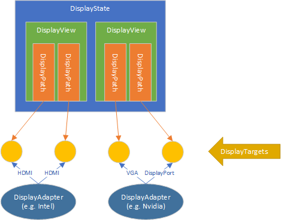

# Building a Custom Compositor App for HMDs and Specialized Monitors

The [Windows.Devices.Display.Core API](https://docs.microsoft.com/en-us/uwp/api/windows.devices.display.core) is a low-level WinRT API for third-party compositors and internal OS components that sits below all other public APIs for enumerating, configuring and driving display adapters and display targets in Windows. The idea is to treat the display controller as a separate “engine”, analogous to the 3D engine and the media engine on the GPU. This API is responsible for:

* Answering queries about the display hardware (such as capabilities and possible display modes)
* Answering queries about the current configuration
* Setting properties on the display hardware (such as display modes)
* Configuring the display hardware (the resolution of the connected monitors, their wire format, etc)
* Allocating and scanning out special GPU surfaces known as “primaries”
* Allowing interop between Direct3D and the Windows.Devices.Display.Core APIs (e.g. sharing surfaces, fences)

It’s worth calling out that Windows.Devices.Display.Core is not:

* An API used by apps for displaying content in a window. Apps still use DXGI, XAML, DirectComposition, GDI, etc.
* An API used by games for displaying content fullscreen. Win32 apps still use DXGI. UWP apps always display content in a CoreWindow.

This API is for compositor apps driving specialized hardware only.


## Scenarios for building custom compositors

Through each Windows 10 release there is a goal to improve scenarios around display and presentation, both in terms of stability and in terms of capability. The delta that is required is large enough of a change that instead of incrementally modifying the fullscreen presentation features in DXGI and in APIs like `SetDisplayConfig` / `QueryDisplayConfig` / `ChangeDisplaySettings`, a new API was needed to encompass the full range of display functionality.

The Windows.Devices.Display.Core APIs are appropriate to use in the following two scenarios:
* Virtual and augmented reality displays that require a proprietary compositor to directly drive the display controller and receive fine-grained control over timing and mode configuration separate from the Windows desktop.
* Specialized display hardware scenarios that require dedicated control over a display in a commercial setting. For example, in cases where the Windows desktop cannot render correctly on such a display because of hardware warping, greyscale displays, etc.

The API accomplishes this by:
* Providing fine-grained control over the full display mode information, including wire format, HDR, etc.
* Using fences to synchronize presentation allows a compositor to chain presentation across processes or sub-components with almost zero performance impact.
* Improving the ability to query and configure the underlying Video Present Network (VidPN) to allow both system components and low level composition components to do more complex operations in a less error-prone and more extensible way.

Note that this API is only for a *very specific set* of third-party use-cases with specialized hardware. Its use is highly restricted to hardware that declares itself needing the functionality of this API. Therefore, a certain degree of familiarity with hardware concepts is expected from developers, and partners should contact Microsoft directly to help with issues.

## Comparison of display-related APIs

| API | Purpose and Target Audience |
|-----|-----------------------------|
| `Windows.Graphics.Display.DisplayInformation` | Used to retrieve rendering and layout properties for a CoreWindow. |
| `Windows.Graphics.Display.Core.HdmiDisplayInformation` | Xbox-only API for enumerating and setting a constrained set of modes. Highly specialized for Xbox app scenarios. |
| `Windows.Devices.Display.DisplayMonitor` | Used for querying properties of a physical monitor device. Does not expose any runtime information about how a monitor is configured or currently used by the OS. |
| `EnumDisplayDevices`, `EnumDisplayMonitors`, `EnumDisplaySettings` | Legacy Win32 APIs for querying HMONITORs, GDI devices, and physical monitor mappings. The information returned here is highly virtualized and maintained for application compatibility. |
| Direct3D | Used for rendering pixel content into GPU surfaces and performing computation on a GPU. |
| DXGI Swap Chains | Used for windowed and “borderless windowed fullscreen” presentation. App swap chain contents flow through the system compositor, DWM. |
| DXGI Output Enumeration | Provides DXGI wrappers around HMONITORs. |
| `QueryDisplayConfig`, `SetDisplayConfig`, `DisplayConfigGetDeviceInfo`, `DisplayConfigSetDeviceInfo` | Win32 APIs for configuring the display topology. Provides no mechanism to enumerate multiple modes, but has a rich set of information about current configuration and settings. Not all newer properties of a mode are exposed by these APIs however. |
| `Windows.Devices.Display.Core` **(this document)** | Used for enumerating targets, enumerating modes, configuring modes, allocating GPU surfaces for presentation, and presenting content to displays. |

## Display configuration overview

### Physical hardware enumeration

The Windows.Devices.Display.Core API has various objects for representing physical hardware objects. A DisplayAdapter is typically (but not always) a physical hardware device, such as a PCI Express-connected GPU or an integrated GPU on a CPU. DisplayTargets represent the physical connectors (e.g. HDMI, VGA, DisplayPort, etc.) that can be connected to from the GPU. This may include internal non-user-visible connections for devices with internal monitors (laptops, tablets, etc.). There may be more DisplayTargets represented in software than a user can physically connect at one time. For example, since the DisplayPort connection standard allows daisy-chaining, GPU drivers typically enumerate several DisplayPort targets per physical port in order to account for chained monitors.


### Objects for setting modes

For enumerating DisplayTargets, setting and querying modes, etc. connections to DisplayTargets are represented with DisplayPaths. Clone groups are represented by DisplayViews, and these are aggregated into a DisplayState. One DisplayState object can therefore represents a complete set of mode state that can be sent to drivers for multiple monitors.



### Atomic state for mode configuration and enumeration

The Windows.Devices.Display.Core API is designed to ensure that compositors can acquire access to various system display state atomically, and with well-defined “staleness” behaviors. A major problem with past APIs has been that there is very little insight into system events and how state can change between API calls. For example, past APIs like `EnumDisplayDevices` and `EnumDisplaySettings` work by the caller passing in an index and making multiple calls. This is fundamentally flawed on the modern OS/hardware stacks because devices can arrive/depart at any time and other things can impact the list of available display modes (e.g. another component changing modes on another path). Likewise, DXGI provides [`IDXGIFactory1.IsCurrent`](https://docs.microsoft.com/en-us/windows/desktop/api/dxgi/nf-dxgi-idxgifactory1-iscurrent) to determine when system display state has changed (requiring a new `IDXGIFactory` to be created), but some updated values can be read from a live factory in some circumstances, which results in inconsistent behavior depending on what has changed.

To take advantage of the API's atomicity features:

* Write any mode configuration logic in a retryable loop.
* Create a new DisplayState at the beginning of the mode configuration, inside each loop.
* Use the [`FailIfStateChanged`](https://docs.microsoft.com/en-us/uwp/api/windows.devices.display.core.displaystateapplyoptions) flag when calling DisplayState.TryApply to detect that the system state is no longer the same as it was when the DisplayState was created. This allows you the opportunity to retry the operation. If the operation fails with `SystemStateChanged`, retry the entire loop.

```C++
// Create a DisplayManager
DisplayManager manager = DisplayManager::Create(DisplayManagerOptions::EnforceSourceOwnership);

// Loop around trying to acquire a target and set a mode
bool shouldRetry = false;
do
{
    DisplayState newState {};

    // ... Find the target that you want to use
    auto targets = manager.GetCurrentTargets();
    DisplayTarget selectedTarget = ...;

    auto stateCreationResult = manager.TryAcquireTargetsAndCreateEmptyState(winrt::single_threaded_agile_vector<DisplayTarget>{ selectedTarget });

	auto stateCreationResult = manager.TryAcquireTargetsAndCreateEmptyState(winrt::single_threaded_vector<DisplayTarget>(std::vector<DisplayTarget>{ selectedTarget }));

	if (stateCreationResult.ErrorCode() != DisplayManagerResult::Success)
	{
		winrt::check_hresult(stateCreationResult.ExtendedErrorCode());
	}

	auto state = stateCreationResult.State();
	DisplayPath newPath = state.ConnectTarget(selectedTarget);

	// ... Configure the path

	auto applyResult = state.TryApply(DisplayStateApplyOptions::FailIfStateChanged);

	if (applyResult.Status() == DisplayStateOperationStatus::SystemStateChanged)
	{
		shouldRetry = true;
	}
	else if (applyResult.Status() != DisplayStateOperationStatus::Success)
	{
		winrt::check_hresult(applyResult.ExtendedErrorCode());
	}

} while (shouldRetry);
```

Windows.Devices.Display.Core therefore provides only a handful of APIs that directly read state from the system. All objects are either immutable or else provide well-defined APIs to update/commit state back to the system.

To read state from the system, only these APIs are used:

* [DisplayManager.GetCurrentTargets](https://docs.microsoft.com/en-us/uwp/api/windows.devices.display.core.displaymanager.getcurrenttargets)
* [DisplayTarget.IsStale](https://docs.microsoft.com/en-us/uwp/api/windows.devices.display.core.displaytarget.isstale)
* [DisplayManager.GetCurrentAdapters](https://docs.microsoft.com/en-us/uwp/api/windows.devices.display.core.displaymanager.getcurrentadapters)
* [DisplayManager.TryReadCurrentStateForAllTargets](https://docs.microsoft.com/en-us/uwp/api/windows.devices.display.core.displaymanager.tryreadcurrentstateforalltargets)/[DisplayManager.TryAcquireTargetsAndReadCurrentState](https://docs.microsoft.com/en-us/uwp/api/windows.devices.display.core.displaymanager.tryacquiretargetsandreadcurrentstate)
* [DisplayState.IsStale](https://docs.microsoft.com/en-us/uwp/api/windows.devices.display.core.displaystate.isstale)
* [DisplayState.TryFunctionalize](https://docs.microsoft.com/en-us/uwp/api/windows.devices.display.core.displaystate.tryfunctionalize)
* [DisplayPath.FindAllModes](https://docs.microsoft.com/en-us/uwp/api/windows.devices.display.core.displaypath.findmodes)

To commit state back to the system, only these APIs are used:

* [DisplayManager.TryAcquireTarget](https://docs.microsoft.com/en-us/uwp/api/windows.devices.display.core.displaymanager.tryacquiretarget)/[ReleaseTarget](https://docs.microsoft.com/en-us/uwp/api/windows.devices.display.core.displaymanager.releasetarget) (and acquiring targets with DisplayManager.TryAcquireTargetsAnd* methods) – Acquires ownership of DisplayTargets from the system.
* [DisplayState.TryApply](https://docs.microsoft.com/en-us/uwp/api/windows.devices.display.core.displaystate.tryapply) – Updates the current system display state by setting or clearing modes on all owned targets in the system, through the display drivers.
