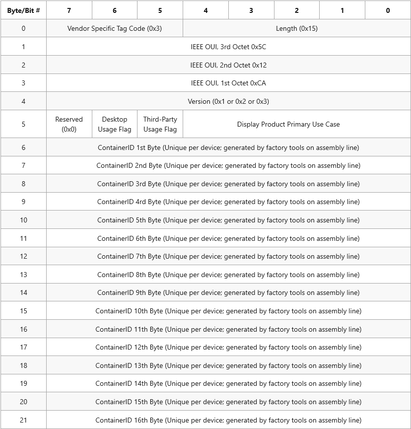

# EDID extension for head-mounted and specialized monitors

This page provides guidance for display manufacturers on how to implement an [EDID](https://en.wikipedia.org/wiki/Extended_Display_Identification_Data) CTA (Consumer Technology Association) extension in HMD (Head Mounted Display) or specialized display firmware that will allow Windows to recognize the display as special and thus enable each layer in the Windows OS to treat them correctly. The terms display and monitor are synonymous.

Without this EDID extension, HMDs and specialized displays have the following problems:

* The Windows desktop will be extended to the display, apps can launch onto it, and the mouse cursor can roam onto the display. If the users are not expecting this, it can be confusing to recover from this state.
* Third-party compositors must use HWND-based or CoreWindow-based presentation APIs, which do not allow for exclusive access to the display. The Windows desktop compositor is responsible for routing windowed presentation APIs to the display, which can incur extra non-deterministic latency in some scenarios.

Two parts are necessary for the specification in this document to solve the above problems:

1. The firmware in the display that contains the [EDID](https://en.wikipedia.org/wiki/Extended_Display_Identification_Data) will be modified to contain a [Vendor Specific Data Block](https://en.wikipedia.org/wiki/Extended_Display_Identification_Data#EIA.2FCEA-861_extension_block) to identify the Windows-specific use-case of the display.
2. The Windows display subsystem will correctly recognize the Vendor Specific Data Block outlined in this document and treat the displays appropriately. Note that different versions of the Windows OS may have different behaviors, which are called out below.

The combination of 1. and 2. above will result in the correct Windows behavior from the moment the display is first plugged in. In particular, HMDs and certain specialized displays will not be included in the regular Windows desktop environment, and access to the display with the [Windows.Devices.Display.Core](/uwp/api/windows.devices.display.core) APIs will become available to third-party compositors.

The Video Electronics Standards Association (VESA) has defined standardized fields in DisplayId v2.0 which provides access to similar information as the VSDB defined in this document.  DisplayID v2.0 or later is the preferred mechanism to deliver this data for HMDs, however if a device must use an EDID for other reasons, this VSDB should be used.

## Vendor-specific data block (VSDB)

The party responsible for writing the firmware code that contains the EDID must include a CTA extension block and within that block put a Microsoft-defined Vendor Specific Data Block (VSDB). The structure of EDIDs is described in the "VESA Enhanced Extended Display Identification Data Standard" ([E-EDID](https://vesa.org/standards-specifications/)), see version 1.4, release A, revision 2 with section 2.2 describing extension blocks.  The CTA extension block is defined in the CTA's 861 series documents "A DTV Profile for Uncompressed High-Speed Digital Interfaces".  VSDBs are described in [ANSI/CTA-861-G](https://webstore.ansi.org/Standards/ANSI/CTA8612016ANSI) including the order of VSDB relative to other data blocks.

The VSDB structure must have the format and values that are outlined in the following table.

### Vendor specific tag code [3 bits]

This field must be set to `0x3`.

### Length [5 bits]

Total length of data block, not including this byte.  This field must be set to `0x15`.

### IEEE OUI [3 bytes]

The IEEE Organizationally Unique Identifier (OUI) assigned to Microsoft for identifying displays: `0x5C`, `0x12`, `0xCA`, in sequential byte order.

### Version [1 byte]

The version number associated with the contents of the Microsoft Display Vendor-Specific Data Block.

| Recommended Use-Case | Version | Supported Windows Release |
|----------------------|---------|---------------------------|
| HMD (VR/AR) display devices that will be used by the Windows Mixed Reality experience | `0x1` | Supported in Windows 10 Creator's Update and later |
| HMD (VR/AR) display devices that will be used by third-party compositors (other than the Windows Mixed Reality experience) | `0x2` | Supported in Windows 10 October 2018 Update and later |
| Specialized display devices that are not HMDs | `0x3` | Supported in next Windows vNext and later |

### Desktop usage flag [1 bit]

On version `0x3` and above of this VSDB, this bit indicates whether the display should be part of the desktop.

* If the display should be part of the desktop, this should be set to `0x1`.
* If the display should not be part of the desktop, this should be set to `0x0`.

In version `0x1` and `0x2` of this VSDB, this value should always be set to `0x0`.

### Third-party usage flag [1 bit]

On version `0x3` and above of this VSDB, this bit indicates whether the display should be usable by third-party compositors, or only the Microsoft-provided Windows compositor.

* If the display should be usable by non-Windows software compositors, this should be set to `0x1`.
* If the display should only be used by the Windows compositor, this should be set to `0x0`.

In version `0x1` and `0x2` of this VSDB, this value should always be set to `0x0`.

### Display product primary use case [5 bits]

The primary use case of the display device:

* Test equipment - `0x1`
* Generic display - `0x2`
* Television display - `0x3`
* Desktop productivity display - `0x4`
* Desktop gaming display - `0x5`
* Presentation display - `0x6`
* Virtual reality headsets - `0x7`
* Augmented reality - `0x8`
* Video wall display - `0x10`
* Medical imaging display - `0x11`
* Dedicated gaming display - `0x12`
* Dedicated video monitor display - `0x13`
* Accessory display - `0x14`

### Container ID [16 bytes]

The 16-byte Universally Unique Identifier that is unique to each device. This is the identifier that is burned in on the factory floor.

## Remarks

Note that in order to maintain maximum compatibility with earlier operating systems, it is recommended that HMDs continue to use version `0x1` and `0x2` of this EDID extension. See the above section on Version for which values to use for HMDs.
