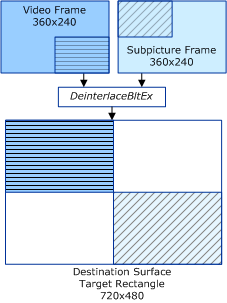

# Stretching Subrectangles

## 

**This section applies only to Windows Server 2003 with SP1 and later, and Windows XP with SP2 and later.**

In the following example, the destination surface is 720 x 480, the coordinates of the target rectangle are {0,0,720,480}, and the background color is solid black.

The source surface of the video stream is 360 x 240, with the following source and destination subrectangles:

-   Source subrectangle (**rcSrc**): {180,120,360,240}

-   Destination subrectangle (**rcDest**): {0,0,360,240}

The source surface of the single substream is 360 x 240, with the following source and destination subrectangles:

-   Source subrectangle (**rcSrc**): {0,0,180,120}

-   Destination subrectangle (**rcDest**): {360,240,720,480}

The following diagram shows the output of the combination deinterlacing and substream compositing operation.

 

 

