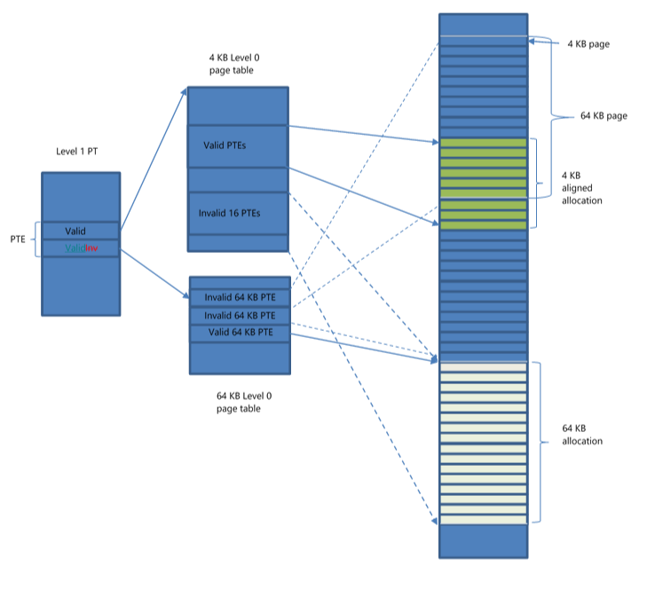

# Support for 64KB pages

To support 64 KB pages Windows Display Driver Model (WDDM) v2 provides two types of leaf page tables, one that supports 4 KB page table entries and one that supports 64 KB entries. Both page table entry sizes cover the same virtual address range, so a page table for 4KB pages has 16 times the number of entries as the 64 KB page table.

The size of a 64 KB page table is defined by [**DXGK\_GPUMMUCAPS**](https://msdn.microsoft.com/library/windows/hardware/dn906348)::**LeafPageTableSizeFor64KPagesInBytes**.

The [*UpdatePageTable*](https://msdn.microsoft.com/library/windows/hardware/ff560815) operation has a flag that indicates the type of the page table is updated, [**DXGK\_UPDATEPAGETABLEFLAGS**](https://msdn.microsoft.com/library/windows/hardware/dn914482)::**Use64KBPages**.

There are two modes of operations that are supported by the WDDM v2:

1.  The page table entries of the level 1 page table point either to 4 KB page table or 64 KB page table.
2.  The page table entries of the level 1 page table point to a 4 KB page table and a 64 KB page table at the same time. This is called "dual PTE" mode.

The *dual PTE* support is expressed by the [**DXGK\_GPUMMUCAPS**](https://msdn.microsoft.com/library/windows/hardware/dn906348)::**DualPteSupported** cap.
The video memory manager chooses the page size based on the allocation alignment, graphics processing unit (GPU) memory segment properties, and the GPU memory segment type. An allocation will be mapped using 64 KB pages if its alignment and the size are multiple of 64 KB and it is resident in a memory segment that supports 64 KB pages.

## Single PTE mode

In this mode the page table entries of the level 1 page table point either to a 4 KB page table or a 64 KB page table.

[**DXGK\_PTE**](https://msdn.microsoft.com/library/windows/hardware/ff562008)::**PageTablePageSize** field is added to **DXGK\_PTE**. It should be used only for page table entries of the level 1 page table (page directory in the old terminology). This field tells the kernel mode driver the type of the corresponding page table (using 64KB or 4KB pages).

The video memory manager chooses to use a 64 KB page table for a virtual address range when:

-   Only 64 KB aligned allocations are mapped to the range.
-   The memory segments of all allocations mapped to the range support 64 KB pages.

When a virtual address range is mapped by 64 KB pages and the above conditions are no longer valid (for example, an allocation is committed to the system memory segment), the video memory manager switches from the 64 KB page table to the 4 KB page table.

When a page table has only 64 KB page table entries and a page table entry needs to point to 4KB page (for example, an allocation is placed to system memory), the page table will be converted to use 4 KB page table entries.

The conversion is done as follows:

1.  All contexts of the process are suspended.
2.  Existing page table entries are updated to point to 4KB pages. The driver will get the [*UpdatePageTable*](https://msdn.microsoft.com/library/windows/hardware/ff560815) paging operation.
3.  The level 1 page table entry that points to the page table will be updated to reflect the new page size (**PageTablePageSize** = **DXGK\_PTE\_PAGE\_TABLE\_PAGE\_4KB**). The driver will get the [*UpdatePageTable*](https://msdn.microsoft.com/library/windows/hardware/ff560815) paging operation.
4.  All contexts of the process are resumed.

When a page table has only 4KB page table entries and the number of page table entries that must point to 4KB pages is zero, the page table will be converted to use 64 KB page table entries.

The conversion is done as follows:

1.  All contexts of the process are suspended.
2.  Existing page table entries are updated to point to 64KB pages. The driver will get the [*UpdatePageTable*](https://msdn.microsoft.com/library/windows/hardware/ff560815) paging operation.
3.  The level 1 page table entry that points to the page table will be updated to reflect the new page size (**PageTablePageSize** = **DXGK\_PTE\_PAGE\_TABLE\_PAGE\_64KB**). The driver will get the [*UpdatePageTable*](https://msdn.microsoft.com/library/windows/hardware/ff560815) paging operation.
4.  All contexts of the process are resumed.

To prevent frequent switches between different page table sizes, the driver should pack small allocations together.

## Dual PTE mode

In this mode the page table entries of the level 1 page table might point to a 4 KB page table and a 64 KB page table at the same time.

Both pointer in the entries of the level 1 page table might have the **Valid** flag set, but the entries in the level 0 page table that cover the same 64 KB virtual address range cannot be valid at the same time.

When an allocation that is covered by a 64 KB page table entry is placed to a memory segment with 64 KB page size, the 64 KB page table entry becomes invalid and the corresponding 4 KB page table entries become valid.

In the following diagram a 4 KB allocation and a 64 KB aligned allocation are in the same virtual address range covered by a level0 page table and in a segment that supports 64 KB pages.

 

 

