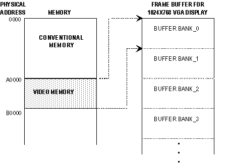
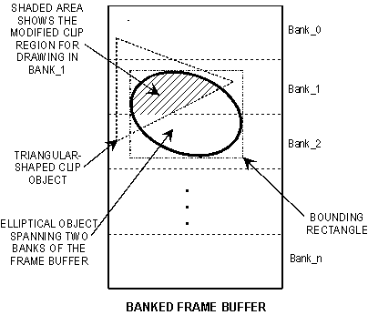

# Supporting Banked Frame Buffers


## <span id="ddk_supporting_banked_frame_buffers_gg"></span><span id="DDK_SUPPORTING_BANKED_FRAME_BUFFERS_GG"></span>


Most of today's accelerators have [*frame buffers*](https://msdn.microsoft.com/library/windows/hardware/ff556280#wdkgloss-frame-buffer) that can be mapped linearly into CPU address space. The display drivers of such devices do not have to support banked frame buffers.

GDI cannot directly access [*banked memory*](https://msdn.microsoft.com/library/windows/hardware/ff556272#wdkgloss-banked-memory) associated with a banked frame buffer. Consequently, the display driver of a device with such a frame buffer must divide the frame buffer into a series of contiguous banks and provide a means for GDI to perform its draw operations to the appropriate frame buffer banks. That is, GDI is made to write data to one bank of the frame buffer before being moved to subsequent banks, as necessary, to complete the draw operation through a mechanism referred to as [*banked callbacks*](https://msdn.microsoft.com/library/windows/hardware/ff556272#wdkgloss-banked-callback).

The *Permedia* sample display drivers that shipped with the Driver Development Kit (DDK) provide sample code for implementing banked frame buffer support.

**Note**   The Microsoft Windows Driver Kit (WDK) does not contain the 3Dlabs Permedia2 (*3dlabs.htm*) and 3Dlabs Permedia3 (*Perm3.htm*) sample display drivers. You can get these sample drivers from the Windows Server 2003 SP1 DDK, which you can download from the DDK - Windows Driver Development Kit page of the WDHC website.

 

The following figure shows a sample accelerator's frame buffer, a 1024-by-768 VGA display buffer, divided into several banks. This figure is provided for the purpose of illustration only. The display driver does not specifically use the physical address A000 but uses a logical address passed to it by the miniport driver.



In this example, the video memory contents are written to the accelerator through a series of draw operations that address contiguous banks of the frame buffer. As far as GDI is concerned, each of its draw operations appear to be to the standard frame buffer and not to different banks of the accelerator's frame buffer. The device driver for the accelerator handles the banking operations that cause GDI to draw to the accelerator's frame buffer on a bank-by-bank basis.

The frame buffer is a [*device-managed surface*](https://msdn.microsoft.com/library/windows/hardware/ff556277#wdkgloss-device-managed-surface) when an accelerator employs a banked frame buffer, so the display driver hooks the draw function calls. When the display driver hooks a call, such as draw path, fill path, or [*bit-block transfer*](https://msdn.microsoft.com/library/windows/hardware/ff556272#wdkgloss-bit-block-transfer), it determines which banks in the frame buffer are affected by the draw function that was called.

If the driver elects to have GDI perform the draw function, the driver calls the appropriate **Eng***Xxx* function. However, before making the call, the display driver must modify the clip and surface objects it received in the hooked call and pass these modified objects in the callback to GDI. The clip and surface objects are modified to prevent GDI from drawing beyond the extents of the bank. That is, if GDI is called to draw a path that exists partially in the next bank, and if there is no modification of the clip and surface objects, GDI will write to memory beyond the extents of the current bank. If GDI attempts to draw outside the extents of the bank, the resulting access violations can be difficult to track.

The example banked frame buffer in the following figure shows how an elliptical object drawn on the display spans two banks of the banked frame buffer, BANK\_1 and BANK\_2.



To draw this object, GDI must first draw the top portion of the ellipse (in BANK\_1) to the standard frame buffer, and then draw the lower portion of the ellipse to the same standard buffer. The display driver must then map these two successive writes by GDI to BANK\_1 and BANK\_2 of the banked frame buffer to display, and also to prevent GDI from writing beyond the limits of each bank.

When performing banked frame buffering, the display driver can determine the bounds of the object (the size of the destination rectangle) by checking the parameters of the call or by calling back to GDI. From the bounds of the object, the driver can determine how many banks are spanned by the object. For every bank that the bounding rectangle touches, the display driver calls back to the appropriate GDI draw function, changing values for each call.

The driver changes the [**CLIPOBJ**](https://msdn.microsoft.com/library/windows/hardware/ff539417) members originally passed by GDI to correspond to changes in the bounds of the bank. The top and bottom scan values are redefined so that GDI does not attempt to draw beyond the limits of the bank. The bank manager takes the original CLIPOBJ data obtained from GDI and retains the values for later restoration. Then it changes the bounds to provide new **rclBounds.top** and **rclBounds.bottom** values that describe the extent of the bank being drawn to. During banking, GDI must perform clipping to a size that prevents drawing the entire path and overwriting the limits of the current bank.

If the original CLIPOBJ passed by GDI was defined as **NULL** or DC\_TRIVIAL, then the display driver passes a substitute CLIPOBJ, created through [**EngCreateClip**](https://msdn.microsoft.com/library/windows/hardware/ff564202). This substitute CLIPOBJ is modified to define a [*clip window*](https://msdn.microsoft.com/library/windows/hardware/ff556274#wdkgloss-clip-window) so that GDI will clip to the extents of a single bank. If the CLIPOBJ is complex, such as a triangular-shaped clip object on an ellipse as shown in the preceding figure, the display driver modifies the complex CLIPOBJ with the **rclBounds.top** and **rclBounds.bottom** values to produce an additive effect between the two clip objects. As a result, GDI is prevented from writing off the end of the bank. The driver must also restore the original bounds of the CLIPOBJ data previously obtained from GDI.

In addition to altering the bounds values, the display driver sets the OC\_BANK\_CLIP flag in the [**clip object**](https://msdn.microsoft.com/library/windows/hardware/ff539417) to inform GDI that this is a [*banked callback*](https://msdn.microsoft.com/library/windows/hardware/ff556272#wdkgloss-banked-callback)*.*

GDI must also be made to draw with reference to the beginning of the standard frame buffer. When called to draw, GDI simply gets a pointer to a SURFOBJ, which includes the **pvScan0**, **lDelta**, and **iBitmapFormat** members. GDI calculates where to draw on the surface by using these values as follows:

```cpp
start_draw_point = pvScan0 + (y*lDelta) + (x*PixelSize(iBitmapFormat))
```

where *x* and *y* are coordinates at which drawing is to begin, and *start\_draw\_point* is the address at which the address of the first pixel is to be drawn. GDI performs this calculation on every drawing call and always references the SURFOBJ for **pvScan0**, which is the logical address for the start of the standard frame buffer.

For example, if GDI needs to draw the entire contents of an 8 bits-per-pixel 64K frame buffer, beginning at a logical address of **pvScan0** = 0x100000, it would end the draw operation at 0x10FFFF (0x100000 + (63\*1024)+(1023)), where *y* is 63, **lDelta** is 1024, and *x* is 1023 (the position of the last pixel in the last scan line).

The next time the display driver calls GDI to draw that part of the object that falls within the *next* bank of the banked frame buffer, GDI interprets the value of *y* as 64. With a value of 0x100000 for **pvScan0** and 64 for *y*, GDI would attempt to begin to write data at 0x110000. However, 0x110000 is beyond the 0x10FFFF extent of the 64K frame buffer and must not be written to by GDI during this operation.

Consequently, when the display driver requests GDI to write the data that is to appear in the second and subsequent banks of the frame buffer, the driver must decrement the value of **pvScan0** so that GDI calculates a starting point that is still referenced to the example address of 0x100000. Continuing in the example, this means decrementing the value of **pvScan0** to a value of 0x090000 when drawing to the second bank of the frame buffer. As a result of this change to **pvScan0**, GDI still draws with a reference to address 0x100000. That is, 0x090000 + (64\*1024) + 0 is equal to 0x100000, where GDI must begin to draw in order for the data to be mapped into the second bank of the frame buffer.

 

 


