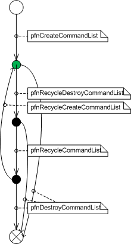

# Supporting Command Lists


This section applies only to Windows 7 and later, and Windows Server 2008 R2 and later versions of Windows.

The Direct3D runtime uses the following Direct3D 11 DDI for command lists:

-   The [**CalcPrivateCommandListSize**](https://msdn.microsoft.com/library/windows/hardware/ff538278) function determines the size of the user-mode display driver's private region of memory for a command list.

-   The [**CreateCommandList**](https://msdn.microsoft.com/library/windows/hardware/ff540602) function creates a command list.

-   The [**RecycleCommandList**](https://msdn.microsoft.com/library/windows/hardware/ff569237) function recycles a command list.

-   The [**RecycleCreateCommandList**](https://msdn.microsoft.com/library/windows/hardware/ff569238) function creates a command list and makes a previously unused DDI handle completely valid again.

-   The [**DestroyCommandList**](https://msdn.microsoft.com/library/windows/hardware/ff552748) function destroys a command list.

-   The [**RecycleDestroyCommandList**](https://msdn.microsoft.com/library/windows/hardware/ff552748) function notifies the driver that lightweight destruction of a command list is required.

-   The [**CommandListExecute**](https://msdn.microsoft.com/library/windows/hardware/ff539476) function runs a command list.

The semantics for the driver's [**CommandListExecute**](https://msdn.microsoft.com/library/windows/hardware/ff539476), [**CalcPrivateCommandListSize**](https://msdn.microsoft.com/library/windows/hardware/ff538278), [**CreateCommandList**](https://msdn.microsoft.com/library/windows/hardware/ff540602), and [**DestroyCommandList**](https://msdn.microsoft.com/library/windows/hardware/ff552748) functions are mostly self explanatory, based on other similar DDI functions and the API documentation for the corresponding DDI.

After the Direct3D runtime successfully calls the driver's [**CreateCommandList**](https://msdn.microsoft.com/library/windows/hardware/ff540602) or [**RecycleCreateCommandList**](https://msdn.microsoft.com/library/windows/hardware/ff569238) function on the deferred context that is specified in the **hDeferredContext** member of the [**D3D11DDIARG\_CREATECOMMANDLIST**](https://msdn.microsoft.com/library/windows/hardware/ff542040) structure that the *pCreateCommandList* parameter points to, the Direct3D runtime performs the following destruction sequence on the deferred context:

1.  The Direct3D runtime "closes" all open deferred object handles. Note that these handles might still appear bound to the deferred context.

2.  The runtime destroys the deferred context.

During the call to [**CreateCommandList**](https://msdn.microsoft.com/library/windows/hardware/ff540602) or [**RecycleCreateCommandList**](https://msdn.microsoft.com/library/windows/hardware/ff569238), any calls that the driver makes to the [state-refresh DDI callback functions](https://msdn.microsoft.com/library/windows/hardware/ff552885) continue to divulge the current state of the deferred context. However, during the "closing" and destruction of the deferred context, any calls to the state-refresh DDI reflect that nothing is bound (that is, immediately after the call to *CreateCommandList* or *RecycleCreateCommandList*, everything is implicitly unbound).

A deferred context can also be abandoned either explicitly by the application or due to an error condition by the API or the driver. For such cases, the Direct3D runtime performs the following sequence:

1.  The Direct3D runtime calls the driver's [**AbandonCommandList**](https://msdn.microsoft.com/library/windows/hardware/ff538199) function.

2.  The runtime unbinds handles from the deferred context one by one.

3.  The runtime "closes" all open deferred object handles.

4.  The runtime either recyles or destroys the deferred context.

The preceding sequence is similar to the destruction sequence of an immediate context. The call to the driver's [**AbandonCommandList**](https://msdn.microsoft.com/library/windows/hardware/ff538199) function provides an opportunity for the driver to apply state into whatever the driver prefers.

During the call to the driver's [**CommandListExecute**](https://msdn.microsoft.com/library/windows/hardware/ff539476) function, the driver must transition the state of the deferred context to make it equivalent to the state when the device was created. This operation is also known as a clear-state operation. During the call to the driver's **CommandListExecute** function, however, any calls that the driver makes to the [state-refresh DDI callback functions](https://msdn.microsoft.com/library/windows/hardware/ff552885) still reflect the state of what was bound during the last DDI call to a driver function. During the next DDI call to a driver function, any calls that the driver makes to the state-refresh DDI callback functions show the current state as completely empty, which reflects the state transition implicit from **CommandListExecute**. This fact differs slightly from the typical semantics and behavior of the state-refresh DDI callback functions. If the driver had called a state-refresh DDI callback function during a call to one of the driver's *SetShader* functions, the state-refresh DDI callback function would show as already bound the new shader that is being bound. This divergence of state-refresh DDI callback behavior provides more flexibility to the driver to reflect the old state during **CommandListExecute**.

The Direct3D version 11 API ensures that no query has been both manipulated (that is, had [**QueryBegin**](https://msdn.microsoft.com/library/windows/hardware/ff569214) or [**QueryEnd**](https://msdn.microsoft.com/library/windows/hardware/ff569217) called on it) by the command list and been only "begun" by the context that attempts to execute the command list. The API also ensures that no command list that recorded the map of a dynamic resource is executed on a context that has the same resource currently mapped. Before an application calls the **FinishCommandList** function, the Direct3D runtime calls the driver's **QueryEnd** and [**ResourceUnmap**](https://msdn.microsoft.com/library/windows/hardware/ff569495) DDI function on any query or dynamic resource that still holds a begun query or mapped resource open because **FinishCommandList** implicitly terminates query ranges and unmaps any mapped resource.

### <span id="optimization_for_small_command_lists"></span><span id="OPTIMIZATION_FOR_SMALL_COMMAND_LISTS"></span> Optimization for Small Command Lists

A memory-recycling optimization for small-memory-amount command lists can be important to reduce contention among command-list DDI function calls and to reduce the overhead of call processing that is required for command lists. The processing overhead that is inherant in each command list is significant. This optimization is meant for command lists where the processing overhead that is required for the command lists dominates the CPU time and memory space that is required for the command lists. A small-memory-amount command list is, for example, a single graphics command, like CopyResource. The amount of memory required for CopyResource is two pointers. However, CopyResource still requires the same amount of command-list call processing as a large-memory-amount command list. When small-memory-amount command lists are generated at high frequency, the processing overhead required for the runtime to call the driver's [**CreateCommandList**](https://msdn.microsoft.com/library/windows/hardware/ff540602), [**DestroyCommandList**](https://msdn.microsoft.com/library/windows/hardware/ff552748), [**CreateDeferredContext**](https://msdn.microsoft.com/library/windows/hardware/ff540622), and [**DestroyDevice(D3D10)**](https://msdn.microsoft.com/library/windows/hardware/ff552768) functions (for deferred context) becomes increasingly important. The memory referred to here is system memory that holds driver data structures, which includes the memory for DDI handles.

The driver's [**RecycleCommandList**](https://msdn.microsoft.com/library/windows/hardware/ff569237) function must notify the driver when driver handles go out-of-use (but are not yet deleted), and when previously unused driver handles are re-used. This notification applies to both command-list and deferred-context handles. The only memory the driver must recycle is the memory that the DDI handle points to. While the objective of **RecycleCommandList** is to recycle memory that is associated with the handle, for efficiency the driver has complete flexibility to pick and choose which memory to recycle. The driver cannot change the size of the region of memory to which the immediate-context command list handle points. This size is the return value of [**CalcPrivateCommandListSize**](https://msdn.microsoft.com/library/windows/hardware/ff538278). The driver also cannot change the size of the region of memory to which the context command list local handle points.This size is the return value of [**CalcDeferredContextHandleSize**](https://msdn.microsoft.com/library/windows/hardware/ff538272).

The driver's [**RecycleCreateCommandList**](https://msdn.microsoft.com/library/windows/hardware/ff569238) and [**RecycleCreateDeferredContext**](https://msdn.microsoft.com/library/windows/hardware/ff569239) DDI functions must return out-of-memory error codes as E\_OUTOFMEMORY HRESULT values. These functions do not provide such error codes through calls to the [**pfnSetErrorCb**](https://msdn.microsoft.com/library/windows/hardware/ff568929) function. This driver requirement prevents the runtime from having to use device-wide synchronization to watch for immediate context errors from these create-type driver functions. Watching for these errors would be a source of catastrophic contention for small-memory-amount command lists.

The distinctions among the driver's [**RecycleDestroyCommandList**](https://msdn.microsoft.com/library/windows/hardware/ff552748), [**RecycleCommandList**](https://msdn.microsoft.com/library/windows/hardware/ff569237), and [**RecycleCreateCommandList**](https://msdn.microsoft.com/library/windows/hardware/ff569238) functions are important. Their features include the following:

<span id="RecycleDestroyCommandList"></span><span id="recycledestroycommandlist"></span><span id="RECYCLEDESTROYCOMMANDLIST"></span>[**RecycleDestroyCommandList**](https://msdn.microsoft.com/library/windows/hardware/ff552748)  
The runtime calls the driver's [**RecycleDestroyCommandList**](https://msdn.microsoft.com/library/windows/hardware/ff552748) function to notify the driver that lightweight destruction is required. That is, the driver should not yet de-allocate the memory for the DDI command-list handle. The driver's *RecycleDestroyCommandList* function is free-threaded just like the driver's **DestroyCommandList** function.

<span id="RecycleCommandList"></span><span id="recyclecommandlist"></span><span id="RECYCLECOMMANDLIST"></span>[**RecycleCommandList**](https://msdn.microsoft.com/library/windows/hardware/ff569237)  
The driver's [**RecycleCommandList**](https://msdn.microsoft.com/library/windows/hardware/ff569237) function informs the driver that the runtime integrated a command-list handle back into the deferred-context cache. The function then provides the driver with an opportunity to integrate memory that is associated with the command list back into the deferred-context cache. The runtime calls the driver's **RecycleCommandList** function from the deferred-context thread. The **RecycleCommandList** DDI function reduces the need for the driver to perform synchronization of its own.

<span id="RecycleCreateCommandList"></span><span id="recyclecreatecommandlist"></span><span id="RECYCLECREATECOMMANDLIST"></span>[**RecycleCreateCommandList**](https://msdn.microsoft.com/library/windows/hardware/ff569238)  
The runtime calls the driver's [**RecycleCreateCommandList**](https://msdn.microsoft.com/library/windows/hardware/ff569238) function to make a previously unused DDI handle completely valid again.

These recycling DDI functions provide optimization opportunities to help recycle resources for small-memory-amount command lists. The following pseudocode shows the implementation of the runtime through the flow of function calls from the API to the DDI :

```cpp
::FinishCommandList()
{
  // Empty InterlockedSList, integrating into the cache
  Loop { DC::pfnRecycleCommandList }

  If (Previously Destroyed CommandList Available)
 { IC::pfnRecycleCreateCommandList }
 else
  {
    IC::pfnCalcPrivateCommandListSize
    IC::pfnCreateCommandList
    IC::pfnCalcDeferredContextHandleSize(D3D11DDI_HT_COMMANDLIST)
  }

  Loop { DC::pfnDestroy* (context-local handle destroy) }

  IC::pfnRecycleCreateDeferredContext
}
...
Sporadic: DC::pfnCreate* (context-local open during first-bind per CommandList)

CommandList::Destroy()
{
  // If DC still alive, almost always recycle:
  If (DC still alive)
 { IC::pfnRecycleDestroyCommandList }
  Else
 { IC::pfnDestroyCommandList }
  // Add to InterlockedSList
}
```

The following state diagram shows the validity of an immediate-context DDI command-list handle. The green state represents a handle that can be used with [**CommandListExecute**](https://msdn.microsoft.com/library/windows/hardware/ff539476).



 

 


