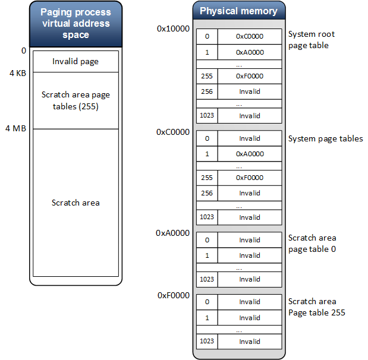

# System paging process

Most paging operations occur in a context of the system paging process. The only exception is the page table update from the [*UpdateGpuVirtualAddress callback*](https://msdn.microsoft.com/library/windows/hardware/dn906365), which occurs in a special companion context and occurs synchronous of rendering.

The Microsoft DirectX graphics kernel uses the system paging process to perform paging operations, such as:

-   Transfer allocation between system and local graphics processing unit (GPU) memory
-   Fill allocations with pattern
-   Update page tables
-   Map allocations to the aperture segment
-   Flush the translation look-aside buffer

The paging process has its own GPU virtual address space, GPU contexts and direct memory access (DMA) buffers (called paging buffers). It has its own page tables which are pinned in physical memory and evicted only during power transitions.

The virtual address space for the paging process has a pre-defined layout, is initialized during adapter initialization, and every time after the memory content is lost due to power transitions.

The DirectX graphics kernel initializes enough page tables and page table entries in the root page table to cover the 1 GB virtual address space. The scratch area is used to temporary map allocations during transfer and fill operations to the Paging process virtual address space. If an allocation does not fit into the virtual address scratch area, the transfer operation will be done in chunks.

A system root page table allocation is created for the paging process. Its content is set during initialization and never changes (except after power transitions).

The page tables of the system process are divided into two parts:

A *system page table* is created that reflects the *scratch area page table* into the address space of the system process. This allow the system process to modify the scratch area page tables and map/unmap memory from the scratch area as necessary. The content of the page tables is set during adapter initialization and never changes.
The *scratch area page table* page table entries are used to map allocations to the virtual address space of the paging process. They are initialized as *invalid* during initialization and used later for paging operations.
The page tables of the paging process are initialized through [*UpdatePageTable*](https://msdn.microsoft.com/library/windows/hardware/ff560815) paging operations during adapter initialization and power on event. For these operations, the **PageTableUpdateMode** is forced to **CPU\_VIRTUAL** and must be completed immediately using the CPU (the paging buffer should not be used).

Updates of the page table entries for all other processes are done using the **PageTableUpdateMode** specified by the driver. These updates are done in the context of the paging process.

Here is how the setup is done:

1.  A root page table allocation and lower level page table allocations are created to cover 1 GB of address space.
2.  The allocations are committed to a memory segment.
3.  Multiple [*UpdatePageTable*](https://msdn.microsoft.com/library/windows/hardware/ff560815) paging operations are issued to the driver to initialize the page table entries.

As an example of the paging process virtual address space initialization, let's consider the case with the following parameters:

-   Page size is 4096 bytes
-   Paging process virtual address space is 1 GB
-   Page table entry size is 4 bytes

In this case we need a 2-level translation scheme made up of:

-   One system root page table
-   One system page table
-   255 scratch area page tables

The following figure shows how the page tables would be initialized based in the location of root page table and the page table in physical memory. Note that the physical addresses are given only as illustration.
A page table covers 4 MB of the address space. So the system page table covers all scratch area page tables. The scratch area starts from 4 MB virtual address.

As you see, the virtual address range from 0 to 4095 will be invalid.

 

 

