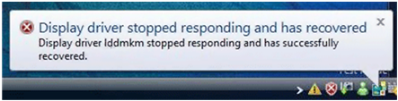

# TDR Error Messaging

Throughout the TDR process (that is, the process of detecting and recovering from situations where a GPU stops operating), the desktop is unresponsive and thus unavailable to the end user. In the final stages of recovery, a brief screen flash can occur that is similar to the brief screen flash that occurs when the end user changes the screen resolution. After the operating system has successfully recovered the desktop, the following informational message appears to the end user.

The operating system also logs the preceding message in the Event Viewer application and collects diagnosis information in the form of a debug report. If the end user opted in to provide feedback, the operating system returns this debug report to Microsoft through the Online Crash Analysis (OCA) mechanism.

 

 

