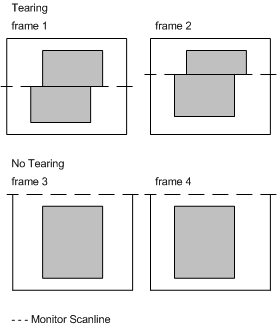

# Tearing

## 

As discussed in the [Flipping](flipping.md) section, a flip essentially changes a memory pointer so that it points to a new region of display memory (see the Permedia2 sample code). The surface being flipped away from must be finished being displayed before the application can lock, blt, or alter that memory, or a tear may result (as shown in the following figure).

A tear may also occur if the surface being flipped to is having data written to it during the flip. Tearing is universal and may happen any time an image is being drawn and displayed at the same time. Faster frame rates do not solve this problem. Because primary surfaces, overlays, and textures are all DirectDraw surfaces, they can be flipped the same way to prevent tearing.

A tear occurs when a page flip or blt happens at the wrong time. For example, if a page flips while the monitor scan line is in the middle of displaying a surface, as represented by the dashed line in the preceding figure, a tear occurs. The tear can be avoided by timing the flip to occur only after the entire surface has been displayed (as in the lower example of the figure). A tear can also occur when blitting to a surface that is in the process of being displayed.

 

 

