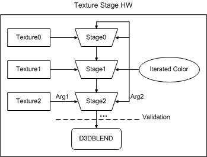

# Texture Stages

## 

The texture stage indicates the location of the texture in the texture pipeline. The position with the highest non-NULL texture is closest to the frame buffer. Each stage is a texture blending unit that performs the operation used to combine an associated texture onto a polygon, as shown in the following figure.

The current texture enters the stage and is blended with another texture and a diffuse component with the result being passed forward to the next stage in the texture pipeline (or frame buffer if this is the last stage).

There are eight texture stages, numbered zero through seven, with zero being furthest from the frame buffer, and corresponding to the render state texture handle D3DRENDERSTATE\_TEXTUREHANDLE, which is described in the DirectX SDK documentation. The driver must handle up to eight texture coordinates, even if the hardware does not support that many.

In multiple texture rendering, the lower-numbered texture stages are farther away from the frame buffer. The lowest texture stage in the cascade is picked up and filtered to get a *texel*, or texture element. A blending operation occurs between that texel and the next as it cascades down the texture pipeline toward the frame buffer.

For example, if two textures, Texture0 and Texture1, are blended together, the resulting texel enters the rasterization pipeline just as a single texture would using legacy texturing. With three textures, Texture0 gets blended with Texture1. The resulting texel is then blended with Texture2 according to some programmable weight. This means that Texture0 cannot influence Texture2 directly; it can only do so by being blended with Texture1, as illustrated in the following figure.

Each texture stage introduces one texture into the pipeline. The pixel pipeline is separate and comes after multiple texture operations. This may include fog application or frame buffer alpha blending.

 

 

[Send comments about this topic to Microsoft](mailto:wsddocfb@microsoft.com?subject=Documentation%20feedback%20[display\display]:%20Texture%20Stages%20%20RELEASE:%20%282/10/2017%29&body=%0A%0APRIVACY%20STATEMENT%0A%0AWe%20use%20your%20feedback%20to%20improve%20the%20documentation.%20We%20don't%20use%20your%20email%20address%20for%20any%20other%20purpose,%20and%20we'll%20remove%20your%20email%20address%20from%20our%20system%20after%20the%20issue%20that%20you're%20reporting%20is%20fixed.%20While%20we're%20working%20to%20fix%20this%20issue,%20we%20might%20send%20you%20an%20email%20message%20to%20ask%20for%20more%20info.%20Later,%20we%20might%20also%20send%20you%20an%20email%20message%20to%20let%20you%20know%20that%20we've%20addressed%20your%20feedback.%0A%0AFor%20more%20info%20about%20Microsoft's%20privacy%20policy,%20see%20http://privacy.microsoft.com/default.aspx. "Send comments about this topic to Microsoft")

