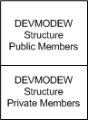

# The DEVMODEW Structure


## <span id="ddk_the_devmodew_structure_gg"></span><span id="DDK_THE_DEVMODEW_STRUCTURE_GG"></span>


The [**DEVMODEW**](https://msdn.microsoft.com/library/windows/hardware/ff552837) structure is the Unicode version of the DEVMODE structure, which is described in the Microsoft Windows SDK documentation. (The 'W' suffix on DEVMODEW stands for "wide", or Unicode characters.) While applications can use either structure, drivers are required to use the DEVMODEW structure rather than the DEVMODE structure.

### <span id="public_and_private_members"></span><span id="PUBLIC_AND_PRIVATE_MEMBERS"></span>Public and Private Members

Immediately following a DEVMODEW structure's defined members (often referred to as its public DEVMODEW members), there can be a set of driver-defined members (its private DEVMODEW members). The following figure shows the public section (the actual DEVMODEW structure itself) and the private section.



Normally, the private members are used only by printer drivers. The driver supplies the size, in bytes, of this private area in the **dmDriverExtra** member. Driver-defined private members are for exclusive use by the driver.

For printer drivers, the DEVMODEW structure is used to specify user choices for a print document. It is also used to specify default values of these choices for printers, such as the number of copies to print, paper size, and other attributes. For display devices, the DEVMODEW structure specifies display attributes such as the number of bits per pixel, pixel dimensions, and display frequency.

### <span id="initializing_a_devmodew_structure"></span><span id="INITIALIZING_A_DEVMODEW_STRUCTURE"></span>Initializing a DEVMODEW Structure

Depending on whether it is to be used by a display driver or by a printer driver, a DEVMODEW structure is initialized in two different ways.

-   Display driver DEVMODEW initialization

    A display driver's [**DrvGetModes**](https://msdn.microsoft.com/library/windows/hardware/ff556233) entry point initializes all members of the DEVMODEW structure to zero. *DrvGetModes* then copies the name of the display driver DLL to the **dmDeviceName** member, fills in the **dmSpecVersion** and **dmDriverVersion** members with the version of the DEVMODEW structure, and copies display attribute information to the appropriate members.

-   Printer driver DEVMODEW initialization

    When an application makes a call to either **DocumentProperties** (a printer interface DLL function that is described in the Microsoft Windows SDK documentation) or [**DrvDocumentPropertySheets**](https://msdn.microsoft.com/library/windows/hardware/ff548548) (an NT-based operating system graphics DDI), a DEVMODEW structure is created with default values. An application is then free to modify any of the public DEVMODEW members. After any changes, the application should then make a second call to the same function it called before, in order to merge the changed members with those of the driver's internal DEVMODEW structure. The second call is necessary since some changes may not work correctly; the printer driver must be called to correct the DEVMODEW structure. When the document is about to be printed, the application passes the merged DEVMODEW structure to **CreateDC** (described in the Microsoft Windows SDK documentation), which passes it on to the [**DrvEnablePDEV**](https://msdn.microsoft.com/library/windows/hardware/ff556211) DDI. At that time, the driver's rendering DLL validates the DEVMODEW structure and makes repairs, if necessary, before carrying out the print job.

### <span id="using_a_devmodew_structure"></span><span id="USING_A_DEVMODEW_STRUCTURE"></span>Using a DEVMODEW Structure

Several APIs and graphics DDIs use the information in the DEVMODEW structure for such purposes as printing, querying device capabilities, showing user interface, and others. For example, [**DrvConvertDevMode**](https://msdn.microsoft.com/library/windows/hardware/ff548532) is a print spooler graphics DDI that translates the DEVMODEW structure from one operating system version to another. This might be necessary if a printer driver gets a DEVMODEW structure from another machine that is running on a different operating system version.

### <span id="modifying_a_devmodew_structure"></span><span id="MODIFYING_A_DEVMODEW_STRUCTURE"></span>Modifying a DEVMODEW Structure

Applications and drivers are free to ask for a DEVMODEW structure and modify its public part directly. Only drivers, however, are permitted to modify the private DEVMODEW structure members.

In order to modify private DEVMODEW structure members, a driver must first determine the offset of the beginning of the private data. Given a pointer to the beginning of this structure, and the **dmSize** member, which holds the size of the public portion of the structure, the beginning of the private portion can be found. The following example shows how to initialize a pointer to the beginning of the private section. In this example, *pdm* points to the beginning of the DEVMODEW structure.

```cpp
PVOID pvDriverData = (PVOID)  (((BYTE *) pdm) + (pdm -> dmSize));
```

### <span id="printer_driver_display_driver_devmodew_differences"></span><span id="PRINTER_DRIVER_DISPLAY_DRIVER_DEVMODEW_DIFFERENCES"></span>Printer Driver/Display Driver DEVMODEW Differences

The DEVMODEW structure members fall into three categories:

-   Members used only by printer drivers

-   Members used only by display drivers

-   Members used by both printer and display drivers

The following table lists several public DEVMODEW members that are used *only* by printer drivers:

<table>
<colgroup>
<col width="50%" />
<col width="50%" />
</colgroup>
<thead>
<tr class="header">
<th align="left">DEVMODEW Members Used Only by Printer Drivers</th>
<th align="left">Purpose</th>
</tr>
</thead>
<tbody>
<tr class="odd">
<td align="left"><p><strong>dmScale</strong></p></td>
<td align="left"><p>Specifies the percentage by which the image is to be scaled for printing.</p></td>
</tr>
<tr class="even">
<td align="left"><p><strong>dmCopies</strong></p></td>
<td align="left"><p>Specifies the number of copies to be printed.</p></td>
</tr>
<tr class="odd">
<td align="left"><p><strong>dmColor</strong></p></td>
<td align="left"><p>Specifies whether a color printer should print color or monochrome.</p></td>
</tr>
<tr class="even">
<td align="left"><p><strong>dmOrientation</strong></p></td>
<td align="left"><p>Specifies the orientation of the paper, either portrait or landscape.</p></td>
</tr>
</tbody>
</table>

 

The next table lists several public DEVMODEW members that are used *only* by display drivers:

<table>
<colgroup>
<col width="50%" />
<col width="50%" />
</colgroup>
<thead>
<tr class="header">
<th align="left">DEVMODEW Members Used Only by Display Drivers</th>
<th align="left">Purpose</th>
</tr>
</thead>
<tbody>
<tr class="odd">
<td align="left"><p><strong>dmBitsPerPel</strong></p></td>
<td align="left"><p>Specifies the color resolution, in bits per pixel, of the display device.</p></td>
</tr>
<tr class="even">
<td align="left"><p><strong>dmPelsWidth</strong></p></td>
<td align="left"><p>Specifies the width, in pixels, of the visible device surface.</p></td>
</tr>
<tr class="odd">
<td align="left"><p><strong>dmPelsHeight</strong></p></td>
<td align="left"><p>Specifies the height, in pixels, of the visible device surface.</p></td>
</tr>
<tr class="even">
<td align="left"><p><strong>dmDisplayFlags</strong></p></td>
<td align="left"><p>Specifies the display mode - color versus monochrome, interlaced versus noninterlaced.</p></td>
</tr>
<tr class="odd">
<td align="left"><p><strong>dmDisplayFrequency</strong></p></td>
<td align="left"><p>Specifies, in hertz, the display&#39;s refresh rate.</p></td>
</tr>
</tbody>
</table>

 

The third table lists several public DEVMODEW members that are used by both printer and display drivers:

<table>
<colgroup>
<col width="50%" />
<col width="50%" />
</colgroup>
<thead>
<tr class="header">
<th align="left">DEVMODEW Members Used by Printer and Display Drivers</th>
<th align="left">Purpose</th>
</tr>
</thead>
<tbody>
<tr class="odd">
<td align="left"><p><strong>dmDeviceName</strong></p></td>
<td align="left"><p>For displays, specifies the display driver&#39;s DLL.</p>
<div>
 
</div>
For printers, specifies the &quot;friendly name&quot; of the printer.</td>
</tr>
<tr class="even">
<td align="left"><p><strong>dmFields</strong></p></td>
<td align="left"><p>Specifies bit flags identifying which of the DEVMODEW members that follow it are in use. For example, the DM_BITSPERPEL flag is set when the <strong>dmBitsPerPel</strong> member contains valid data.</p></td>
</tr>
<tr class="odd">
<td align="left"><p><strong>dmSize</strong></p></td>
<td align="left"><p>Specifies the size, in bytes, of the public portion of the DEVMODEW structure.</p></td>
</tr>
<tr class="even">
<td align="left"><p><strong>dmDriverExtra</strong></p></td>
<td align="left"><p>Specifies the number of bytes of private driver data following the public structure members. For display drivers, this is usually zero.</p></td>
</tr>
</tbody>
</table>

 

 

 


