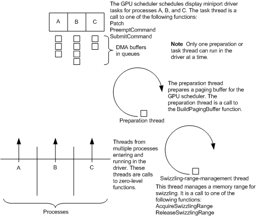

# Thread Synchronization and TDR

The following figure shows how thread synchronization works for the display miniport driver in the Windows Display Driver Model (WDDM).

If a hardware timeout occurs, the [Timeout Detection and Recovery (TDR)](timeout-detection-and-recovery.md) process initiates. The GPU scheduler calls the driver's [*DxgkDdiResetFromTimeout*](https://msdn.microsoft.com/library/windows/hardware/ff559815) function, which resets the GPU. *DxgkDdiResetFromTimeout* is called synchronously with any other display miniport driver function, except for the runtime power management functions [*DxgkDdiSetPowerComponentFState*](https://msdn.microsoft.com/library/windows/hardware/hh451422) and [*DxgkDdiPowerRuntimeControlRequest*](https://msdn.microsoft.com/library/windows/hardware/hh451396). That is, no other thread runs in the driver while the *DxgkDdiResetFromTimeout* thread runs. The operating system also guarantees that no access to the frame buffer can occur from any application during the call to *DxgkDdiResetFromTimeout*; therefore, the driver can reset a memory controller phase locked loop (PLL) and so on.

While the recovery thread executes [*DxgkDdiResetFromTimeout*](https://msdn.microsoft.com/library/windows/hardware/ff559815), interrupts and deferred procedure calls (DPCs) can continue to be called. The [**KeSynchronizeExecution**](https://msdn.microsoft.com/library/windows/hardware/ff553302) function can be used to synchronize portions of the reset procedure with device interrupts.

After the driver returns from [*DxgkDdiResetFromTimeout*](https://msdn.microsoft.com/library/windows/hardware/ff559815), most driver functions can again be called, and the operating system starts to clean up resources that are no longer required. During the cleanup period, the following driver functions are called for the indicated reasons:

-   The driver is called to notify about an allocation being evicted.

    For example, if the allocation was paged in a memory segment, the driver's [*DxgkDdiBuildPagingBuffer*](https://msdn.microsoft.com/library/windows/hardware/ff559587) function is called with the **Operation** member of the [**DXGKARG\_BUILDPAGINGBUFFER**](https://msdn.microsoft.com/library/windows/hardware/ff557540) structure set to DXGK\_OPERATION\_TRANSFER and with the **Transfer.Size** member set to zero to inform the driver about the eviction. Note that no content transfer is involved because the content was lost during the reset.

    If the allocation was paged in an aperture segment, the driver's [*DxgkDdiBuildPagingBuffer*](https://msdn.microsoft.com/library/windows/hardware/ff559587) function is called with the **Operation** member of DXGKARG\_BUILDPAGINGBUFFER set to DXGK\_OPERATION\_UNMAP\_APERTURE\_SEGMENT to inform the driver to unmap the allocation from the aperture.

-   The driver's [*DxgkDdiReleaseSwizzlingRange*](https://msdn.microsoft.com/library/windows/hardware/ff559786) function is called to release an unswizzling aperture and segment aperture ranges.

The driver should not access the GPU during the preceding calls unless absolutely necessary.

After the cleanup period is over, the operating system calls the driver's [*DxgkDdiRestartFromTimeout*](https://msdn.microsoft.com/library/windows/hardware/ff559820) function to inform the driver that cleanup is complete and that the operating system will resume using the adapter for rendering.

**Note**  TDR functionality has been updated for Windows 8. See [TDR changes in Windows 8](tdr-changes-in-windows-8.md).

 

 

 

